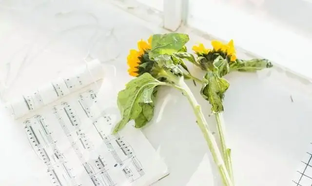

《心存旷野，手握玫瑰》这本书中有这样一句话：

**“有随它去的心态又有克制自我的能力，才是与世界长久相处的好方法。”**

在凡尘中修行，在安静中修心。

一个人最好的状态，就是好好生活，不胡思乱想。

做事努力

没有压力的船最危险，没有负重的人生最可怕。

18世纪英国著名的航海家詹姆斯·库克，45岁的时候第二次远征太平洋。

当他的航海船队返航时，遇上了可怕的风暴。

库克和船员们所在的空货轮摇摇晃晃，眼看就要被风浪吞没。

此时，库克下命令，“立即打开货舱，灌满船舱三分之一的海水！”

船员们都以为他疯了，但是库克坚持要这么做。

事实上，当海水灌到货舱三分之一的刻度时，虽然海面上依然狂风大作，货船却奇迹般地恢复了平稳。

海上风暴大，被打翻的往往是根基轻的小船，上万吨的巨轮很少有被打翻的。

人生也是如此，如果只图轻松，不努力做事，就很容易被命运打败。

有时候，我们看见的是麻烦，但常常忘记，正是这些麻烦，让我们成长，使人生丰富。

捷克作家米兰·昆德拉曾说：“一切重压与负担，人都可以承受，它会使人坦荡而充实地活着，最不能承受的恰恰是‘轻松’。”

努力做事，负重前行，不虚度年华，才不负此生。

心态稳定

看一个人是不是有成绩，不是看他做了什么，而是以怎样的心态去做。

《六祖坛经》中记载了这样一则故事：

梁武帝爱佛法，一次，梁武帝问六祖达摩：“我即位以来，弘扬佛法，建寺庙，抄佛经，这功德应该不小了吧？”

谁知达摩却说：“没有功德。”

梁武帝不解，问为什么没有功德？

达摩说：“因为你的一切仅仅是为了取得功德。”

做事，是为了让自己感觉心安。

不能以得到和失去，或者收获多寡，来评价。

得到，欢喜；失去，亦欢喜。

行路，是一种体验；做人，是一种境界。

认真做事，开阔心胸，放下得失，人生才得真正的自由。

不忘初心，方得始终

看过一句话：

“无休止地自设困境，带来的是无休止地自我折磨。”

人世间最大的牢笼，不是监狱，而是心的绝境。

无论遇到什么境遇，活到什么年纪，都不应该放弃努力成长。

听过这样一则故事：

有个武术大师，因为一次意外，腿摔断了。

因为这个武术大师，擅长的就是腿上的功夫，可是现在却没了腿，所以弟子们都替他悲伤。

然而，事实并没有按人们通常的理解发展。

当武术大师，从昏迷中醒来的时候，并没有为自己失去的双腿忧伤。

他只是一如往昔，继续认真练武，只是这次他练习的是臂掌部的功夫。

他告诉弟子：

“我不会因为没有了两条腿而变成废人，你们也不必因为我而放弃自己的修炼。”

不因失去的而悔恨，只对拥有的去珍惜。

命运残酷的给人以磨难，不忘初心，不断精进，却是我们对生命最好的回答。

结语：

曾经有个学生心浮气躁，总是无法专心学习，于是他向老师求教。

老师对他说了一段话：

“人生最重要的，就是不要去看远方模糊的未来，而是动手清理手边实实在在的最具体的事情。”

一个人最好的状态，就是不急不躁，认真做事。把未来交给时间，把心安放当下。

—END—