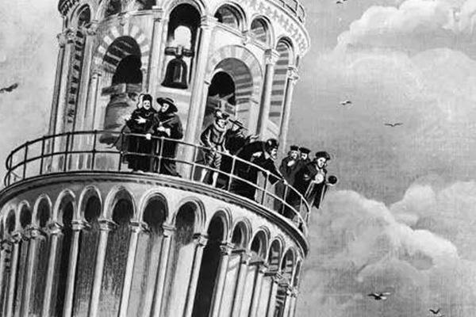
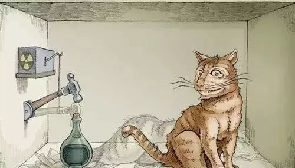
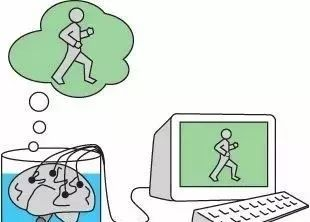
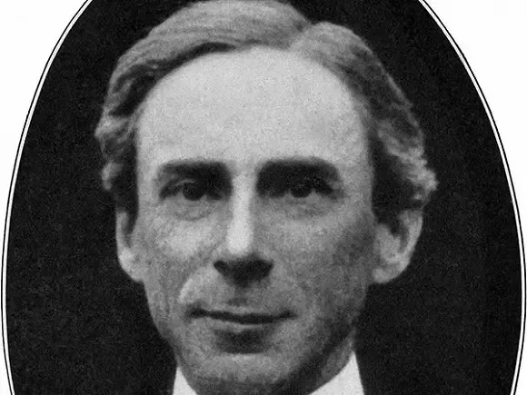
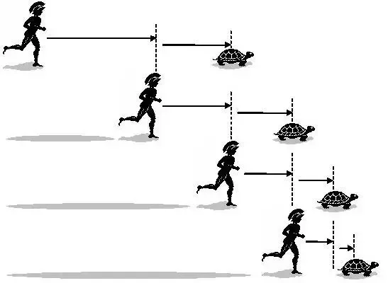
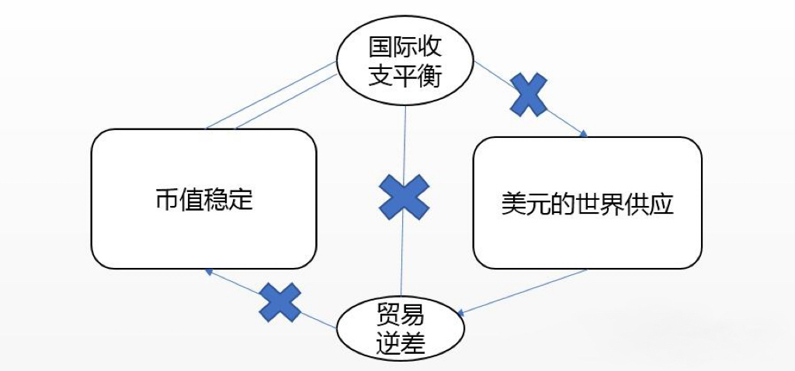

悖论是指表面上同一命题或推理中隐含着两个对立的结论，而这两个结论都能自圆其说。悖论可以引发我们对于逻辑、哲学、伦理等方面的思考，也可以增强我们的思辨能力。本文将为你介绍世界十大悖论的内容和解读，让你感受一下烧脑的乐趣。后面悖论为补充。

1. 电车难题

引用：

电车难题是伦理学领域最为知名的思想实验之一，其内容大致是：一个疯子把五个无辜的人绑在电车轨道上。一辆失控的电车朝他们驶来，并且片刻后就要碾压到他们。幸运的是，你可以拉一个拉杆，让电车开到另一条轨道上。但是还有一个问题，那个疯子在那另一条轨道上也绑了一个人。考虑以上状况，你应该拉拉杆吗？

解读：

电车难题最早是由哲学家Philippa Foot提出的，用来批判伦理哲学中的主要理论，特别是功利主义。功利主义提出的观点是，大部分道德决策都是根据“为最多的人提供最大的利益”的原则做出的。从一个功利主义者的观点来看，明显的选择应该是拉拉杆，拯救五个人只杀死一个人。但是功利主义的批判者认为，一旦拉了拉杆，你就成为一个不道德行为的同谋——你要为另一条轨道上单独的一个人的死负部分责任。然而，其他人认为，你身处这种状况下就要求你要有所作为，你的不作为将会是同等的不道德。

总之，不存在完全的道德行为，这就是重点所在。许多哲学家都用电车难题作为例子来表示现实生活中的状况经常强迫一个人违背他自己的道德准则，并且还存在着没有完全道德做法的情况。

2. 空地上的奶牛

引用：

认知论领域的一个最重要的思想实验就是“空地上的奶牛”。它描述的是：
一个农民担心自己的获奖的奶牛走丢了。这时送奶工到了农场，他告诉农民不要担心，因为他看到那头奶牛在附件的一块空地上。
虽然农民很相信送奶工，但他还是亲自看了看，他看到了熟悉的黑白相间的形状并感到很满意。
过了一会，送奶工到那块空地上再次确认。
那头奶牛确实在那，但它躲在树林里，而且空地上还有一大张黑白相间的纸缠在树上，很明显，农民把这张纸错当成自己的奶牛了。
问题出现了，虽然奶牛一直都在空地上，但农民说自己知道奶牛在空地上时是否正确？

解读：

空地上的奶牛最初是被Edmund Gettier用来批判主流上作为知识的定义的JTB（justified true belief）理论，即当人们相信一件事时，它就成为了知识；这件事在事实上是真的，并且人们有可以验证的理由相信它。在这个实验中，农民相信奶牛在空地上，且被送奶工的证词和他自己对于空地上的黑白相间物的观察所证实。而且经过送奶工后来的证实，这件事也是真实的。尽管如此，农民并没有真正的知道奶牛在那儿，因为他认为奶牛在那儿的推导是建立在错误的前提上的。Gettier利用这个实验和其他一些例子，解释了将知识定义为JTB的理论需要修正。

3. 定时炸弹

引用：

如果你关注近几年的政治时事，或者看过动作电影，那么你对于“定时炸弹”思想实验肯定很熟悉。
它要求你想象一个炸弹或其他大规模杀伤性武器藏在你的城市中，并且爆炸的倒计时马上就到零了。
在羁押中有一个知情者，他知道炸弹的埋藏点。你是否会使用酷刑来获取情报？

解读：

与电车难题类似，定时炸弹情景也是强迫一个人从两个不道德行径中选择的伦理问题。它一般被用作对那些说在任何情况下都不能使用酷刑的反驳。它也被用作在极端形势下法律——就像美国的严禁虐囚的法律——可以被放在第二位的例子。归功于像《24小时》的电视节目和各种政治辩论，定时炸弹情景已成为最常引用的思想实验之一。几年前，一份英国报纸提出了更为极端的看法。这份报纸提议说，如果那个恐怖分子对酷刑毫无反应，那么当局者是否愿意拷打他的妻子儿女来获取情报。

有一个现实生活中的真实的故事：

一个朋友是相当于一级的领导。一次他办理一个绑架小女孩的案件，罪犯送来小女孩的手指勒索钱财——影视剧中常见的情节。不过下面的故事却很不常见。罪犯约定了无论钱是不是到手都要撕票，罪犯A去取钱，如果罪犯A在22时不回来集合，其他罪犯就撕票潜逃。

朋友只好把A抓回来——让他拿钱回去就等于害死了小女孩。问题是时间紧迫，A这小子是知道一点法律的，他认定说不说都是死刑，不如不说，说不定找不到证据，还能留条活路。所以审讯室里出现了奇怪的场景：审讯员手脚冰凉、头顶冒汗，罪犯却神态自若，从容以对，时不时地露出狰狞的奸笑。

时间在流逝，每一秒钟都生死攸关。当断不断，必受其乱。朋友打发其他人离开，独自负责审讯，并且声明有其个人对结果负责。

朋友拎出一把菜刀，按住A的一个手指，微笑着说：“我只问你一遍：小女孩关在哪里?”

A显然对这种威胁不屑一顾：“我真的不知道你问什么。”

咔嚓一声，手起刀落，一根手指掉在地上。

在A的鬼嚎声中，朋友按住他的另一根手指，仍然微笑着说：“我只问你一遍：小女孩关在哪里?”

A这一次没有回答。

咔嚓一声，手起刀落，地上现在有了两根手指。

没有等到朋友按住他的第三根手指，A交代了小女孩关押的位置。

小女孩解救出来以后，朋友用一个塑料袋装着菜刀和手指，到检察院投案自首：“我刑讯逼供，我来投案自首。”

事情的发展更加富有戏剧性。朋友的行为显然违法，显然构成犯罪，但是检察院就是不立案，说这行为有紧急避险的性质，最终定性还要研究，就是不给文字结论。公安局也不给他停职，说这是检察院的事儿，检察院没有结论，我们不好说什么。法院不闻不问，检察院没有起诉，我们根本不知道。就连无孔不入的律师也对这事儿只字不提，甚至A自己都认为这是合理的，既然没人提，他干脆就不承认被人剁了手指，法庭上他说他因为干了这事儿后悔，自己剁的。甚至恬不知耻地说是他主动交代小孩的关押地点，主动配合公安解救了小女孩，有重大立功表现，要求给条生路。

生路是没有，A很快就毙了。朋友的行为成了我们酒后谈论的英雄壮举，朋友自己的话，是这个故事最好的注脚：“即使是法律，也不能蒙蔽我的良心。”

我们不反对罗尔斯，也很欣赏程序正义。我们自愿遵守法律程序，我们对正当的程序表示真心的尊重，但是，指导我们行动的，永远是心灵深处的道德法则！当程序正义或者其他任何正义与我们心灵深处的道德法则发生冲突时，我们毫不犹豫地捍卫道德的尊严；同时，一个理性的人不应当伤害程序的正义，我的朋友和苏格拉底一起做出了表率：我不逃避、不隐瞒、不后悔、不改变，我自愿接受程序的处罚。我用行动维护道德的尊严，同时甘愿用一个人的苦难维护程序的尊严。

4. 爱因斯坦的光线

引用：

爱因斯坦的光线是一个关于物理学和相对论的思想实验，它涉及到时间、空间、运动和观察者之间的关系。它是这样描述的：

幻想在宇宙中追寻一道光线。爱因斯坦推理说，如果他能够以光速在光线旁边运动，那么他应该能够看到光线成为“在空间上不断振荡但停滞不前的电磁场”。对于爱因斯坦，这个思想实验证明了对于这个虚拟的观察者，所有的物理定律应该和一个相对于地球静止的观察者观察到的一样。

解读：

爱因斯坦的光线是帮助爱因斯坦完成到狭义相对论这如此巨大的飞跃的一个如此简单的思想实验。在当时，这个实验中的想法与现在已被抛弃的“以太”理论相违背。爱因斯坦的光线表明了时间和空间并不是绝对的，而是相对于观察者而变化的。它也表明了物理定律是普遍适用的，不受观察者的运动状态影响。

5. 特修斯悖论

引用：

特修斯悖论，也叫忒修斯悖论或忒修斯之船，是最为古老的思想实验之一：假定物体的构成要素被替换后，它还是原来的物体吗？特修斯悖论最早出自普鲁塔克的记载。它是这样描述的：

一艘可以在海上航行几百年的船，归功于不间断的维修和替换部件。只要一块木板腐烂了，它就会被替换掉，以此类推，直到所有的功能部件都不是最开始的那些了。问题是，最终产生的这艘船是否还是原来的那艘特修斯之船，还是一艘完全不同的船？如果不是原来的船，那么在什么时候它不再是原来的船了？

哲学家Thomas Hobbes后来对此进行了延伸，如果用特修斯之船上取下来的老部件来重新建造一艘新的船，那么两艘船中哪艘才是真正的特修斯之船？

解读：

特修斯悖论被用来研究身份的本质。特别是讨论一个物体是否仅仅等于其组成部件之和。一个更现代的例子就是一个不断发展的乐队，直到某一阶段乐队成员中没有任何一个原始成员。这个问题可以应用于各个领域。对于企业，在不断并购和更换东家后仍然保持原来的名字。对于人体，人体不间断的进行着新陈代谢和自我修复。这个实验的核心思想在于强迫人们去反思身份仅仅局限在实际物体和现象中这一常识。

亚里士多德认为可以用描述物体的四因说解决这个问题。构成材料是质料因，物质的设计和形式是形式因，形式因决定了物体是什么。基于形式因，忒修斯之船还是原来的船，因为虽然材料变了，但船的设计——形式因——没有变。从这个角度看赫拉克利特的河流问题，则两次踏入的是同一条河流，因为河流的形式因没有变。事物的目的决定了其目的因。忒修斯之船的目的在神话中是装载和运输，在现实中的目的是证明和纪念忒修斯，虽然材料变了，但目的没有变。

6. 伽利略的重力实验

引用：

为了反驳亚里士多德的自由落体速度取决于物体的质量的理论，伽利略构造了一个简单的思想实验。

根据亚里士多德的说法，如果一个轻的物体和一个重的物体绑在一起然后从塔上丢下来，那么重的物体下落的速度快，两个物体之间的绳子会被拉直。这时轻的物体对重物会产生一个阻力，使得下落速度变慢。

但是，从另一方面来看，两个物体绑在一起以后的质量应该比任意一个单独的物体都大，那么整个系统下落的速度应该最快。

这个矛盾证明了亚里士多德的理论是错误的。

解读：

这个思想实验帮助证明了一个很重要的理论：无论物体的质量，不考虑阻力的情况下，所有物体自由落体的速率都是一样的。

7. 猴子和打字机

引用：

另一个在流行文化中占了很大分量的思想实验是“无限猴子定理”，也叫做“猴子和打字机”实验。

定理的内容是，如果无数多的猴子在无数多的打字机上随机的打字，并持续无限久的时间，那么在某个时候，它们必然会打出莎士比亚的全部著作。

猴子和打字机的设想在20世纪初被法国数学家Emile Borel推广，但其基本思想——无数多的人员和无数多的时间能产生任何/所有东西——可以追溯至亚里士多德。

解读：

简单来说，“猴子和打字机”定理是用来描述无限的本质的最好方法之一。人的大脑很难想象无限的空间和无限的时间，无限猴子定理可以帮助理解这些概念可以达到的宽度。猴子能碰巧写出《哈姆雷特》这看上去似乎是违反直觉，但实际上在数学上是可以证明的。这个定理本身在现实生活中是不可能重现的，但这并没有阻止某些人的尝试：

2003年，一家英国动物园的科学家们“试验”了无限猴子定理，他们把一台电脑和一个键盘放进灵长类园区。可惜的是，猴子们并没有打出什么十四行诗。根据研究者，它们只打出了5页几乎完全是字母“s”的纸。

8. 中文房间

引用：

“中文房间”最早由美国哲学家John Searle于20世纪80年代初提出。

这个实验要求你想象一位只说英语的人身处一个房间之中，这间房间除了门上有一个小窗口以外，全部都是封闭的。

他随身带着一本写有中文翻译程序的书。房间里还有足够的稿纸、铅笔和橱柜。写着中文的纸片通过小窗口被送入房间中。

根据Searle，房间中的人可以使用他的书来翻译这些文字并用中文回复。

虽然他完全不会中文，Searle认为通过这个过程，房间里的人可以让任何房间外的人以为他会说流利的中文。

解读：

Searle创造了“中文房间”思想实验来反驳电脑和其他人工智能能够真正思考的观点。

房间里的人不会说中文；他不能够用中文思考。但因为他拥有某些特定的工具，他甚至可以让以中文为母语的人以为他能流利的说中文。

根据Searle，电脑就是这样工作的。它们无法真正的理解接收到的信息，但它们可以运行一个程序，处理信息，然后给出一个智能的印象。

9. 薛定锷的猫

引用：

薛定锷的猫最早由物理学家薛定锷提出，是量子力学领域中的一个悖论。其内容是：

一只猫、一些放射性元素和一瓶毒气一起被封闭在一个盒子里一个小时。在一个小时内，放射性元素衰变的几率为50%。

如果衰变，那么一个连接在盖革计数器上的锤子就会被触发，并打碎瓶子，释放毒气，杀死猫。

因为这件事会否发生的概率相等，薛定锷认为在盒子被打开前，盒子中的猫被认为是既死又活的。

解读：

简而言之，这个实验的核心思想是因为事件发生时不存在观察者，盒子里的猫同时存在在其所有可能的状态中（既死又活）。

薛定锷最早提出这个实验是在回复一篇讨论量子态叠加的文章时。薛定锷的猫同时也说明了量子力学的理论是多么令人无法理解。

这个思想实验因其复杂性而臭名昭著，同时也启发了各种各样的解释。其中最奇异的就属“多重世界”假说，这个假说表示有一只死猫和一只活猫，两只猫存在在不同的宇宙之中，并且永远不会有交集。

10. 缸中之脑

引用：

缸中之脑假想：一个人被邪恶科学家施行了手术（这个人可能就是你），他的脑被从身体上切了下来，放进一个盛有维持脑存活营养液的缸中。脑的神经末梢连接在计算机上，这台计算机按照程序向脑传送信息，以使他保持一切完全正常的幻觉。对于他来说，似乎人、物体、天空还都存在，自身的运动、身体感觉都可以输入。这个脑还可以被输入或截取记忆（截取掉大脑手术的记忆，然后输入他可能经历的各种环境、日常生活）。他甚至可以被输入代码，“感觉”到他自己正在这里阅读一段有趣而荒唐的文字。那么问题来了：你如何担保你自己不是在这种困境之中？

解读：

缸中之脑最初是被Edmund Gettier用来批判主流上作为知识的定义的JTB（justified true belief）理论，即当人们相信一件事时，它就成为了知识；这件事在事实上是真的，并且人们有可以验证的理由相信它。在这个实验中，缸中之脑相信自己在正常的世界中，且被计算机的信息所证实。而且经过科学家的证实，这件事也是真实的。尽管如此，缸中之脑并没有真正的知道自己在正常的世界中，因为他认为自己在正常的世界中的推导是建立在错误的前提上的。

缸中之脑也被用来探讨意识、身份和现实的本质。它引发了我们对于我们所感知到的一切是否真实可靠的怀疑，以及我们是否能够证明我们自己不是被操纵或欺骗的问题。它也让我们思考，我们是如何定义我们自己和我们所处的环境的。

11. 飞矢不动悖论

引用：

飞矢不动悖论是古希腊数学家芝诺 (Zeno of Elea)提出的一系列关于运动的不可分性的哲学悖论中的一个。人们通常把这些悖论称为“芝诺悖论”。芝诺问他的学生：“一支射出的箭是动的还是不动的？”

“那还用说，当然是动的。”

“确实是这样，在每个人的眼里它都是动的。可是，这支箭在每一个瞬间里都有它的位置吗？”

“有的，老师。”

“在这一瞬间里，它占据的空间和它的体积一样吗？”

“有确定的位置，又占据着和自身体积一样大小的空间。”

“那么，在这一瞬间里，这支箭是动的，还是不动的？”

“不动的，老师”

“这一瞬间是不动的，那么其他瞬间呢？”

“也是不动的，老师”

“所以，射出去的箭是不动的？”

解读：

芝诺提出，由于箭在其飞行过程中的任何瞬间都有一个暂时的位置，所以它在这个位置上和不动没有什么区别。他用这个悖论来证明运动只是一种错觉，因为运动只能由无穷多个静止状态组成。

芝诺悖论引发了对于时间、空间、运动和无穷等概念的讨论。后来数学家和物理学家通过引入微积分、相对论和量子力学等理论来解决了芝诺悖论。他们指出，芝诺悖论忽略了时间和空间都是连续而非离散的变量，以及运动物体具有速度和方向等属性。

12. 外祖母悖论

引用：

假设你回到过去，在自己父亲出生之前，把自己的祖父母杀死；因为你年轻的祖父母被你杀死了，所以就不会有你的父亲；没有了你的父亲，你就不会出生；你没出生，就没有人会把你的祖父母杀死；若是没有人把你的祖父母杀死，那么，你就会存在；既然你存在，那么就有了最开始的假设，即回到过去，在父亲出生之前杀死祖父母。这一矛盾被称为“外祖母悖论”，也叫“祖父悖论”。

解读：

外祖母悖论是关于时间旅行的一个经典问题，它涉及到因果律和自洽性的概念。它表明了如果时间旅行是可能的，那么就有可能造成逻辑上的矛盾和悖论。为了避免这种情况，有些理论提出了多世界解释或平行宇宙的假设，即当你回到过去时，你实际上是进入了一个与原来的宇宙分支出来的新的宇宙，在这个新的宇宙中，你可以改变历史而不影响原来的宇宙。另一种理论则认为时间旅行是不可能的，或者即使可能，也有一些自然法则来阻止任何可能导致悖论的事件发生。

13. 上帝悖论

引用：

几个世纪前，罗马教廷出了一本书，书中用当时最流行的数学推论导出“上帝是万能的”。一位智者针锋相对地问：“上帝能创造出一块他搬不动的石头吗？”如果教廷回答说能的，那上帝不能搬动他创造的那块石头，所以上帝不是万能的；如果教廷回答说不能，那么上帝不能创造出一块他搬不动的石头，所以上帝也不是无所不能的。由此那位智者导出“上帝不是万能的”。这即是“上帝悖论”。

解读：

上帝悖论是对于全能者概念的一个挑战，它试图证明全能者不存在或者自相矛盾。它也可以被改变为其他形式，比如“上帝能否制造一个他不能解决的问题？”或者“上帝能否让自己不存在？”等等。这些问题都试图用逻辑推理来限制全能者的能力。

对于上帝悖论，有些人认为它是一个无意义或错误提出的问题，因为它违背了全能者定义中的内在逻辑。他们认为全能者不能做任何违背逻辑或自身本质的事情，比如创造一个方圆之物或者让自己不全能等等。这些事情并不是真正意义上的事情，而只是语言上的混淆。另一些人则认为上帝悖论表明了全能者定义中存在着矛盾或不完备性，因此需要重新审视或修正。

14. 理发师悖论

引用：

在一个城市里，唯一的理发师立下了一个规定：只帮那些自己不理发的人理发。那么，理发师应该为自己理发吗？如果理发师不给自己理发，那么，他就属于“自己不理发的人”，根据他自己定的规则，他可以帮自己理发；如果理发师给自己理发，那么，他就不属于“自己不理发的人”，根据他自己定的规则，他不该给自己理发。不管怎样推论，理发师所说的话都是自相矛盾的。这即是“理发师悖论”，也叫“罗素悖论”，由英国数学家罗素提出。

解读：

理发师悖论是一个关于集合论和逻辑的问题，它涉及到自指和无穷回归的概念。它可以被改变为其他形式，比如“所有不是自己父亲的人都是自己父亲的父亲”或者“所有不包含自己的集合都包含自己”等等。这些问题都试图用语言来构造一个既属于又不属于某个范畴的对象。

对于理发师悖论，有些人认为它是一个无意义或错误提出的问题，因为它违背了语言和逻辑的规则。他们认为理发师的规定是不合理或不可能的，因为它导致了一个无法判断真假的命题。另一些人则认为理发师悖论表明了语言和逻辑中存在着潜在的矛盾或不完备性，因此需要重新审视或修正。

15. 伊壁鸠鲁悖论

引用：

如果是上帝想阻止“恶”而阻止不了，那么上帝就是无能的；如果是上帝能阻止“恶”而不愿阻止，那么上帝就是坏的；如果是上帝既不想阻止也阻止不了“恶”，那么上帝就是既无能又坏的；如果是上帝既想阻止又能阻止“恶”，那为什么我们的世界充满了“恶”呢？这即是“伊壁鸠鲁悖论”，由伊壁鸠鲁提出。

解读：

这个悖论是“神议论”问题的经典表述，至今仍然是宗教哲学与神学中的一个难题。它挑战了传统上对于上帝作为全能、全善和全知的存在的观念。它暗示了上帝或者不存在，或者不符合人类对于他的期待。

几种反驳的观点认为：1）恶是上帝计划中的一部分，是其实现善的手段；2）否认恶的存在，即认为恶并没有实体性的存在，只是善的缺乏；3）恶都是相对的恶，对于神而言，恶是不存在的。

16. 说谎者悖论

引用：

“说谎者悖论”的内容是：如果某人说自己正在说谎，那么Ta说的话是真还是假？举个例子：“我说的这句话是假的。”如果这句话是真的，那就不符合“我说的这句话是假的”，则这句话就是假的；如果这句话是假的，那就符合“我说的这句话是假的”，则这句话就是真的。因此，“我说的这句话是假的”这句话无解。

解读：

说谎者悖论最早由西元前6世纪，克利特哲学家埃庇米尼得斯提出，他说了一句很有名的话：“所有克利特人都说谎。”说谎者悖论是一个关于语言和逻辑的问题，它涉及到自指和矛盾的概念。它可以被改变为其他形式，比如“这个命题是假的”或者“我正在撒谎”等等。这些问题都试图用语言来构造一个既不能为真也不能为假的命题。

对于说谎者悖论，有些人认为它是一个无意义或错误提出的问题，因为它违背了语言和逻辑的规则。他们认为说谎者悖论中涉及到的命题是不合理或不可能的，因为它导致了一个无法判断真假的命题。另一些人则认为说谎者悖论表明了语言和逻辑中存在着潜在的矛盾或不完备性，因此需要重新审视或修正。

17. 二分法悖论（dichotomy paradox）

引用：

概述：运动是不可能的。你要到达终点，必须先到达全程的1/2处；要到达1/2处，必须先到1/4处……每当你想到达一个点，总有一个中点需要先到，因此你是永远也到不了终点的。

解读：

古希腊哲学家芝诺（Zeno）提出了一系列关于运动不可分性的哲学悖论，二分法悖论就是其中之一。直到19世纪末，数学家们才为无限过程的问题给出了形式化的描述，类似于0.999……等于1的情境。

那么究竟我们是如何到达目的地的呢？二分法悖论只是空谷传音般放大了问题。若想妥善解决这个问题，还得靠物质、时间和空间是否无限可分等等这些20世纪的衍生理论。

并夕夕：是在说我嘛。😊

18. 我知我无知

引用：

苏格拉底有句名言：“我只知道一件事，那就是我一无所知。”

解读：

这个说法本身就是悖论，展现了自我参照的表述（self-referential statement）的复杂性。而这也是西方哲学先贤带给我们的重要启示：你得问你以为你知道的一切。越是问东问西问长问短打破砂锅问到底，越会发现身边正有一大波悖论呼啸而过。

19. 有趣数悖论（Interesting Number Paradox）

引用：

概述：1是非零的自然数，2是最小的质数，3是第一个奇质数,4是最小的合数等等；如果你找不到这个数字有趣的特征，那它就是第一个不有趣的数字，这也很有趣。

解读：

于是，量子计算领域的研究猿纳撒尼尔·约翰斯（Nathaniel Johnston）把这些有趣的整数定义为一个整体，并将这些整体排成序列，像是质数、斐波那契数列、毕达哥拉斯数等。基于这个定义，约翰斯在2009年6月的博客里提出，第一个没有出现在序列里的数字是11630。2013年11月序列更新之后，他表示14228是最小的无趣数。

脑洞：n只青蛙n张嘴，2n只眼睛4n条腿，扑通n声跳下水……你想起数列是个什么鬼了吗？

20. 先有鸡还是先有蛋

引用：

先有鸡还是先有蛋这个因果困境想要表达的是一个“到底是先有（鸡）蛋，还是先有鸡”（鸡生蛋，蛋生鸡，到底谁先出现在这个世界上，是鸡还是蛋）的问题。这个鸡与蛋的问题也常常激起古代的哲学家们去探索并讨论生命与宇宙的起源问题。

解读：

先有鸡还是先有蛋这个因果困境想要表达的是一个“到底是先有蛋，还是先有鸡”。这是一个让人百思不得其解的古老悖论。这个问题也常常激起古代和现代的哲学家们，去探讨生命与宇宙的起源。古希腊哲学家亚里士多德、柏拉图等人，都曾就这个问题发表过意见。如今达尔文的进化论已经给出了答案：世上必须先有一个传统意义上的卵或者一个能孵出鸡的蛋。"

进化论表示物种在通过一定时间的突变以及自然选择后最终可以得到进化。这使得人们相信在历史上的某一刻，某一种像鸡但是不是鸡的物种，由于基因突变，产出了第一颗“鸡蛋”。因为，鸡和鸡蛋都是由鸟和不是鸡蛋的鸟蛋演化而来的，只不过在很长的时间中二者进化的越来越相似而已。
但是，一个个体发生了某些突变并不能认为它就成为了一个新的物种。单个的个体与母体分离并且使得它们之间再也不能够交配，这才是新的物种形成的必要条件；这通常也是家养物种同野生祖先们的分离过程。这些完全遭到分离的族群才能够被称为是新的物种。现代家养鸡往往被认为起源于红原鸡，不过最新的研究结果表明家养鸡是由灰原鸡与红原鸡杂交得来的。如果鸡蛋正如后者的情况下出现的话，那么根据前面所提到的新物种的种种定义，可以得出这世上是先有鸡蛋再有鸡。
受进化论的启发，可以做一个更宏观的思考。鸡与鸡蛋的关系可以推广到鸟与鸟蛋的关系，如果不断追根溯源，就可以找到这样一个进化链：细胞→最早的生命→最早最低等的动物→能够进行有性生殖的动物→最低等的卵生动物→较高级的卵生动物（如两栖动物、爬行动物）→鸟类。而每一个物种都有一个内部循环，使其一代一代的繁殖，又在繁殖中不断进化，与此同时这样的内部循环也在不断改变。换言之，物种的进化就是一个物种的内部循环衍生出另一物种的内部循环，当这两个循环无法“融合”时，新物种就产生了。从这个角度理解，就会发现鸡与鸡蛋无非是一个循环中的两个不同的元素，少了其中任何一个这个循环都无法继续存在，因此鸡与鸡蛋不存在孰先孰后的问题。
另一方面，如果从生物个体的角度分析，就会发现，对于同一个个体来说，鸡蛋和鸡（孵化后的鸡）分别是它生命的两个不同的阶段。这就好比对昆虫而言，个体会经历虫卵、幼虫、成虫等阶段。因此对单一的鸡的个体而言，是先有蛋再有鸡。

在整个问题中，有一点往往被大家所忽略，那就是（鸡）蛋的定义问题。鸡蛋指的是鸡所下的蛋还是指能够孵出鸡来的蛋？如果是前者，那么当然是先有的鸡，如果是后者则有可能是由其它物种先产下了鸡蛋（产生了变异）。按照正常定义指可以孵出鸡来的蛋也不一定就是先有蛋，根据表观遗传学生物可能在出生时为其它物种，但在后面进化为某种物种（具有遗传性）。但是这个问题便与哲学家们所提出的问题有了不小的出入，哲学家们所问的是哲学问题（哲学问题就是哲学家问的问题）。

史蒂芬·霍金和克里斯托弗·兰根曾为先有蛋还是先有鸡而争执，虽然该问题因达尔文的进化论而丧失了重要性：世上必须先有一个传统意义上的卵或者一个能孵出鸡的蛋。

21. 阿基里斯悖论

引用：

公元前5世纪，芝诺发表了著名的阿基里斯悖论：他提出让乌龟在阿基里斯前面1000米处开始，和阿基里斯赛跑，并且假定阿基里斯的速度是乌龟的10倍。当比赛开始后，若阿基里斯跑了1000米，设所用的时间为t，此时乌龟便领先他100米；当阿基里斯跑完下一个100米时，他所用的时间为t/10，乌龟仍然前于他10米；当阿基里斯跑完下一个10米时，他所用的时间为t/100，乌龟仍然前于他1米…… 芝诺认为，阿基里斯能够继续逼近乌龟，但决不可能追上它。

解读：

阿基里斯悖论分离了运动与静止，夸大了相对静止，而否认了绝对运动，是形而上学说。
黑格尔在《小逻辑》中说：“辩证法切不可与单纯的诡辩相混淆。诡辩的本质在于孤立起来看事物，把本身片面的、抽象的规定，认为是可靠的。”辩证唯物主义认为，运动与静止是对立统一的辩证关系。
一方面，运动与静止的对立表现在：运动是绝对的，静止是相对的，二者相互区别，不可混淆。所谓运动是绝对的是说，运动是物质的根本属性，任何事物在任何条件下都是永恒运动的，是无条件的。所谓静止是相对的是说，静止是运动在特定条件下的特殊状态，是有条件的。
另一方面，运动与静止的统一表现在：运动和静止是相互依存、相互贯通的，即所谓动中有静、静中有动。在运动与静止关系上有两种形而上学的错误：一种是割裂运动与静止的关系，否认运动，只讲静止，将静止绝对化的形而上学不动论；一种是割裂运动与静止的关系，只讲运动，否认静止的形而上学相对主义和诡辩论。

关于阿基里斯悖论的一个解释是：阿基里斯的确永远也追不上乌龟。虽然现实中我们知道阿基里斯超越乌龟非常简单，但是它是如何超过乌龟的在过去却一直存在争论。
现代物理学已经证明了时间和空间不是可以无限分割的，所以总有最为微小的一个时间里，阿基里斯和乌龟共同前进了一个空间单位，从此阿基里斯顺利超过乌龟。

22. 黄油猫悖论

引用：

黄油猫悖论，又叫黄油猫理论，英文Buttered Cat Theory，把两种民间常识合成一个悖论，内容为：(1) 猫在半空中跳下，永远用脚着陆。(2) 依据墨菲定律（事情如有变坏的可能，不管可能性多小，总会发生），如果将一片涂有黄油的面包片抛到半空，永远将是涂上‎黄油的一面落地。这个悖论在于，把黄油吐司没有涂上黄油的一面黏着猫的背部，让猫从半空中跳下。依照以上两条定律，猫永远无法用脚着陆，因为黄油吐司永远在涂上黄油的一面落地；同样，黄油吐司涂上黄油的一面无法落地，因为猫永远用脚着陆。

解读：

有意思的是，有人表示，黄油猫实验将导致一个反地心引力的情况。他们猜测，黄油猫在半空落地之时，将会渐渐减速和转动，最终到达一种恒稳状态，在地面上方高速转动，使得面包没有涂上黄油的一面和猫背无法接触地面。所谓黄油猫悖论，就是一种理想中的永动机。

不用仔细想，你也明白这种事情不可能发生，唯一的结果就是猫背着沾着黄油的面包落地，不会发生任何神奇的事情。“黄油猫悖论”这个思想实验存在的意义其实就是为了嘲讽一些把两件不相干的事情结合在一起制造新矛盾的人。

23. 蒙提·霍尔悖论

引用：

蒙提霍尔悖论亦称为蒙提霍尔问题、蒙特霍问题或蒙提霍尔悖论、三门问题（Monty Hall problem）。
三门问题（Monty Hall problem），是一个源自博弈论的数学游戏问题，大致出自美国的电视游戏节目Let's Make a Deal。问题的名字来自该节目的主持人蒙提·霍尔（Monty Hall）。

这个游戏的玩法是：参赛者会看见三扇关闭了的门，其中一扇的后面有一辆汽车，选中后面有车的那扇门就可以赢得该汽车，而另外两扇门后面则各藏有一只山羊。当参赛者选定了一扇门，但未去开启它的时候，节目主持人会开启剩下两扇门的其中一扇，露出其中一只山羊。主持人其后会问参赛者要不要换另一扇仍然关上的门。问题是：换另一扇门会否增加参赛者赢得汽车的机会率？如果严格按照上述的条件的话，答案是会—换门的话，赢得汽车的机会率是 2/3。
这条问题亦被叫做蒙提霍尔悖论：虽然该问题的答案在逻辑上并不自相矛盾，但十分违反直觉。这问题曾引起一阵热烈的讨论。

解读：

Mueser 和 Granberg 透过在主持人的行为身上加上明确的限制条件，提出了对这个问题的一种不含糊的陈述：
参赛者在三扇门中挑选一扇。他并不知道内里有什么。
主持人知道每扇门后面有什么。
主持人必须开启剩下的其中一扇门，并且必须提供换门的机会。
主持人永远都会挑一扇有山羊的门。
如果参赛者挑了一扇有山羊的门，主持人必须挑另一扇有山羊的门。
如果参赛者挑了一扇有汽车的门，主持人随机在另外两扇门中挑一扇有山羊的门。
参赛者会被问是否保持他的原来选择，还是转而选择剩下的那一道门。

转换选择可以增加参赛者的机会吗？
问题的答案是可以：
初选时你获胜的概率是1/3，
主持人必须要选择一扇没有汽车的门，因此你第二次选择获胜的概率=1-初选时你获胜的概率1/3=2/3。
当你不转换选择时，你获胜的概率仍然是1/3，失去了剩下的2/3的获胜概率；
当你转换选择时，你失去了这1/3的获胜概率，得到了剩下的2/3的获胜概率。

24. 特里芬悖论

引用：

要满足世界经济和全球贸易增长之需，美元的供给必须不断增加，从而美国的国际收支逆差必然不断扩大。而美国国际收支逆差的不断扩大和美元供给的持续超速增长，一方面将使美元与黄金之间的固定比价难以维持；另一方面，必将对美元产生贬值压力，并导致美元与其他国家货币的固定比价也难以长期维持，从而使这种国际货币制度的基础发生动摇。

解读：

内容在1960年出版的《黄金与美元危机》中提出的一个观点。即：由于当时美元与黄金挂钩，其他货币与美元挂钩，美元取得了国际核心货币地位，但各国为发展国际贸易，须用美元作为结算与储备货币，导致其在海外不断沉淀，美国发生长期贸易逆差；而作为国际核心货币应该保持币值稳定，这要求美国须是长期贸易顺差国。这两个要求互相矛盾成为一个悖论。
例证上世纪70年代因为美元泛滥形成的危机是对特里芬悖论的最好印证。
2009年，美国不断推出巨额美元救市计划，大量印钞造成美元全球泛滥。

25. 斯托克代尔悖论

引用：

吉姆·柯林斯先生写了一本书叫《从优秀到卓越》，非常棒的一本书。他筛选出了能够持续50年排行在世界500强的企业，将它们作为研究对象，寻找这些企业有什么奇特的方法，能够常青50年那么优秀。其间他介绍了一个所有这些企业都一直在用的，而且还将继续运用下去的关于信念的方法，叫斯托克代尔悖论。

斯托克代尔是美国的一个海军上将，在越南战争期间，是被俘的美军里级别最高的将领。但他没有得到越南的丝毫优待，被拷打了20多次，关押了长达8年。他说：“我不知道自己能不能活着出去，还能不能见到自己的妻子和小孩。”但是他在监狱中表现得很坚强。越南人有一次为了表现他们优待俘虏，把他养了一段时间，准备给他拍照。结果斯托克代尔就自己用铁条把自己打得遍体鳞伤，并用刀片把自己的脸割破。越南人拿他没办法，只好放弃了。他为了鼓励监狱中的同胞，因为是一个人关一间，彼此看不到，就发明了一种密码，通过敲墙用快慢节奏来表达英文字母。有次一位战俘因思念家人掩面痛哭的时候，他们全监狱的战俘都通过敲墙，用代码敲出了“我爱你”，那个战俘非常感动。

斯托克代尔被关押8年后放了出来。吉姆·柯林斯先生去采访他，问：“你为什么能熬过这艰难的8年？”斯托克代尔说：“因为我有一个信念，相信自己一定能出来，一定能够再见到我的妻子和孩子，这个信念一直支撑着我，使我生存了下来。”吉姆·柯林斯又问：“那你的同伴中最快死去的又是哪些人呢？”他回答说：“是那些太乐观的人。”吉姆·柯林斯说这不是很矛盾吗？为什么那些乐观的人会死得很快呢？斯托克代尔说：“他们总想着圣诞节可以被放出去了吧？圣诞节没被放出去；就想复活节可以被放出去，复活节没被放出去；就想着感恩节，而后又是圣诞节，结果一个失望接着一个失望，他们逐渐丧失了信心，再加上生存环境的恶劣，于是，他们郁郁而终。”斯托克代尔说：“对长远我有一个很强的信念，相信自己一定能够活着出去，一定能再见到我的妻子和小孩；但是我又正视现实的残酷。”吉姆·柯林斯说：斯托克代尔悖论是持续50年能保持在世界500强的企业全部采用的理论。它们之所以能常青50年，是因为他们对前景充满乐观，相信前途一定是光明的，但是又直面现实的残酷。

解读：

其实做人也一样。一个人对自己的前途失去信心，他就没有一点希望。哀莫大于心死。心已死，人也就完了。一定要记住，不管在人生中遭受什么样的打击，不管你处在怎样的逆境，你都要保持一种必胜的信念，对前途充满信心；但是现实生活又是很复杂、很残酷的，你要能够直面它。这就是斯托克代尔悖论。

