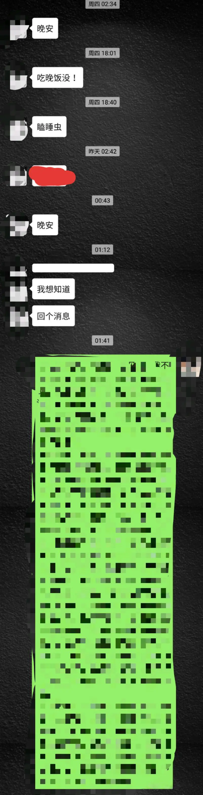

觉得射手男很没担当 好像什么事都能用对不起就解决了 射手男很怕事 不喜欢给自己找麻烦 被射手男伤得透透的 可又跳不出来 各位来说说你遇到的射手男有多渣！

请慎重考虑和射手结婚。本人射手人生建议。

射手很会撩人是真的。就算他不怎么喜欢你，都会装作很喜欢你的样子把你追到手。追到了心想也不过如此。。然后冷暴力。你问他是不是不喜欢你了，他会说不是。其实这个时候他内心在犹豫要不要说实话，但是又觉得不好意思。这里的不好意思是指：比如你去坐公交，只投了一块钱正好被发现。就是这个不好意思。如果你当场戳穿，他会习惯性逃避，你越逼问他越回避，（女生都喜欢逼问，哈哈哈哈）逼急了，他就会逃。而且会说出类似我就这样，怎么着很伤人的话来。你不戳穿，这个时候他选择继续演戏。如果你不作，他可能还会保持一天两头的电话报道微信慰问的状态。然后他实在受不了这种自己欺骗自己感觉的事情了，他就会和你坦白。反正就是就这样吧的意思。你一哭二闹三上吊的话，他会觉得你是神经病。这个时候，不是他的错了。而是你的错，你不让我走。

你要说他没喜欢过你吗？不，他确实喜欢过你，是真的喜欢。恨不得把所有都给你的那种喜欢。但是，射手是很自私自卑又自恋的一个星座。他的喜欢都是出于自我利益的喜欢，是这种我喜欢你跟你没关系我高兴了就好的喜欢。我喜欢这个过程的喜欢。后来发生的也不是他想要的结果，他内心也很矛盾，为什么就不喜欢了呢？其实他自己也不清楚，也不想这样。所以，他选择逃了。因为他不想面对。越麻烦越不想面对。这就是为什么总有女生说射手很花心，出渣男的原因。

这种逃避责任的态度是射手习惯犯的罪过。

每个男人心里都住着一个小孩子。只是射手男的小孩不会长大而已。射手男比较适合做朋友是真的，因为他会让你很开心。

2019.3.5更…………………………………………………………

……………………………………

是不是觉得射手太可恶了。说一个射手好的一面吧。他很念旧，是的。曾经出现过的你，他不会忘记。如果你们曾是校园情侣，恭喜你，如果你曾是他初恋女友，恭喜你。如果你们相恋好几年，恭喜你。为什么说恭喜？如果你此刻还忘不记。去试着找他吧，假如他是单身的话。如果你们只是半路认识，然后很快恋爱。很快分手，那么没必要了。他会想起你这个人，但不会想你。

人这一辈子会遇见很多人，会喜欢上很多人，你是，他也是。不要把自己美好时光压在一个人身上。佛说：遇见的每个人都不是没有意义的（好像是佛说的）。简单来说，就是你遇见的人能让你感到舒适，快乐，就够了。如果让你不开心，请快速止损吧。不管朋友也好，爱人也罢。就这么简单。

2更……………………

废话一波……射手喜欢哈哈哈哈哈哈哈哈哈哈哈哈哈。所以你如果喜欢他请别一起和他哈哈哈哈哈哈哈，不然你只会和他成为兄弟。。。。他喜欢一个女生会蛰伏比较久，会观察。如果真打算处对象，他会这么做。。。他喜欢一个人会比较害羞，真的。。。。通常说女生没有安全感，安全感在射手没有男女之分。。。你们第一次见面很重要，如果是网友奔现，请注意了。。这里和脸没有关系，如果你很漂亮，但是却很高冷，（你所认为的矜持）就算他全程笑嘻嘻，后面继续约第二次也代表不了他喜欢你，充其量只是想yp。。。射手确实外貌协会，但是，他选择牵手的那个有可能是你觉得很一般的女生。。。（安全感！！）是不是觉得你的射手男异性朋友很多呢。。。射手不喜欢哪种女生？请参考顾里（小时代）类型。喜欢哪种女生？请参考刘亦菲型（注意，不是脸，和脸无关）。。。

被射手拒绝怎么办？被拒绝一般是  他有喜欢的人。2他确实不喜欢你。无论哪种情况都=他看不上你。。。他说我们做朋友吧，你们就真的只是朋友。。。被拒绝后天天找他聊天，开始他会回你，只是出于礼貌。后来他会选择无视。不要以为成年射手做不出来。射手不会成年的。。。。（他内心是很烦躁的，不回你又不好，又真的很不想回你。因为你天天发消息，女生发消息都是事无巨细，喜欢一个人就更是了，巴不得事事报备。）。。

射手喜欢玩消失的所有原因可以归结为一点：他不想面对什么事情。什么事也好，总之不想面对。美其名曰：想一个人静静。。。。你问他怎么了，他不会说的。自尊心特强。。。讨厌装逼的人，不分男女。。你看见他和谁都玩的好，其实都是假象。。。不是你挑他和你一起玩儿，是他挑你，不分男女。。。。防备心很重。他不会和你说很多关于他的信息，甚至有可能撒谎在一方面。如果是一开始就这样，代表他不认可你，只是想表面交集，散伙的时候很决绝，都不想敷衍你说好听的话。。。。喜欢一个人没有理由的话。射手是一定有理由的。。。射手的自私连他自己也不知道。。射手的自恋也是。。。自卑他知道。。别不信。。。。

其实，我不喜欢射手座。真的。。。

4月20几？碎念

陆续接到私信。心疼。基本问的是为什么？是不是只是玩玩而已，你是不是他人生中的过客？答案是的。现实吧？除非你有强大的心理去隐忍对他的喜欢，坚持不懈。这需要长期作战，而且是你足够喜欢。提醒一句，在他浪期间(大概就是大学到30岁期间）我单说的大概，不要着重具体数字。。。这个期间最不稳定。你能够在此期间一直持续间断的出现在他生活里。你成功的几率很大。

他打游戏出去玩对你忽冷忽热。。。你都得忍。但是如果他猛然发现你。你就是最幸福的人儿了。对你能上天入地。这个我担保

问题是没人能忍。基本都是直接放弃了。和射手谈恋爱百分之90都是你付出更多。你坚持不懈付出很久，然后你放弃分手。他基本会后悔的。没找到下家会厚着脸皮来找你。经过几个轮回。在浪子想真正拥有一个家的时候，还是会觉得你最好。那么多个，你赢的就是你比其他女孩子付出得多。有病哈？射手

性格方面，射手会慢慢磨掉自己的棱角。不那么直观。当初的愤世嫉俗会变得通透了然。但不会下沉入世。怎么说呢？就是虽然看开了，但还是不会变得那么圆滑。射手基本会被身边不了解的人说性格古怪。幽默风趣之类的。嘴上挂着痞痞的笑。一脸玩世不恭的样子。不要笑，基本这样的。。。。正经起来呢，又感觉很正经。。。对人很好，很绅士。简直自由切换。

我是从写这篇答案开始关注射手这个星座的。以前觉得这个星座挺好。以前也听到看到有说射手渣的。连我身边的朋友都说了，你们射手最渣，出渣男。。。。。但是我喜欢一个人，除非他不叫我走或者涉及到我的痛处，我是不会走的。朋友也是。

想到一个说谈恋爱有一个冷淡期。和射手是不会的，他喜欢你，每天都是甜蜜日常，不会让你无聊的。。。。先更这么多。。。。。(我说的很乱，别介意。基本想到就更）谢谢

2019.5.20几更  关于射手被伤害

大概都听过时间可以冲淡一切这句话。假如你分手了，等你觉得ok的时候，或者是任何关系中，你被伤害了。你是不是觉得都过去了。当两个人很久见面坐下来吃顿饭喝杯茶，感觉什么都好了。

这种对于射手来说，是不可能的事。肯定有人不信，不信试试吧。比如你是一个射手前任（伤害过他的人）。你这个时候打电话给他，他不是语气冷淡就是笑嘻嘻的跟你调侃。也会答应你的约会。你以为几年没见，他就变了。你会发现他一点没变。没说模样哈，就是气质上。两个人玩的比较开心。你以为他什么都忘记了，可以冰释前嫌。甚至还想和他发生点什么。。。

我想表达的是射手很记仇。时间可以冲淡一切？不存在的。前面说过，自尊心很强。追你没追上也包括在内。对你好你没记着在内。对你好你对他不好更在内。有两个字叫寒心知道吗？如果他对你很好很爱你，在他没有什么毛病的情况下，分手复合是不可能的，除非你真的是天使。分分合合不可能的，这种情况分一次就走得很远了。他对人分类，对你好证明认同你，哈哈哈哈哈～你却装高冷。那就再见吧。任何一种关系一样的。划重点：记仇。

收到多个私信都反映你的他：冷暴力。忽冷忽热。额……我想说他对你忽冷忽热证明他对你还是在乎的。为什么呢？对于射手这个物种来说，不管你们什么关系，他有这个举动证明你在他心中还是有位置的呀！没关系的人，他都不会理你的。可能有人会说我说得太牵强了，太会安慰人了。这理由……不是的！不是的！他就是这样的人！只要你们不是亲戚，哈哈哈哈哈，他不的不回你不的不理你。

还有，对于冷暴力这个说法。不要用在自己身上。不要老想自己问题。他不是对你冷暴力，他绝大多数情况下是对所有人冷暴力。别电话微信乱轰炸。到时候他可能就只针对你一个人了。这个可以理解为情商低吧。我也搞不懂射手为毛老这样。横起来，连妈的电话都拉黑，这个举动可以安插在年龄低点的射手男身上哈。

我觉得冷暴力期间他没发动态，没任何动静都可以证明他对所有人冷暴力。所以别想自己问题了，你没问题，不闹最好。发一句怎么了，没接就算了，哈哈哈哈（好了，先不更了，手机打字好累，都不想好好说话了。祝天天开心）谢谢

问一下

射手吸引的多数是不是摩羯水瓶双鱼星座的女孩子？

突然想起：射手特别爱给别人洗脑。而且是不经意间的哦。给你造成一种好像是这个理得错觉。（连分手都是你的错，他万不得已的感觉）意志不坚定的人注意了。

更一个星座配对：

1 射手和白羊：好基友。朋友百分之99（只适合做朋友）

2 射手和水瓶：情侣百分之50。水瓶会被虐。朋友百分之90

3 射手和双鱼：情侣百分之40。双鱼会被虐。朋友百分之60

4 射手和金牛：情侣百分之60，将就。磨合后百分之75

5 射手和狮子：情侣百分之0。容易吵架。朋友百分之60

6 射手和摩羯：情侣百分之70，还好。磨合后百分之80

7 射手和天蝎：情侣百分之60，将就。（个人比较中意的一对）朋友百分之80。

8 射手和射手：情侣百分之0，朋友百分之0

9 射手和双子：情侣百分之40，朋友百分之60

10 射手和巨蟹：情侣百分之50，朋友百分之70

11 射手和处女：情侣百分之0，朋友百分之0

12 射手和天秤：情侣百分之75，磨合后百分之90（个人中意的一对）射手能被天平制

（以上仅个人想法。）

更

严格来说射手很难真正的喜欢一个人。首先看这个星座的形象，上身是人，下身是马。这个星座代表自由。一切事物都比不上他们对待自由两个字的看重。更何况是男射手。

他们接近一个新的领域事物，往往是好奇心驱使。

好奇接近你，这阶段对你充满了兴趣。无论你是御姐萝莉还是高冷女神或者温柔持重，他通吃。（这里不代表喜欢你哈）你以为他想谈恋爱，错了，是好奇。他喜欢的人可多了。

接下来的阶段探索，这阶段的招式对菜下碟。有攻有守。不在乎结果，（不在乎你是否喜欢他）一般十拿九稳。因为基本都抗不住。别问我为什么抗不住，你自己心里比我清楚。

探索中（约会聊天看电影吃饭等）发现你也就那样，（不指颜值，他一般能对不同颜值的人产生兴趣，但肯定是你身上某点吸引了他注意。当然有颜的就更好啦）他会中途放弃（如不再约你，原因是你和刚认识时没区别）。对你越来越客气。如果你是女神，当然首先你得认知自己的女神类型，假如你本来一直是温柔示众，却在他面前翻了本性（逗比）。那么这也会让他放弃。因为他喜欢的是你的公众形象。他接近你的目的不是处朋友啊，所以有意的话还是憋住吧。（现在好多女生都挺逗的）

如果能持续吸引。（肯定你接触起来比他想象中好很多，这里多半是性格在起作用）虽是意料之外，但也是惊喜。这会加重他对你的热情。

在这时，说喜欢你是顺其自然。连他自己也相信他是真的喜欢你。想好好和你处对像。

往往结果也就是我写的开篇那样。

因为会撩（我也不知道为什么这么会撩）。射手身边真的不缺女的。走一个来一个，也许上一个还没走干净，下一个已经来了。

你以为射手长得都很帅？不，这个星座大多出屌丝男。（不是指外形邋遢）反正没多少颜值高的人。而且关于自己长相这点，他比你还清楚，非常有自知之明。

靠什么撩妹？靠气场。气场来源于自信，自信来源于没失手，没失手来源于随性的态度。这种随性的态度是这个星座绝无仅有的。（可以说是情场高手）

不管是你什么吸引了他，如果这个点是伪装的。比如刚认识的时候，你的朋友圈是一派清新文艺女孩风格。（每个人朋友圈风格不一样，但是有些喜欢立人设）结果追你的时候接触下来才知道你并不是这种女孩子。那么，就还是算了吧。。。

射手很难真正喜欢一个人=很难真正崇拜一个人。（后面再说这点）

回到他认真的喜欢谁这点上说。他喜欢的首先肯定是和他完全相反的人。所以，我上面说的星座配对里，摩羯，金牛，天平比较符合这点。

也是我觉得磨合后可以长远发展的星座。（后面再单独说这几个星座和射手）

外形上不是很重要，但肯定不要低于平均水平（现在已经没有哪个女孩子低于平均线吧，稍微打扮打扮都是可以的）。

结合这个基础，再判断。非正式场合认识的可以直接否决（如夜店社交软件。不要问为什么）

我没有和射手男谈过恋爱，身边也没射手朋友。所以我说的只是从自身角度延伸分析出来的。不是绝对，仅参考。

即兴更一条：射手不喜欢胖子！！（对不起了胖胖的小可爱）虽说男的都不喜欢胖子，但射手尤胜。胖胖的外形会让他觉得你是一个无知，懒惰的女孩子。。。。

11月14日

更一波。。。。。。。

一般是即兴码字，想什么说什么。都是以聊天的方式说话。有时候想到了一个东西想说的，可是手机码字比较累，我比较懒，想着过两天再给你们说吧。但又忘了。其实有很多想说的。将就看吧，意会就行。

先说渣男。我对渣男其实没什么概念。不知道渣男到底什么样才算渣，好像也没什么标准来定义。不过后来我发现很多人特别是网上星座里边出渣男的星座就这几个：双鱼，双子，射手。射手应该是排第一。我前面说了我对自己的星座没感觉，也从不注意，因为身边没射手朋友。有时候也挺自我感觉良好的。除了谈恋爱，或者我喜欢谁会去研究一下我和他的星座配不配之外也不太关注自己的星座。基本上我也不喜欢这个星座且周围也有人说过不相信我是射手座。

我不喜欢这个星座的原因我还在找，找到了告诉你们。

前面说过射手是一个自恋，自私，自卑的星座。自恋是没来由的觉得自己挺好，不错。人缘不错，异性缘不错（我异性缘不行），工作也能做得很好。而且如果是在感兴趣的领域内的话，肯定算一工作狂。就算是外貌不行，也不会产生我很丑我就会因为这个自卑的这么个心理，完全不会。（我现在有这个意识了。。哈哈）然后性格也比较风趣，幽默，和谁都能聊得来。话题多，不会冷场。

自私究其根本是射手因为怕麻烦，会本能回避。最怕事儿妈，最怕啰嗦。喜欢和直来直去的人交朋友，因为不会累。所以前面配对里白羊指数最高。性格里直来直去这点相同，所以做朋友很合适。也可以说自私用在射手身上算一个中性词了，因为他并不是为了自己利益化，而是怕麻烦。比如，刚开始他因为冲动脑子一热叫你做他女朋友，在不是特别喜欢你的情况下。后来他确实熬不住了，想好聚好散的本来。但是又知道肯定知道事情没这么好解决。怎么办呢？那就破罐破摔吧，反正我就这样了，怎么着吧。他烦的是过程。他也会内疚，觉得这事做得不对，但是又不想解释。本来就没什么好解释的，就是自己想分手，不想继续了。为什么不想继续，原因不清楚。这是他自己的问题。他需要想明白。所以，很多时候，注意，真的是很多时候，射手真的是突然下子就消失了。也就是你们说的找不着人了。微信不回，电话不接。很多人都反映了这个情况说突然冷暴力，或者就跟消失了一样。其实就是因为他想停下来想一下，想明白，想自己的问题。等他觉得自己状态OK了，他会自己跳出来。所以不要慌。很多人在问遇到这种情况怎么办？在这儿统一回答：先给他发消息，问他怎么了，他如果没回。不要继续发。过两天再给他发，还是不回的话。就给你们共同的朋友打电话发信息问他有没有事，或者有没有聊天之类的，最好找经常一起打游戏的兄弟问。如果他都不知道，那么就是没什么事，至少和你无关。整个期间，都不要打电话发信息轰炸。他是会特烦的，到时候他本来是因为其他事，到时候就会变成我们分手吧。

在这里，要说下，如果他几次这样。你受不了了（是我我也受不了）你可以找他两个人聊一次，不要在微信上聊。当面聊。郑重的说明你真的很不喜欢这样。你可以告诉他，有什么可以说出来。是可以解决的。不要回避。（我相信这个是可行的，至少对我可行。我就喜欢把问题摊开来说）如果他连谈都不愿意跟你谈一次，那么你就要做好分手的准备。也要考虑你们是否合适了。因为射手是愿意和自己在乎的人谈话的，深谈。他是愿意告诉你他的想法的。如果从来没有，那么就像和一个人不愿意带你见他朋友证明你的存在有什么区别。当然，这是需要你们已经恋爱一段时间的基础上。刚开始谈恋爱就玩消失，不用说多半是后悔了。

很多时候，射手特缺乏安全感。所以，他可能有的时候你们聊天，本来都聊得挺高兴的。或者是你们氛围挺和谐的在一起干嘛，他可能转头会突然冷不丁的说一句，类似于你觉得我们合适吗或者我们以后会走在一起吗（这里只是打比方）这种类似有点消极的话来。

自卑是由于自恋。觉得自己都行，也觉得自己什么都不行的这么一个心理状态。所以，很多时候，私下是消极的。看待问题也是。也会本能的回避问题，不想解决。也就是想自我消化。这导致了对很多事都是一种随性的态度，无所谓。随性散漫，热爱自由。

人格也会变得多元化。感觉琢磨不透，自己也不知道自己是一个什么样的人，什么样的性格。外向吗？不是，只是展示的一面。话多，那是因为想说话。第一次见面，你觉得射手兄弟一路都不吭一声呢怎么，那是因为他不想说。可能是因为里面有他不喜欢的人。如果不是交际应酬的局，那么八成就是这样。不得不要见不喜欢的人，会特正儿八经的夸你，其实都特假。演起来就跟真的一样，哈哈哈哈哈哈哈哈哈。每次都夸，你今衣服不错，发型也很好。（比方）等等。

你看他在旁边随时附和。嗯嗯，你说得都对。

他讨厌谁不喜欢谁和喜欢谁都是有依据的。不是说他讨厌谁找不出理由。比如他讨厌走形式的人，因为你确实是走形式，爱显摆，爱吹牛。他一眼就看穿了。是男性的话，他觉得特好玩儿，不说穿。还随声附和你。女性的话，最多就是直接忽略了。很多时候他知道一些事情的本质，但是他不会说穿。会看你怎么演，陪你演。

射手的观察力很好的哦。一眼注定生死。对第一印象很看重。

喜欢谁那肯定是你身上某点吸引了他。但是，吸引了他也不一定代表他有想和你谈恋爱的想法。比如你们刚认识，加了个微信。你发现他隔三差五的都在找你说话，有时候还稍微关心你一下。这时候女生就在想他是不是想找你谈恋爱。注意，谈恋爱和喜欢在射手看来是两码事。喜欢是不一定要谈恋爱的，你只是吸引了他。有好感而已。（我说的喜欢在这里是比较浅层次的）如果他从头到尾都没说出，我们在一起吧。那么请不要理解为他是想找你谈恋爱。很多时候，女生都会误读这个情况。一个男生时不时的找你聊天，不是想谈恋爱是干嘛。射手不是的。他自己也不知道这个其实是错的，是在释放错误信息。等他还没反映过来聊着聊着，女生已经对他产生了好感。不表白还好，一表白。他才会发现，天啊，原来你喜欢我。可是我不喜欢这样，好大压力。我还是走吧，拜拜。本来是件挺好的事，因为射手和谁谈恋爱时间会持久，就是从朋友开始的恋爱啊。真的是这样。（我可以很确定的说）没有什么比朋友开始的恋爱更合适射手的。这个时候，在他还没反映过来，你表白，那么他就会想又不了解我，我们互相都不了解，你就喜欢我，你到底怎么想的？你是不是一个轻浮的人。你对待感情这样轻率的吗。会把他吓到。本来对你的好感就会完全没有。找你时不时说话，肯定是好感开始的。完全没有了，那么再想回到以前那个状态是不可能的了。窗户纸一捅开，都不行了。

他只要没说，就是没那个意思。就是真实的想跟你做朋友。可能后来发现你真的挺好的，那么你们就真的会成为很幸福很甜蜜的一对了。

如果是加微信就马上说谈恋爱。你就要注意了。他是不是想约炮。不管说什么，都不要答应。除非你真的很自信认为自己是天仙，美得不可方物。真的自己恰好万一就是他的理想情人。要知道，我前面说过，射手异性缘可是很好的。身边不缺女的以及女性朋友。

你答应后，最多三个月你就要经历魔鬼冷暴力过程。因为新鲜劲就三个月啊，可能一个月就没了。

恋爱时如果能给你聊他的家庭和他朋友，以及他生活私事以及他的想法。那么他对你的认可度是比较高的。特别是家庭。如果能跟你说他的童年往事，少年往事各种。父母成员各种。因为射手的家庭观念很重。很孝顺父母。能给你分享这些，说明已经很认可你。说不定已经把你定位结婚对象了。

射手把结婚和恋爱分得很开。恋爱是不一定要结婚的，应该是恋爱的对象和结婚的对象分得很开。而且都比较恐惧婚姻。

其实，很多时候我觉得射手是没受过打击。我相信如果他在感情上遭受一次重创（姐妹，靠你们了）给他深深一次伤害。我觉得他在对待感情上就会成熟很多。

分手时说话太激烈，比如我觉得和你在一起，感觉我们以后日子会很苦。或者平时就老在他面前说闺蜜男朋友今天给她买了什么，而你又怎么怎么样。这种话对男人听来都不舒服，但是对射手是如雷劈。我认为如果他有能力给你买，那么他肯定给你买高兴。射手对金钱其实就没什么概念的。对自己在乎的人都是买买买（反正我就这样）不管朋友，还是家人，喜欢的人就不用说了啊。两个字大方。我还真没听过说射手抠门的。不像金牛男，金牛男的付出（物质方面）那他是认定你是女朋友了，或者说认定你已经是结婚对象了。这个是有交换条件的。射手不一样，射手是对喜欢的人，都挺大方的。就算最后不一定能在一起。不会计较这些。

如果真对你“抠门”，那他除非平时自己就很节俭。这个可能和原生家庭有关，比如他家一直都很穷，但是他爸妈教育得好。教他不要乱花钱，他知道这钱来之不易。上大学的钱还是借的。那么他才会对钱才会有概念。那么他再“扣”。对你应该还算可以的吧。除了这个原因我想不出其他。因为射手天生性格就不像抠门的人。

一个人的人格，性格各方面的形成我认为除了后天的很多的都是可以从原生家庭去寻迹的。包括渣男，他是一个什么样的人，他这个人怎么样。都是可以寻迹的。原生家庭的重要性我就不说了。渣男知道自己是渣男吗？有很多真的不知道自己是渣男，而且还狡辩。有很多渣男在感情上就是有缺陷，但是他自己并不知道。而且他觉得这样没问题，很正常。比如甩了一个又一个，女生为他寻死觅活的。

父母不和谐。母亲没什么话语权。甚至父亲出轨，离婚等等。这就会造成他长大没法尊重女性。没这个概念。但是不会妨碍他其他方面很好，很优秀。唯独在感情方面是一个缺失。

射手一般会让你知道他是明明白白的渣男。一开始就告诉你他不是好人。就表明他跟你没戏，只是把你当普通朋友，或者是不得不这么说。让你不要想着还有发展。

射手应该是属于越优秀就越渣的人。

射手星座的人是我认为十二星座里最有趣的。（不接受反驳）附带自夸。。。

射手的出轨率高。（不是总结，是直觉）

金钱方面，容易沾上赌博或者沉迷游戏之类的。已经结婚的朋友注意了。

先更这么多。

抱歉，来晚了，还是更一波吧

首先要说的几点

1不要再质疑我身边没射手星座的人，何来的这些观点。我要告诉你射手其实很精分？直接问我是不是在撒谎，我会觉得你更诚实。

2我说过的观点，不想重复。质疑的请仔细看。虽然我说过多次我更得比较乱。即兴码字

3不要带着情绪说话。也不要怼我

下面正题

如果把男人划为理性和感性之分，那么你们觉得射手是归理性还是感性？

我觉得两者都划分不了。射手是往前一点特别理性，往后一点就特别感性。

有说男人不都大都理性吗？社会之驱，哪敢感性。但是射手不一样。他们时刻都是站在中间的。有时候往前，有时候往后。

大多数是往前的。不过不代表他们就大多数都是清醒的。他们往后一点的时候会深恶痛绝此时的自己，然后逼自己往前。所以，这个往前，都是逼自己的。

如果你发现他从没感性过。那绝对是他在做某件事时因理性思维带来了成功，达到了这件事的目的。成就感带来的愉悦和女孩子表白男神成功是一样的。

也许你们听不懂，举例吧（我很喜欢举例，哈哈）比如，分手后想复合的女孩子一般都想让对方来找自己，还想知道他分手后的心理活动到底是怎样的。

射手是这样的：他会难过会伤心。但是，他会逼迫自己分散注意力，不管用什么方式。这个就是目的。如果他成功了，那么就会再往前一步。第二步就是分析你和他之间的可能性。如果他觉得你们不可能走在一起。在这个过程中也发现自己原来不那么喜欢你。那么他就会算了。再回头找你已没必要。

不找你不联系你就是目的。这个做到了。那么基本期待他回头无望。

这个比方，都是女孩子，应该看的懂吧。（我生怕你们看不懂我说的什么意思。）

再解释一遍：意思就是说只要他因为理性所做的决定而成功的事。而且是他觉得所正确的事，他是不会回头的。

在这个上面，是绝对的冷漠绝情。不正面回应也不留任何一点退路。话也会说的超级绝。很寒心的那种。。。。

说到冷漠绝情，扯一下关于友谊的。

好朋友闹到决交，大家可能都觉得是因为比较大的事情，起码是牵扯到利益上的，比如钱。才会绝交。

但是射手不是。你和身边的射手朋友绝交绝对是因为她/他。为什么说是因为她/他呢。因为当时你就是觉得自己没错，为什么射手就大发脾气，而且还说一些平时从没说过的话，甚至觉得像变了一个人。总之好像记恨你很久的样子。怎么回事？

是这样的：任何吵架，生气绝对不是没有原因的。射手不可能无缘无故因为一件小事大发脾气，甚至闹到绝交的份上。能这样，绝对是积累了很多不满。只是平时看在眼里，不说。不说不代表不敢说。是不想说。说了没用。到了压死骆驼最后一根草的时候。就是彻底别离的时候了。我想说的是，别误会就好了，反正不会因为钱。

比如你对她说，你皮肤怎么这么差？你又胖了？你长得丑？不是。上面说过射手有自知之明的，如果真皮肤差，不好看。说这些问题时，他不会和你生气。还会正儿八经和你讨论，哎呀，就是就是，我也觉得。然后再哈哈哈哈哈哈哈哈哈哈。。。。。

什么会生气？1误会。误会他/她的动机。比如她今天不想吃饭，你来句，难怪这么瘦，每天不好好吃饭。为了漂亮，啧啧啧。。

好冷哦，你不冷嘛？穿这么少。你新剪的发型？好丑，你怎么剪这样的发型（此处对应射手男）类似这种阴阳怪气。？（我想不出了哈哈）相信我，这种直接会被射手拉进黑名单。你觉得射手会怎么面对这种情况？他会沉默，控制不住的会拉脸。能控制的会先沉默几秒，然后微笑的给你说，就是。然后下面约会的时间，你会发现气氛有点微妙。

此后，他会尽量减少见面。就算见面，和从前一样哈哈哈哈哈哈也代表不了什么。

这种次数多了，就等压死骆驼的那根草。通用射手男女，感情友情都一样。所以，不要奇怪为什么感觉好像平时好好的，怎么就翻脸了。你还会觉得，Wc，脾气这么怪？

忘了还有一条：践踏他的天真和尊严。想不到吧，前面说过，射手是小孩子心性。他/她只会在好朋友和亲密的人的面前展示这一面。假如你让他受到了伤害，黑名单见。比方，他说他喜欢宫崎骏的动漫。你嘲笑。比方他给你表白，你拒绝的言辞添加了一些侮辱性的词。这类似的情况，他会下来偷偷难过。女的话，会下来哭。但不会从此失去了希望。天真和希望，这两样东西射手永远都不会失去的。不管曾经经历过什么。

天真遭遇伤害时，告诉他们要现实，要理性。逼迫的，强迫的。不想成为那样的人。改不了吧，回到了感性。就这样弹过去弹回来。挺矛盾的。

所以总结一句：射手是很容易抑郁的星座。是真的。不要质疑。

后续继续更。

来了2020 7 4

很想把这篇帖删了。现在看一遍都不知道在说啥。。。

分享下最近。纯属吐槽

谈了一个男朋友。两个月夭折。

对方双鱼。我实在受不了了。简直病娇体

我不喜欢在微信上聊天。一般有事说事。不回消息是常态。比如，发一张图，发一首歌类似这种分享型消息，不回。当然，我看到好笑的，好玩的，也会分享。你回不回都没关系。大家都很忙，我喜欢舒服自在轻松的交际关系。

这是前提。只吐槽交流问题，我不喜欢有交流障碍的人。

因为我喜欢，所以刚开始我也比较主动。但是交往后面发现了一些问题

给他打电话发语音不接。接了说等会儿打过来。晚上就收到一句晚安。第二天，中午收到一句你在干嘛？我打电话过去。（这就是我喜欢的聊天方式，在知道对方有空，且不打扰的情况下）但是没接，或者接起来说等会儿打过来。结果晚上又是一句晚安。后面我知道他这种日常操作后，我也就不主动了。他不明就理说我不理他。发来上一句后面一秒钟紧接着说我不理他。。。消息我是恰好有次看到了的。不知道微信有显示时间间隔吗？我？？？？我是崩溃的。后面有次又这样。我就这个事，给他发了一长段话。把话说清楚

我以为他听进去了。结果。。又开始了表演。而且我不知道一个大男人为啥每天那么多愁善感，包括他发的一些朋友圈和一些其他平台上的信息。多愁善感可能是褒义词。但是我这里指的是他很负能量。让我。。。。。

最后，就在刚刚。我说了分手。把该说的都说了。分手的原因包括一个触及到我原则和底线的事，不方便说。

可以说我谈了一个假恋爱。

但是也有美好的时候。见面是真的开心。

说两点：射手如果还能就一件事和你讨论，讲道理，说明还没严重到分手的地步。

如果没解决，那么过段时间。就会收到分手的消息。结尾的话男女都会用的：就这样吧。好好过。

冷暴力过后不一定分手。射手的冷暴力不是故意的，（虽然不想辩解）第一次冷暴力是想有个缓和的过程和空间。想让对方自己想明白问题出在哪儿，如果没有。还能和你沟通，不严重。沟通还解决不了，没办法，继续冷暴力。这次也许就是最后一次了。如果和平分手，问题不大但还是触及到射手不能忍的事情上（意思就是两个人相处发现只是性格不合适，没有其他特别大的问题）。那么分手过后是会愿意做朋友的。

我两次冷暴力过后说的分手（我没想到我也会冷暴力。。。我晕）他让我回一个消息。我也不想就这么拖着。于是就有了上面分手长信息。我喜欢把话说清楚。如果直接说分手，说明厌恶到了一定程度。

这样的，我不想做朋友。除了让我觉得累之外，还有原则上的问题。

手好酸。下次说下与射手的交流方式和注意的点。这个以前就想说的。现在想起了，这么晚了，就下次吧。（我发现我前面说的要说的点都没说）不好意思哈，我一般即兴更，所以状态比较重要。

好了，就这样吧，好好过。大家。哈哈哈哈哈哈哈哈哈

—END—

