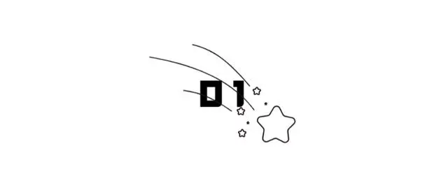
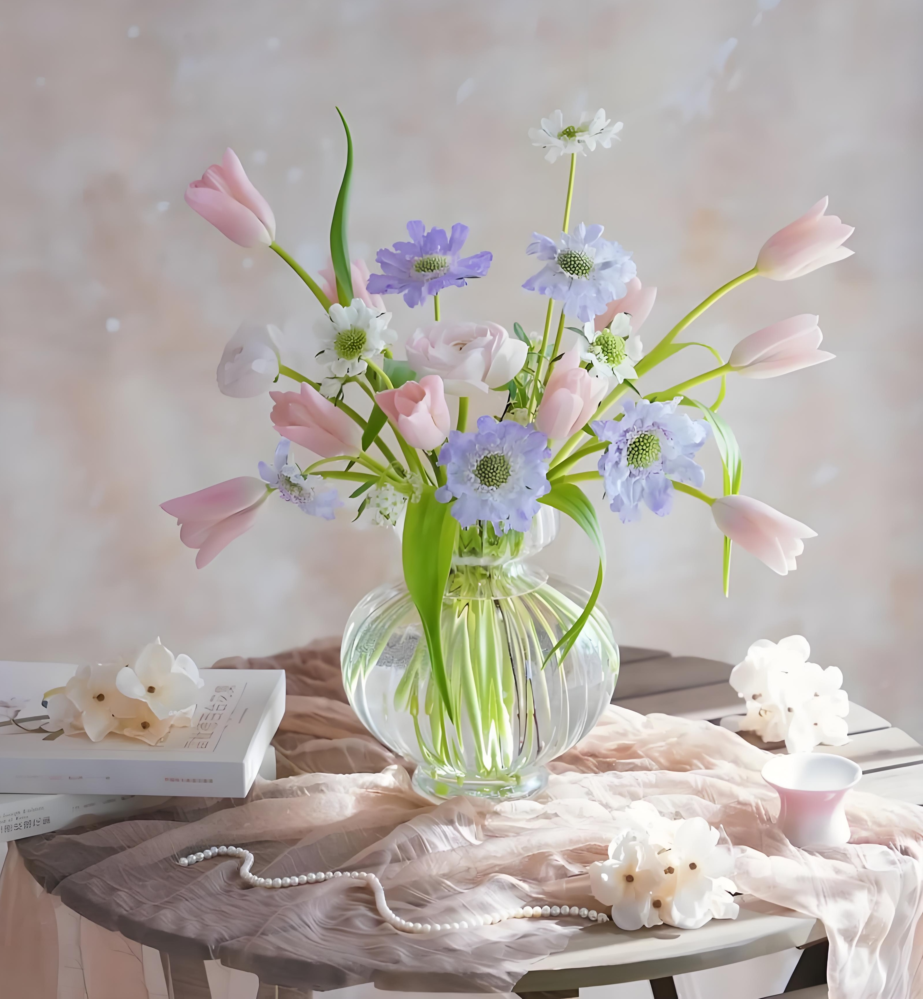
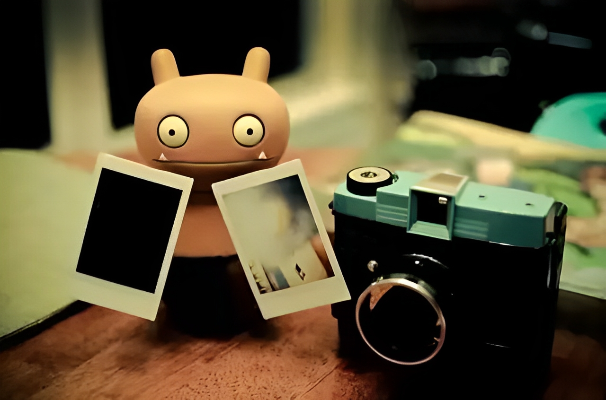

子夏问孝，子曰“色难”。

我们总说孝顺，那么什么是孝顺呢？孔子认为，和颜悦色就是孝顺。

孝顺，最难的就是保持心情的愉悦。

然而，一个人只有自己开心，才能够向外传递正能量。

所以，人生最重要的事，是先照顾好自己。

  
  <h3>1</h3>
  <h3>照顾好自己的身体</h3>

你知道，这个世界上最能改变人的地方在哪里吗？

答案是：医院。

因为到了医院，脾气再犟，你也得听医生的。

因为到了医院，工作再忙，你也得停下来。

确实，人一生病，说什么都是徒劳。

正如稻盛和夫所说：“不论你多么富有，多么有权势，当生命结束之时，所有的一切都只能留在世界上。”

有位年轻人向一位高龄创业者请教，你是如何成功的？

这位睿智的老人，温柔的说：“你不必着急，只要照顾好自己的身体，其他老天自有安排。”

年轻的时候，她也曾遭遇大风大浪，但是无论发生什么，她都保持规律的生活。

佛家常说，修行就在日常。

正所谓“天助自助者”，当你珍惜自己，福气自然会来。

 
  <h3>2</h3>
  <h3>照顾好自己的生活</h3>

松浦弥太郎，是日本有名的畅销书作者，他被大家称为“日本生活美学大师”。

他出版了很多书，这些书大多讲的是一些日常小事。

比如，和家人一起吃饭，把工作台打扫干净之后再回家之类的。

这些书读起来轻松，却也发人深省。

他认为，“要像父母对待婴儿一般对待蔬菜、鸡蛋等食材，以及生活器具、服装、植物等身边的一切物品”。

这个观点，他是受到了一位高僧的影响。所谓“优雅的生活”，并不是物质的堆积，而是心境的塑造。

不要什么都想要，而是取舍有度，过一种舒服的生活。

生活过得好不好，不在于多少，而在于是否用心。

他的这些理念，让我们重新思考，究竟怎样的生活方式，更容易让我们获得满足。

世上有千万种人，就有千万种生活方式，找到一种最适合自己的生活方式，用心经营，相信你也可以过得快乐。

  
  <h3>3</h3>
  <h3>照顾好自己的情绪</h3>

作家胡夫兰德说：

“一切对人不利的影响中，最能使人短命夭亡的，就是不好的情绪和恶劣的心情。”

人生就像一个怪圈，越好的就会越好，越坏的就会越坏。

心理学有个“踢猫效应”，讲的是有个父亲，在单位里受了老板的批评。

回家后就拿孩子撒气，结果孩子一生气，踢了一脚猫。

坏情绪是会传染的，如果你的情绪不好，不仅会伤及家人，还可能伤害身体。

中医讲，生气一小时，等于熬夜六小时。

没事别生气，做点什么不好呢？

遇到不痛快的事，不如找个可以让你情绪变好的地方，放松一下。

伤心，失落，不愉快，每个人都会有，不同的是，每个人应对的方式不同。

生活，无非是选择。你选择快乐，心情就会舒畅；你选择了太阳，生活就会阳光。

拥有什么样的心境，就拥有什么样的生活，爱自己，就学会照顾好自己的情绪。

有句话说得好：

“人到一定岁数，得学会自己撑伞躲雨，再也不会有人冒着大雨来接你了。”

生命轮回，与其做一个等别人撑伞的人，不如学会照顾自己，成为可以为别人撑伞的人。

余生，好好照顾自己，与君共勉。

—END—