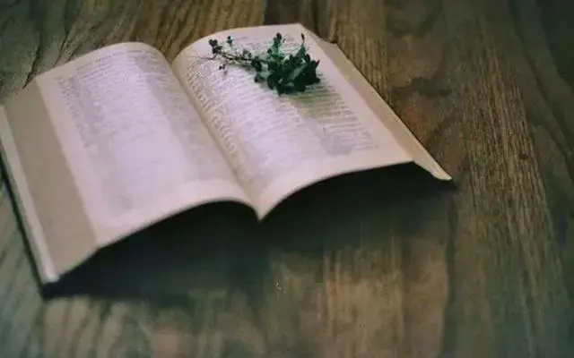

古德云：

“至道无难，唯嫌拣择。”

至上的大道不难，只怕有人挑这挑那。

正所谓，行是禅，坐是禅，行走坐卧间都是人生的道理。

无论境遇多么艰辛，我们都不要抱怨，抱着一种学习的态度，放低姿态，才能过好生活。

  
  <h3>不计较</h3>

星云大师说：

“能干的人，不在情绪上计较，只在做事上认真；无能的人，不在做事上认真，只在情绪上计较。”

时间是有限的，你把它用在哪，它就在哪里显现出它的“果”。

你若每日悲伤痛苦，生活绝不会因为你的抱怨，有任何的好转。

你若认真做事，好好生活，光阴也不会亏欠你。

你的命运，掌握在自己的德行中。

计较，往往做不了大事。太在意一城一池的得失，最终失去的可能是整个天下。

《汉书》中记载：

“（项王）于人之功无所记，于人之罪无所忘；战胜而不得其赏，拔城而不得其封；非项氏莫得用事；为人刻印，玩而不能授；攻城得赂，积财而不能赏。天下畔之，贤材怨之，而莫为之用。”

别人的功记不住，别人的过却忘不了。给人授官的时候，连官印都刻好了，却舍不得给，自己不停地抚摸把玩。

最终，项羽失去了人心，也失去了天下。

斤斤计较，不仅得不到想要的，反而会失去更多。

做人，就应该心胸开阔一点。不要在小事上纠缠，不要在无意义的事情上浪费时间。

正如人们常说的那样：

“人有一分大度，便有一分气质；人有一分气质，便多一分人缘；人有一分人缘，必多一分事业。”

当你越来越宽容的时候，路也会越走越宽广。

  
  <h3>常知足</h3>

《遗教经》中说：

“不知足者虽富而贫，知足之人虽贫而富。”

炒菜的时候，放适量的调料，可以提味增香，但如果放的过多，则会盖过饭菜的本味。

同样，欲望不要太多，心灵才会更加平静，生活才能品出真味。

不要羡慕别人的生活，更没有必要羡慕别人所拥有的。

生活简简单单，就是福气。

心里满足，面上就没有苦相。自己轻松自在，生活就不累，人就显得有精神。

“人人知足则天下有余，人人安分则天下无事！”

穿衣打扮，干干净净，适合自己，就很好看，没必要比牌子，比价位。

放下了过多的物欲，生活变得轻松自在，精神也得到了滋养。

常言，知足常乐。

知足的人，不埋怨；知足的人，珍惜当下。

因为珍惜，所以生活也会变得温暖且安然。

  
  <h3>懂感恩</h3>

人的一生，不应该只是索取和抱怨，应当学会感恩和奉献。

感恩，本就是宇宙最强大的法则。

感恩一粥一饭，感恩亲人的陪伴，感恩你的身体，感恩大自然。

感恩你所拥有的一切，把这个想法刻入生命中，生命的能量就会发生转变。

宋佳说：“女孩只有快乐，运气才会好。”

懂感恩的人，心里是温暖的，面色是红润的。

他们不会因为得不到，心生怨念，只会对拥有的，倍加珍惜。

康德说：

“在晴朗之夜，仰望天空，就会获得一种快乐，这种快乐只有高尚的心灵才能体会出来。”

感恩，让心灵获得平静，让幸福变得简单。

星云法师说：

“心中要有主，才能立处皆真；心中要有德，才能涵容万物；心中要有道，才能拥有一切。”

大道至简，心怀天下，才能海纳百川。

少计较，得人心；

常知足，得福气；

懂感恩，得运气。

你计较得越少，人生的福报就会越多。

——END——

