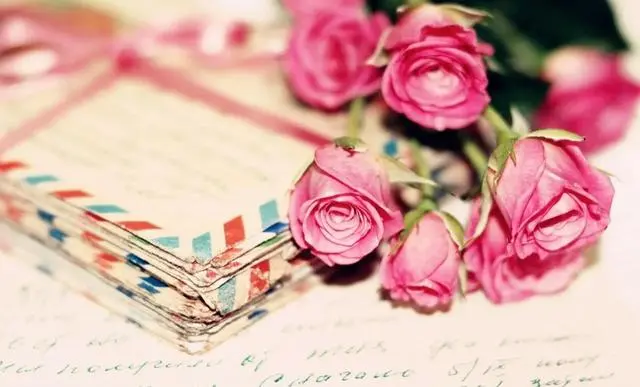
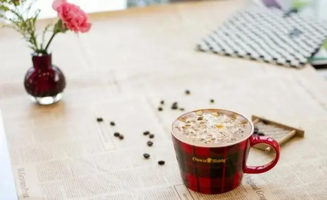
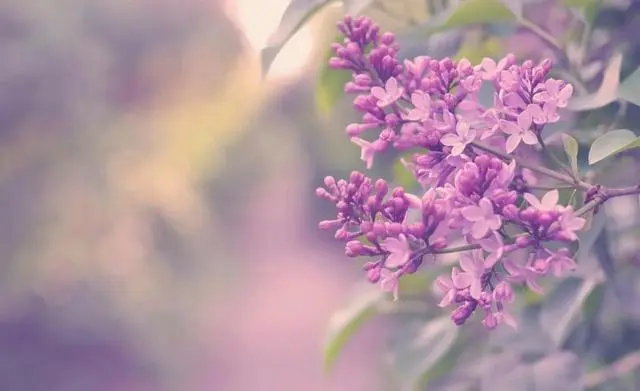

很喜欢一句话：

“没有独善其身，何来兼济天下？”

好的人生，就是先照顾好自己，其他随缘。

忙的时候，专心致志，闲下来，就要学会放松、放空。

脸上带着笑，身体常运动，打开心胸，福气自来。

  
  <h3>少思虑</h3>

《黄帝内经》中说，脾主思。

如果一个人过度思虑，就会影响到脾的运化功能。

会使身体出现问题，比如消化吸收功能差，食欲不振，头晕目眩，甚至会出现焦虑等症状。

思，本来是人的正常精神活动。

然而，过度的思考，不仅对生活没有帮助，反而会损害身体。

《红楼梦》中，林黛玉就是因为忧思过多，最后香消玉殒。

《论语》中也记载，季文子办事总是三思而后行。孔子听闻却说：“思考两次就可以了。”

思考多了，犹豫不决，反而什么事都做不了，还伤神内耗。

治疗思虑过多的方法，一个是放下，一个是行动。

放下犹豫不决，放下恩怨计较，放下不甘心，然后行动。

放下过多的欲望，放下对事情的掌控，学会顺其自然，学会坦然面对，你才能活得更加真实，活出最好的状态。

  
  <h3>多微笑</h3>

狄更斯说：

“只有在你的微笑里，我才有呼吸。”

微笑，给人带来强大的精神力量。

曾经，美国总统杰斐逊与官员们，骑马到乡间出游。

到了一座断桥边，有位农夫看见他们，就径直走向杰弗逊，请求他的帮助。

原来，他想要让马渡河，可是自己没办法做到。

于是，杰弗逊就指挥大家一同帮忙，最终将马顺利地送到了对岸。

过后，有人不解地问农夫：“你怎么知道要找我们的杰斐逊总统？”

农夫惊讶地说，他并不知道那人就是总统先生，他只是在那人的微笑中，看见了YES（是）。

微笑，就是接纳，就是用温柔包容世界。

爱笑的人，总给人力量，因为他本身就充满了力量。

微笑不仅鼓舞他人，也滋养着自己的身体。

据统计，每笑一声，相当于从脸部到腹部约有80块肌肉在参加体育运动。

开怀大笑，驱散阴霾，是最好的良药。

正如《菜根谭》说的那样：

“天地不可一日无和气，人心不可一日无喜神。”

微笑，就是你最好的护身符。

  
  <h3>心放宽</h3>

《景行录》里说：

“片刻不能忍，烦恼日月增。”

心窄，一点小事都容不了，那么往后余生，就只能活在幽怨中，片刻不得安宁。

别人的一句闲话，他人的无心之举，若是处处计较，这人生就会充满痛苦，失去活力。

常听人说，心宽才是福。

少年时，不懂这句话的意思，经历一些事情后，才知道了它的深意。

心宽，不是懦弱，也不是逃避，而是能够放下的智慧，敢于转身的气魄，勇于面对的胆识。

佛说，烦恼即菩提。

每一个菩提，都是一次增长见识，开阔人生格局的机会。

所谓困境和苦难，就是走不出去。如果走出去了，就是成长，就是阅历。

北宋朱敦儒曾写道:

“世事短如春梦，人情薄似秋云。不需计较劳苦心，万事原来皆有命。幸过三杯酒好；况逢一朵花新。片时欢笑具相亲；明日阴晴未定。”

浮世人生，莫要自寻烦恼，努力做好自己，其他放下随缘。

人们常说：

“一个人的快乐，不是因为他拥有的多，而是因为他计较得少。”

往后余生，少思虑，常微笑，放宽心，尽力而为，过好每一天。

—END—

