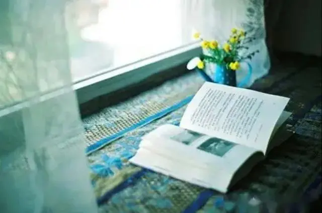
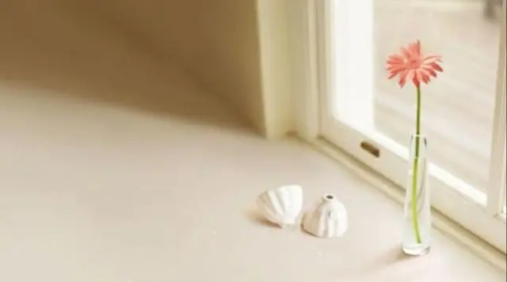

  
  <h3>不做老好人</h3>

《人类群星闪耀时》中说：“人只需让步一次，就会不断让步。一次妥协，势必导致一连串新的妥协。”

这句话深刻地揭示了，人们在面对冲突和不同意见时的心理和行为模式。

在人际交往中，一次妥协并不可怕，或者说是再正常不过的事，怕的是，次次妥协，甚至把妥协当成了习惯。

在心理学中，有一类人群被称为“情绪高敏感人群”，其中的一个重要特点，就是“习惯委屈自己，迁就别人。”

同样的东西，本来自己也想要，却因为考虑他人的情绪，怕别人不开心，于是就放弃了自己的需求。

这类人群在人际交往中，常常给他人很容易亲近的印象，但同时也很容易让他人忽视。长此以往，心理的缺失感会越来越重。

一个人，当然不能太自私，但是也不要过度无私。

忽略自己的感受，只会让心灵感觉疲惫，身心失去平衡。健康的人际交往，应当是在满足自己的需求上，与他人和谐相处。

  
  <h3>学会拒绝，敢于说“不”</h3>

有位教授曾发出过这样的感慨：“央求人固然是一件难事，而当别人央求你，你又不得不拒绝的时候，亦是叫人头痛万分的。”

这句话道出了很多人的心声。即便很不情愿，因为不想让他人失望，不想让自己不被他人喜欢，很多人只能委屈自己，答应他人的请求。

曾经，有位愤世嫉俗的青年拜访了一位哲人。

他向哲人请教，如何能够得到幸福？

哲人回答：“一切的烦恼都来自人际关系，所谓的自由，就是被人讨厌。”

上述情节，是日本作家岸见一郎和古贺史健合著的书籍《被讨厌的勇气》的内容。

这本书告诉我们，一个人要想获得幸福，就要敢于做自己，为自己的人生负责。不要过多的在意他人的眼光，不要让自己的人生迷失在他人的想法中。

这并不意味着我们要做一个自私的人，而是告诉我们要学会拒绝，敢于对他人说“不”，敢于亮出自己的观点和想法。

真正的平等是，我捍卫你说话的权利，但也保护自己的观点和立场。

卓别林说过一句话：“学会说‘不’吧，那样你的生活将会好得多。”

成年人的世界本身就是选择，你只有去繁，才能就简，你只有学会拒绝，才能更好的与他人相处。

  
  <h3>关注自己的需求和感受</h3>

有句话说：“我们越关注自己的需求，就会变得越真实可靠，越平和从容。”

一个人内心越富足，就越能感受到他人的需求，也就越能理解和接纳他人。

当我们关注自己的需求时，我们会变得更加自信和坚定，因为我们知道自己想要什么，也更清楚自己的价值。这种自信和坚定，是自己给予自己的力量。

我们越幸福，就越希望别人也幸福；我们越快乐，就希望别人也快乐。

一个人最重要的使命，是让自己获得幸福，变成一个快乐的人。

有句谚语说，赠人玫瑰，手留余香。而这个的前提是，你手中首先得有玫瑰。

满足自己的需求，就是先把玫瑰赠给自己的过程。

日剧《面包和汤和猫咪好天气》中有这样一句话：一个人只有被好好的爱过，才能平常的爱他人。

看见自己吧，请好好的爱自己，就是你送给世界最好的礼物。

——END——
