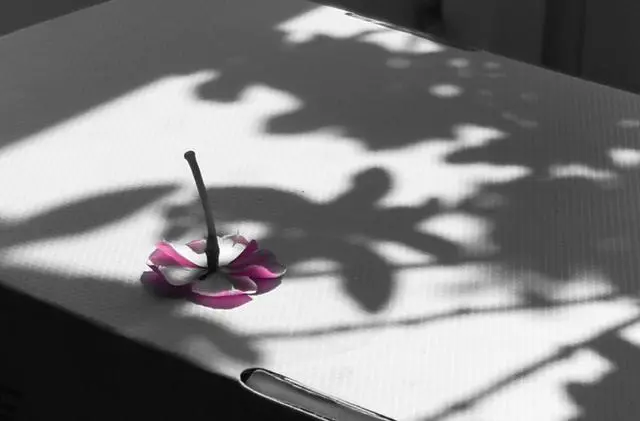
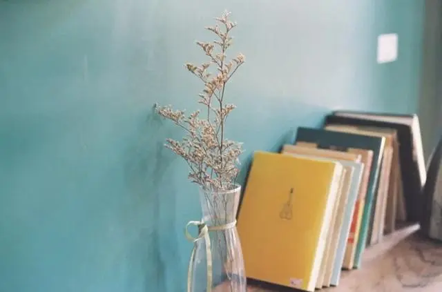
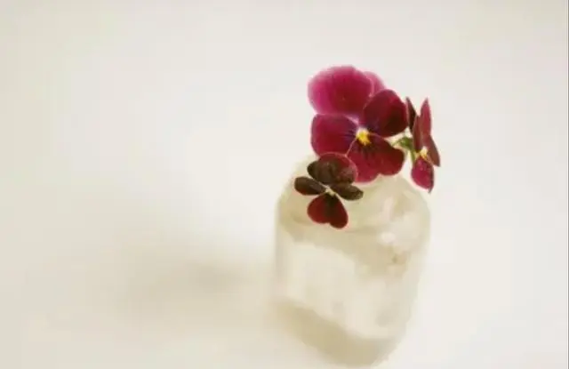
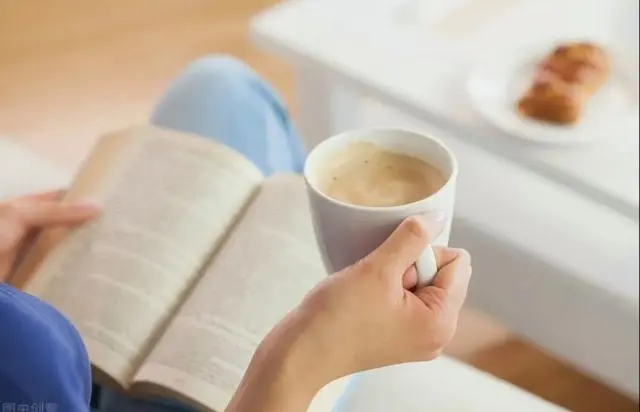

  
  <h3>什么都要，等于什么都不曾真正拥有</h3>

有位女演员，她拥有上万件衣服，即便如此，她仍不满足。她总是在网上和不同的衣服店购置衣服，最终，衣服多到即使一间很大的房子都无法容纳。

即便如此，在很多人的眼中，她仍然是一个不懂时尚的人，而且因为她购置的衣服太多，导致家里很乱，都没有办法邀请朋友来家里。

生活中，其实有很多这样的人，因为购买欲和占有欲，把东西堆的满满的，却无法真正享受生活。

东西不是越多越好，而应当物尽其用。

一本好书，只有被反复阅读，其中的道理和知识，才能真正被吸收；一件衣服，也只有经过精心搭配和整理，才能散发出它应有的魅力。

一件物品真正的价值，不在于数量的多少，而在于质量的优劣。

好的生活，不是毫无目的的占有，而是珍惜拥有，细细体味。

  
  <h3>放下过多的欲望</h3>

现代社会，我们常常被各种欲望所困惑。对于金钱的渴望、名利的追求、物质的欲望，不仅让我们迷失了自我，还让我们失去了对真正重要的事物的关注。

曾经，有位年轻人一直抱怨自己不够富有。

后来，这个年轻人遇见一位80岁的老人。老人对年轻人说：“我可以让你变得富有。”

接着，老人继续讲，只要你愿意把年龄和我交换，我就愿意给你1000万元，年轻人果断拒绝了。

很多时候，我们迷恋的外在事物，常常让我们忘记真正的自己。而当重重迷雾被剥开后，我们才发现，其实我们一直忽视了自己，忽视了身边很多重要的事情。

我们不能否认欲望的存在，正是因为有了欲望，才让我们不断追求。但是，我们也不能总是被欲望牵着走，变成欲望的奴隶。

放下过多的欲望，找寻真正的自己，认识自己，才是我们一生的追求。

  
  <h3>珍惜当下的生活</h3>

“问君能有几多愁，恰似一江春水向东流。”

人生不如意事十之八九，不同的是，有人只记得八九伤心事，却忽略了自己拥有的一二幸福。

其实，人生如一列火车，我们能够看到的只能是当下的风景。无论过去是好是坏，都已经过去，既不可能更改，也不会重来。

过去经历的事，只可以给我们人生经验，让我们成长，让我们蜕变，却不能成为我们过好当下生活的绊脚石。

真正的生活，在当下，在此刻。

太宰治在《人间失格》中写道：“在所谓‘人世间’摸爬滚打至今，我唯一愿意视为真理的，就只有这一句话：一切都会过去的。”

所有过去的经历，已然成为过去。而所有当下正在经历的，如果不珍惜，一样也会成为过去。

光阴似水，人生如梦，抓住当下，才无悔一生。

  
  <h3>享受生活，学会放下</h3>

梭罗说：“把一切不属于生命的内容剔除，简化成最基本的形式。”

梭罗的这句名言提醒我们，要时刻保持警觉，将生活中无关紧要的事物删除，才能专注于那些真正重要的事情。

在他的名著《瓦尔登湖》中，梭罗抛弃了城市的喧嚣和繁忙，选择在湖畔建造简陋的小屋，过着与自然和谐相处的生活，他将生活精简至最基本的形态，却过得安静从容，倍感幸福。

愿我们在忙碌中，学会享受当下的美好；愿我们在凡尘中，懂得放下和舍弃，学会享受当下，学会安放自己的灵魂。

——END——