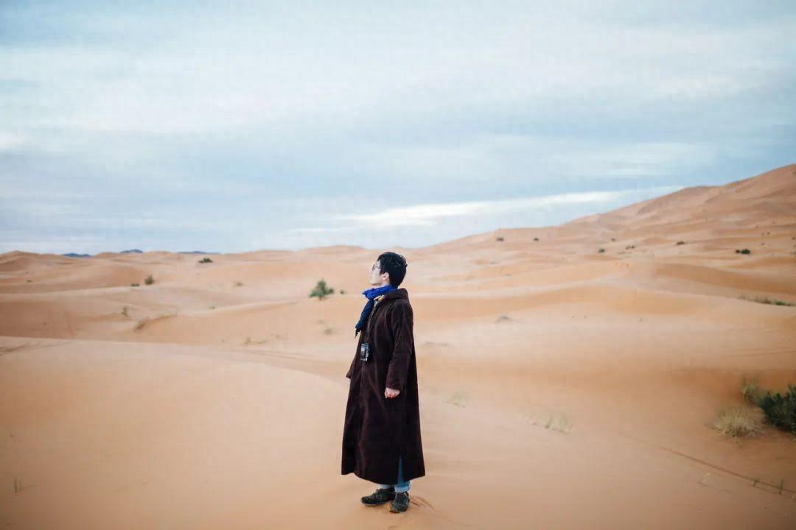

互联网人老喻讲过一件趣事。

有年夏天，他在上海连续参加了三场饭局，分别是商学院校友圈、金融艺术圈以及生意伙伴圈。

结果每场饭局上，他们这群中年人都在讨论“运势”“八字”。

原因也很简单，这几年很多行业失去红利，大家都在重新出发，寻求好运、祈求转运。

所以这几年很多搞“迷信”的人，赚得盆满钵满。

时来运发，扁担开花。没有人不希望自己有个好运气。

但老喻说：**好运不是玄学，而是可以设计的。**

好运的本质是与不确定性共舞。多接触，多链接，才能提高好运的概率。

走出去，以开放的心态面对生活，才能被命运之神垂青。

  
  <h3>1</h3>

**走出家门，多社交。**

现在很多人都在讲中年人要学会享受孤独。

但万维钢说：**很多人的孤独其实是中年封闭，它会让一个人僵化。**

一个人需要不断和外界接触，才能拥有更多的机会和可能。

作家克里斯蒂讲过一个故事：

做零售的巴格贾想要转型做汽车销售，但是每次去应聘都被拒绝。

很多人劝他说：没有机缘，还是放弃吧。

但是巴格贾却偏偏不信邪，反而用自己的方式来为自己创造契机。

零售工作中，他每天接触的客户五花八门，其中不乏汽车行业的从业者。

他每次都细心留意客户身份，一旦遇到汽车行业的人，就会主动结交，并请教汽车销售的知识。

不到半年时间，他就认识了十几个新朋友。

在日常的相处中，有个奔驰经销公司的经理，对他产生了兴趣，邀请他加入自己的团队。

就这样，他成了对方麾下首位没有经验的销售顾问，实现了自己的职业跃迁。

《破圈》中有这么一句话：

“我们要有一颗好奇心，一种结识不同人的意愿。”

去结识不同的人，去经营新的关系，我们才能获得命运的垂青。

2000年的时候，巴黎大学举办过一场“创业游戏”。

参与游戏的有一千人，每个人的初始资金一致，能使用的赚钱技能也一致。

一周过后，有不到两百人赚得盆满钵满，剩下的八百多人濒临破产。

游戏之后，举办方复盘发现：**失败者大多厌恶社交，他们大多“闭门造车”，而不愿去求助陌生人。**

而胜利者恰恰相反，他们擅长借助外力，凭借好的人缘迅速组织好完备的资源，成功达成目标。

人际关系学大师卡耐基说，一个人成功的因素中，知识、经验、技术只占15%，剩下的85%全由人际关系决定。

人际关系单薄，圈子发挥不了作用，我们就失了85%的胜算。

独木不成林，单弦不成音。

人脉的时代里，能胜出的人，往往都是社交高手。人脉越广，朋友越多，人越幸运。

  
  <h3>2</h3>

**走出舒适区，多尝试。**

投资人冯仑曾说过一句很有意思的话：

“整天待在家里的人，永远碰不到天上掉馅饼的好事。”

馅饼就是好运。

一直待在自己熟悉的环境里等待好运上门，无异于“守株待兔”。

学会走出去，突破自己熟悉的环境，人生才能遇到新的发展，新的可能。

我自己是传统媒体出身的。

十年前，传统媒体还是香饽饽。

当时我在北京一家知名媒体担任副主编。稳定、体面，收入也算不错。

靠着经验和资历，我也可以躺得很舒服。

但是，13年前后，我敏锐发现很多人开始有了线上阅读的习惯。

我那时感觉，传统纸媒也许会就此衰落。

于是我选择离开北京，跳出自己的舒适区，回到合肥创建了洞见自媒体。

凭着多年的纸媒经验，借着风口，短短几年，洞见就成了全国数一数二的大号。

我自己也实现了财务自由。

很多人说我运气好，但是我想如果当时没有勇气脱离安逸，只怕再好的运气，我也抓不住。

美国作家斯宾塞·约翰说：

“生活永远在变化中，而变化就意味着危机。享受惯了舒适，人也就成了呆子，最终将一事无成。”

一直待在舒适区，人也会慢慢变得平庸。

想要有新的突破，好的运气，就必须拒绝安稳，不断迎接新的挑战。

主持人倪萍大学毕业后，被分配到山东话剧院工作。

她当时出演了不少电影，很快就被评为国家二级演员。

随着年龄增长，她的演出几乎少了很多。

绝大部分女演员都会在这个时候选择在工作上“躺平”，然后专心相夫教子，安定舒适地过完后半生。

倪萍却做了个大胆的决定。

她放弃了自己的演艺生涯，跑到北京，开启了自己的主持事业。

1988年，倪萍成为央视实习主持人。

两年后，凭着专业能力，她被央视领导看中，成为春晚主持人。

由此开始，倪萍逐渐为全国观众所熟悉，最终成长为连续13年主持春晚的央视一姐。

作家木木说：**一个人总是在原地打转，就隔绝了一切好运降临的可能。**

眼前的生活固然稳妥，但是跳出去才能领略命运的波澜壮阔。

去没去过的地方，见没见过的人，做没做过的事，持续地尝试与突破，终将让你和好运撞个满怀。

  
  <h3>3</h3>

**走出固有认知，多思考。**

古典老师讲过打工人王鹏的故事。

王鹏是一个公司的技术岗，人到中年，体力和脑力大不如前。

他向古典求教，希望知道自己未来的职业之路如何规划。

古典建议他转型做管理。

他听完立马显露出鄙夷的表情，说管理层就知道假大空。

天天拍拍老板马屁，做做PPT，动动嘴皮子，活都分下去，啥也不干。

他觉得管理层一无是处，远不如自己搞技术好。

古典听完之后说：你这是狭隘的专业主义，建议你先了解一下，再做决定。

随后一个月，王鹏开始多方了解管理岗的工作，又和自己的领导谈了谈。

他才知道，管理也是一门学问。

不仅要深谙心理学，平衡利益关系，还要恩威并施，要知人善任。

王鹏感慨：聊完才知道，自己之前有多狭隘。

后来，王鹏决定转型做管理，最终实现了职业上的突破。

张方宇有句话说：**最了不起的外出，是走出自我。**

如果不能走出自我的认知，他就总觉得自己是对的，会排斥任何与自己不同的人。

人就会变得偏狭，愚蠢。学会走出自我，人生才能迎来新的契机。

作家成甲讲过一个故事：

一个金融自媒体达人曾经和新东方的俞敏洪有过一次会面。

闲聊中，这个达人从自己的视角谈了对教育行业的看法。

按理说，俞敏洪从事教育行业多年，说起教育，很少有人比他更有发言权。

但是他却没有敷衍，反而认真倾听，认真记录。

会面结束的时候，敏洪在本子上记录了满满三页纸。

成甲说：真正厉害的人，都有绿灯思维。

他们始终用开放的心态汲取新的知识，拓宽自己的认知边界。

所以他们走到哪里，都是一路绿灯，一路畅通。

自满者败，自矜者愚。

很多时候，耽误你的不是时机，而是头脑的保守封闭。

始终保持开放心态，不断开拓自身的边界，才能将好运收入囊中。

  
  <h3>▽</h3>

哈佛研究员费罗迪，问过导师这么一个问题：

“根据你超过25年的高管采访经验，你觉得领导者成功的关键因素究竟是什么？”

导师没有给出任何理论，只说了三个字：“靠运气”。

时来天地皆同力，运去英雄不自由。

运气，不是“瞎猫碰上死耗子”，而是一种足以改变生活的真实力量。

打开思维，走出家门，走出舒适区。

尝试新的链接，学会与不确定性共舞，才能让自己变成“好运体质”。

—END—

