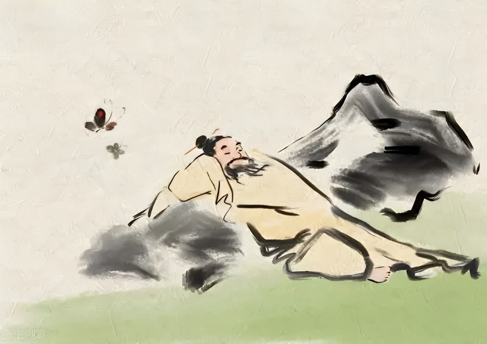

在古代读书人的口中，口口相传着这样一句话：

**“得意学孔孟，失意学老庄。”**

人在春风得意时，去读孔孟著作，便不会太过得意忘形，从而失去分寸，行差踏错。

而身处失意困顿之时，最应该捧起的一本书，就是《庄子》。

庄子超脱的智慧，广阔的胸怀，可以让人在失意时，找到心灵的支撑，不至于失去自我、一蹶不振。

读懂《庄子》你就会明白：

原来世上竟有人的思想境界，能高到超越生死，超脱一切困境。

达到这种境界的人，根本不会为名利所扰、为世事所困。

人生万般烦恼，对他们来说，皆似浮云。

  
  <h3>1</h3>
  <h3>面对得失：</h3>
  <h3>得失随缘，万事随命</h3>

《庄子·田子方》里讲过一个故事。

楚国大臣孙叔敖，曾三次荣居相位，又三次惨遭罢免。

但无论境遇如何变迁，他始终不为所动。

别人问他：为何你上任时没见多高兴，被罢免时也没见多失落呢？

孙叔敖回答：当不当官不由我决定，我能做的就是让自己无忧无虑，至于人生起落，又何必纠结呢？

境界高深的人，从不会被得失所扰。

在他们看来，富贵功名、荣辱得失，都是命中定数，非人力所能更改。

于尘世而言，我们也都只是匆匆过客，来时无法拥有，走时也无法带走什么。

既如此，或得，或失，对我们来说又有什么分别？

倒不如洒脱一点，看淡一切，做到得而不喜，失而不忧。

**任由生命里的一切自由来去。**

那么即便我们有朝一日深陷得失的漩涡，亦能不被其裹挟，活得自在洒脱。

  
  <h3>2</h3>
  <h3>面对好坏：</h3>
  <h3>一切为我所用</h3>

庄子曾说：“人皆知有用之用，而莫知无用之用也。”

世人皆以为，只有那些看似有用的东西，对我们才有价值。

但在庄子看来，世俗认为无用的事物，也可为我们所用。

《庄子·逍遥游》里讲过一棵樗树的故事。

惠子对庄子说：“我有一棵樗树，树干臃肿，树枝蜷曲，虽然很大，却是大而无用。”

庄子摇了摇头，说道：“你可以悠闲地在树下徘徊，逍遥地在树下躺卧，它给你遮风挡雨，怎么还不算有用？”

其实这世上，根本没有一无所用的事物。

只不过很多人一叶障目，发现不了一件事物真正的价值。

就比如人生中那些苦痛的经历，内心脆弱的人遇到它们，就只会抱怨连连，感叹人生无望。

而内心强到可怕的人，只会把那些都看做是成长的阶梯，满怀信心地去迎战一切困难。

正所谓，**一切经历，皆是成长。**

只要你以正确的态度去对待发生在你身上的所有事情，那么这一切，都将丰富你，成就你，让你拥有更丰盈的人生。

  
  <h3>3</h3>
  <h3>面对孤独：</h3>
  <h3>人唯孤独，方能出众</h3>

庄子《逍遥游》里有一只大鹏，想飞到南海去。

蜩与学鸠看到了，嘲笑它不自量力。

大鹏没有在意它们的议论，而是忠于自己的内心。

终于等到六月风起，它独自乘风而去，欣赏到了高空辽阔的风景。

大鹏的经历，其实也是庄子一生的真实写照。

庄子所处的时代，污浊黑暗，所以尽管过得贫困潦倒，他也不愿出仕做官，只愿隐居。

他在山野间耕作，与鸟兽为伴，过着与世隔绝的生活。

虽然生活贫困，但庄子的内心却不沾染世俗的污秽，达到了精神的自由。

庄子感慨道：**“独来独往，是谓独有；独有之人，是谓至贵。”**

孤独让我们走向高贵，孤独也让我们走向自己。

那些害怕孤独，盲目追求合群的人，最终只会淹没于人群里，泯然众人。

而那些强到可怕的人，永远忠于内心，永远不会被世事的纷繁所困。

他们享受孤独和自由，不管身处何种境遇，都活出了最高的境界。

  
  <h3>4</h3>
  <h3>面对名利：</h3>
  <h3>不戚戚于贫贱，不汲汲于富贵</h3>

在先秦诸子之中，庄子怕是最穷的一个。

可当楚王派人来请他出任相国时，他却一口回绝。

他说，他宁愿做一只在泥水里撒欢的乌龟，也不愿被人供奉在庙堂之上。

后来，庄子的好友惠子，在梁国做了相国。

庄子前去拜访，惠子却十分担心他来抢自己的相位。

庄子就对他说了这样一番话：

“有一种叫做鹓雏的鸟，非梧桐树不栖息，不是竹子的果实不吃，不是甜美的泉水不喝。

而猫头鹰抓住了一只腐鼠，仰头看着鹓鶵，发出‘喝’的响声来护住自己的食物。

而今天，你也用梁国来吓我吗？”

在庄子眼中，所谓权势官位、功名利禄，不过就像那死老鼠肉。

他不屑要，也不愿被其拘束，因为他是吸风饮露非梧桐不栖的凤凰。

世间的绝大多数人，其实一生都在被名利拿捏。

**穷困潦倒时，就怨天尤人；飞黄腾达时，又担忧落魄，怎么活都不称心。**

要知道，一生短暂，若是为了名利如此自苦，便丧失了生命本身的意义。

不如像庄子一样，做一个内心强到可怕的人。

放开对名利的执着，不戚戚于贫贱，不汲汲于富贵，我们也能超脱于外物，活得无拘无束。

  
  <h3>5</h3>
  <h3>面对无常：</h3>
  <h3>看透无常，一切都是寻常</h3>

庄子《知北游》里说：“人生天地之间，若白驹过隙，忽然而已。”

在这短暂的一生里，我们所遇到的，所拥有的，没有一样会是恒常的。

**因缘聚散，成败得失，终究会随着命运起起落落，谁也左右不了。**

诗人黄庭坚，从小便是天才，19岁就夺得乡试头名，随后高中进士。

他的人生，可以说是一路高歌猛进。

但很快，他就因为深陷党争，被贬谪出京。

面对这种人生落差，黄庭坚接受得很快，还写下来“俯仰之间已陈迹，暮窗归了读残书”来表明心迹。

黄庭坚的好友苏轼，与他的命运也很相似。

苏轼也是天纵奇才，年纪轻轻就名满天下。后来通过科举取士以后，还颇受皇帝赏识。

但如此顺利的人生开局，也抵不过无常的命运。

苏轼中年以后，因为朝中小人的诬陷，被一贬再贬，最后还被贬到了海南。

但苏轼并不抱怨，还说：“九死蛮荒吾不悔，滋府游绝冠平生。”

**这些内心强到可怕的人，藐视一切跌宕。**

**在他们看来，万般无常，皆是寻常。**

今日的风光，不代表明日的风光；此时的落魄，也决定不了以后的境遇。

只要保持一颗平常心，哪怕世间风起云涌，我们亦能坐看风云，守住一隅岁月静好。

  
  <h3>6</h3>
  <h3>面对生死：</h3>
  <h3>方生方死，方死方生</h3>

《庄子》一书中，讲过一个鼓盆而歌的故事。

庄子的妻子去世了，庄子却不伤心，反而敲着瓦缶唱歌。

别人不懂为什么，就问他缘由。

庄子说：“我妻子的生与死都是生命的必然规律，就像春夏秋冬四季运行一样。

现在她已经回归自然，静静安息在天地间，那我何必还要悲伤呢？”

庄子将死亡视为一种天道，所以面对妻子的离去，他表现得平静而坦然。

其实，世间万事万物，有生就有死，死亡之后又能孕育着新生。

一个内心强大的人从不会因为生死而恐惧或担忧。

他们已经看透了生死之间的真相，将生死视为平常之事。

生死之外的琐事，对他们来说更是微不足道。

**而我们所有人，亦无法决定怎么生，怎么死，但至少可以决定，这一生怎么爱，怎么活。**

顺其自然，淡看生死，我们才能不辜负此生，过好每一寸时光。

  
  <h3>7</h3>
  <h3>面对生活：</h3>
  <h3>允许一切发生</h3>

最后，再给大家讲一个《庄子》里非常经典的空船故事。

有一个人乘船渡河，发现前面有一只船正要撞过来。

这个人喊了好几声没有人回应，于是破口大骂前面开船的人不长眼。

结果撞上来的竟是一艘空船，于是刚才怒气冲冲的人，一下子怒火就消失得无影无踪了。

人生中的很多挫折、破事，就像这艘撞上来的空船。

它要撞上来时，你再如何抵触，都改变不了它的轨迹。

可是你若放平心态，坦然接受，它其实也对你产生不了多大的伤害。

所以与其对着一艘空船生气，还不如强大内心，允许一切自然而然发生。

就像庄子说的：**“知其不可奈何，而安之若命。”**

凡事顺其自然，命运给予什么，就接受什么。

不内耗，不对抗，带着一颗从容的心处世。

无论遇到再糟糕的事情，你也能扭转乾坤，让它在忧患的凡尘里开出一朵花。

  
  <h3>▽</h3>

《庄子·应帝王》里有言：

**“至人之用心若镜，不将不迎，应而不藏，故能胜物而不伤。”**

心境高深的人，本性从容，心无挂碍，故能穿梭世间，不被外物所伤。

你我若想达到如此心境，也应当以此标准修炼自己。

像庄子一般，不乱于心，不困于情，不缠于物，不伤于世。

那么世间纵有万般挫折，也不足以在你的世界里掀起风浪。

—END—

