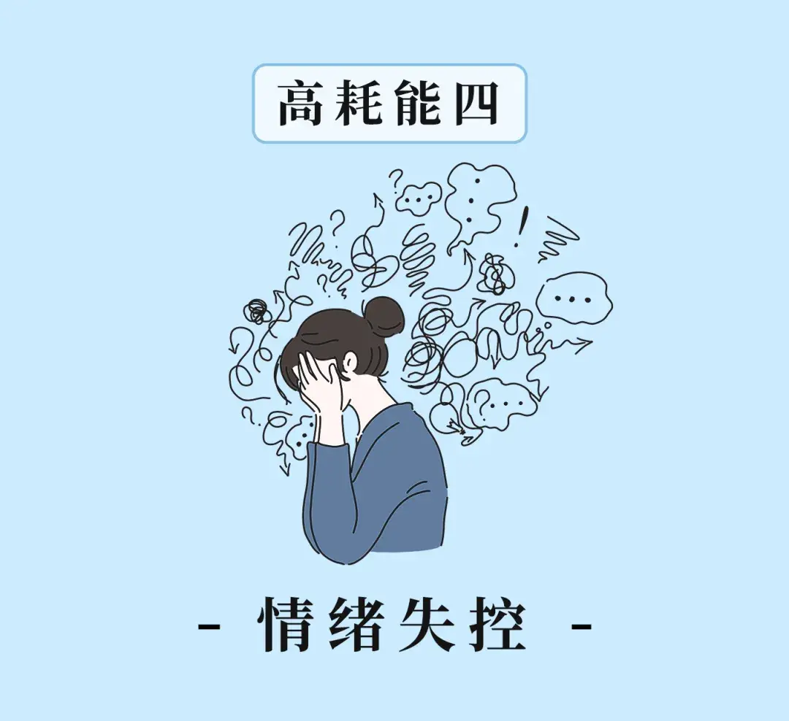

在网上看到一个问题：“为什么我每天都活得很累？”

一个高赞评论说：“因为你身体能量流动的方向错了。”

生活中有两种人，一种是吸能型人格，能从外界的人和事中汲取能量，不断丰盈自己。

另一种则是耗能型人格，这类人多疑敏感，喜欢瞎操心，生闷气。

在这些无用的事上耗费了大量能量，就没有多余的精力，来应对生活的重压。

想要减轻身上的负累，活得更加轻松，一定要戒掉以下四种高能耗行为。


<div style={{textAlign: 'center', color: '#FF8C00'}}>  
  <h3>1</h3>
</div>


你是否有过这样的体验？

```

工作汇报时，看见领导皱了下眉，就惴惴不安地推测，是不是自己做的不好；

跟人聊天时，对方没有及时回复信息，就开始胡思乱想；

看到同事躲着自己说悄悄话，便觉得他们是在议论自己。

```

很多时候，明明你什么都没做，不消片刻，就觉得身心俱疲。

有心理学家指出，**过度敏感，就是一种无谓的自我消耗。**

长此以往，它会大量损耗人的精力，拖累我们的生活。

英国心理医生科莉诺曾讲过一个病例。

玛丽是一位心思细腻的女孩，刚工作那年，一度几近抑郁。

科莉诺仔细了解才发现，她的烦恼完全是自己强加给自己的。

有一次，她出外勤回来，看到同事们都在喝咖啡。

玛丽觉得同事买咖啡也不叫上自己，瞬间有一种被孤立的感觉。

于是她的内心立刻悲伤起来：原来大家都不喜欢我，我要怎么做才能合群呢……

偶尔瞥向同事的时候，她觉得对方的眼神都带着满满恶意。

就这样，她揣摩了一下午，思虑过度，脑袋昏昏沉沉。

到了下班的时候，同事们约了她去聚餐。

她这时闲聊才知道，同事没给她点咖啡，是以为她出外勤还需要很久才回来。

正是玛丽太过敏感的心思，这才让自讨苦吃。

生活中像玛丽一样的人不在少数，总是活在自己的内心戏中。

别人不经意的一句话、一个眼神、一个动作，都能让他们心中掀起骇浪。

但古语有言，**脸厚耳聋，活着不累；事事入心，活着受罪。**

每个人的精力都有限，如果你对所有事都太过在意敏感，就很难再有精力去感受那些美好的事物。

试着学会把心放大一点，迟钝一点。

只有这样，你才能避免不必要的思虑，保持充足的活力，将每一天过得热气腾腾。


<div style={{textAlign: 'center', color: '#FF8C00'}}>  
  <h3>2</h3>
</div>


国学大师南怀瑾曾说：

**人生不外乎三件事，自己的事，别人的事，老天的事。**

很多时候，自身的命运起伏，就让我们无力招架。

若是操心太多，再强行插手他人的事务，只会让自己雪上加霜，徒增负累。

贾平凹小说《暂坐》中，茶馆女老板海若有位朋友辛起。

辛起出身农村，家境贫寒，但长得很好看。

刚进入城市的时候，她一下子就被眼前的灯红酒绿所吸引。

为了开上豪车，挎上名牌包包，她精心打扮自己，想要以此结识富人。

海若得知她的想法，当即劝说辛起别误入歧途。

可对方非但不听，还阴阳怪气地指责海若见不得她好。

海若听完，当即气冲冲地离开了。

几个月后，辛起与有房有车的田诚斌结了婚。

但她没有过上富太太的生活，反倒是整日与丈夫闹矛盾。

海若见不得辛起受委屈，就趁田诚斌出差帮辛起搬了家，将她安置在自己的茶馆中。

结果田诚斌知道后，气得火冒三丈，直接找上门来就要砸掉茶馆。

双方在争执中无意破坏了燃气管道，最后导致燃气爆炸，茶馆沦为一片废墟。

就因为多管闲事，海若苦心经营的事业就此付诸东流。

生活中，我们每个人都有各自需要面对的难题和坎坷。

单单是家庭的杂事，工作的压力，就足以让人费神费力。

你若是过多操心别人的事，对方不领情不说，还会让你陷入困境。

正如阿德勒所说的那样：

**基本上人的一切烦恼，都源于对别人的课题妄加干涉。**

从今往后，与其为旁人消耗自己，不如过好自己的日子。

眼前没了外界的是非纷扰，你自然能活得更松弛。


<div style={{textAlign: 'center', color: '#FF8C00'}}>  
  <h3>3</h3>
</div>


曾有一位小有成就的创业者，向老教授请教：

相比从前，我财富自由了，为什么却越活越累？

老教授便询问他的日常安排。

他一脸骄傲地回答：“我每天除了本职工作，会参加各种饭局、应酬，甚至还有演讲等等。”

老教授听完，就把他带到了衣帽间，嘱咐他把衣服都穿上。

那人听了，连忙拒绝：“身上衣服正合适，再多穿也不舒服啊，又热又不方便。”

教授说：“衣服，就如你给自己加的身份，多了自然就累了。”

直到这时，他才恍然大悟：自己过得那么累，并非生活太苦，而是欲念太多。

《欲念心理学》中指出，欲念会偷偷消耗人的精力，甚至摧毁意志力。

若不加以克制，只会让人越活越累，越陷越深。

亦舒作品《悠悠我心》中的胡先生，是一名银行经理，年薪数十万。

家庭十分和睦，妻子温柔体贴，女儿可爱聪明。

在外人看来，他简直是人生赢家。

可胡先生并不满足，他常嫌弃房子不够气派，吃穿不够阔气。

为了追求更多的财富，他开始想方设法赚钱。

于是，他费尽心思利用银行漏洞中饱私囊，甚至铤而走险，借用职务收受贿赂。

就这样，保险柜中的现金多了起来，胡先生的内心却变得更加焦虑、慌张。

他每天耗费心神算计，想要掩盖真相，不足一年，整个人都苍老了许多。

结果纸还是包不住火，最终胡先生事迹败露，锒铛入狱。

想起了莎士比亚的一句话，**欲望犹如炭火，必须使它冷却，否则，那烈火会把心灵烧焦。**

人一旦欲念缠身，眼中全是利益，满脑子都是算计。

高强度的思虑，终究会耗尽自身所有的生命能量，让人心神枯竭。

梭罗曾说，**当我们不再汲汲于声名，不再汲汲于富贵，就可以更从容，更充实地享受人生。**

在你疲惫不堪的时候，不妨收起你的欲念。

懂得知足常乐，减少不必要的消耗，你才可以心无所累，轻装前行。


<div style={{textAlign: 'center', color: '#FF8C00'}}>  
  <h3>4</h3>
</div>




华中师范大学应用心理学导师黄伟强说：

负面情绪就像一个无底洞，无穷无尽地吞噬人的生命能量。

无论是愤怒还是沮丧，人一旦被负面情绪缠身，自身的能量便会迅速干涸。

自媒体人胖胖说职场，曾讲过自己的亲身经历。

几年前，他们公司与一位大客户商谈合作，提供技术服务。

他作为负责人，兢兢业业地拜访、谈判，忙前忙后地服务客户，唯独疏忽了对公司技术软件的检测。

结果就在临签约前，客户发现一处重大技术漏洞，直接导致对方放弃合作。

想到这么多日的心血就这样付之流水，他的委屈与愤怒充斥胸口，怎么都压不下去。

头脑一热之下，他径直闯进技术部的办公室，大声斥责道：

“看看你们做的垃圾软件，害得我们被老客户解约。”

朝着同事发火后，他仍不解气，甚至当着众人的面，踹碎了办公室的玻璃门。

当天晚上，公司便勒令他停职，无论他如何道歉也无济于事。

就因为一次情绪失控，他便断送了在公司的前途。

最后胖胖感慨道：

“一番情绪宣泄出来后，却没有想象中的痛快。反而因为自己的冲动，让自己越发心累、不顺。”

现实生活中，相信不少人都有过胖胖相似的体验。

稍不如意，就乱发一通脾气，结果情绪发泄后，心情却更加沉重了。

因为情绪爆发的同时，也在大量消耗心理能量。

当能量被吞噬殆尽，处理事情自然就力不从心。

此外，一些不合时宜的情绪宣泄，甚至还会酿成大祸。

甚至需要耗费更多心力，才能弥补自身的过错。

日本心理作家和田秀树说：

剧烈的情绪波动，很轻松就能摧毁一个成年人。

**没有平和的情绪，就没有充沛的能量。**

常微笑少懊恼，维持积极饱满的状态，你会发现生活没有什么无法逾越的困境。


<div style={{textAlign: 'center', color: '#FF8C00'}}>  
  <h3>▽</h3>
</div>


知名商业管理专家崔璀讲过一段话：

```

有些人一天什么都不干都觉得很累，就以为是自己能量低。

但其实上午八卦一下别人，下午再生个闷气，这种看不见的事，最消耗精神力。

说到底，你不是能量低，而是能耗高。

```

人这一生，除了应对生存，没有什么事值得消耗你的能量。

别人的事情不必操心，外在的眼光无需介意。

只有专注于自身，稳住了情绪，你才能过低耗生活，收获一个能量满满的人生。


—END—


