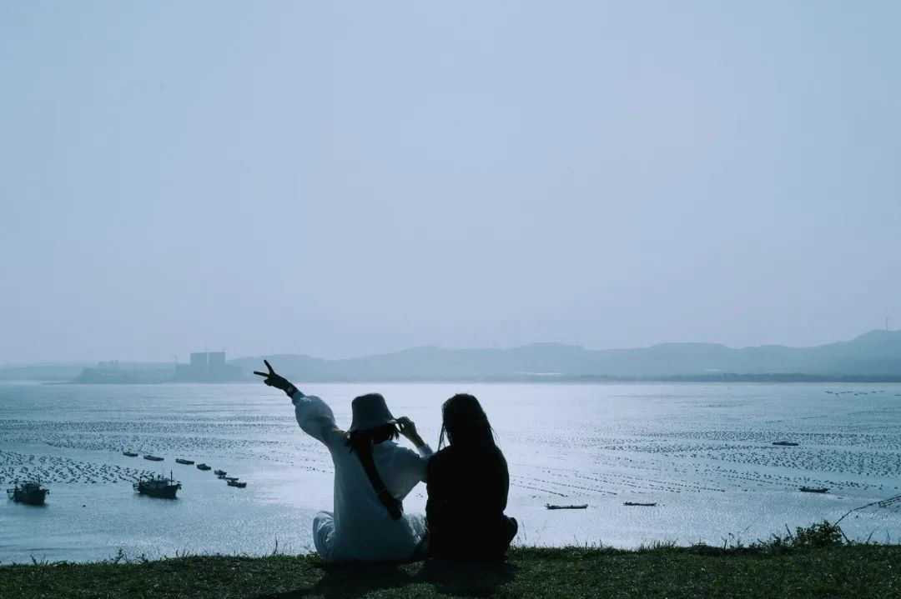

《山河故人》里说：

“有些人只能陪你走一段路，迟早是要分开的。过了这段路，你会遇见新的人和新的生活。”

没有人可以陪你一辈子。

随着时间的变迁，距离的阻隔，曾经的朋友会慢慢变得疏离，变得陌生，变得面目全非。

渐行渐远，彼此走散，才是大部分关系的结局。

当一段关系无法延续时，强行挽留只会徒增烦恼，好聚好散，默默退场，才是成年人最大的体面。

  
  <h3>1</h3>
  <h3>缘分尽了，不强留</h3>

佛家常常讲缘分。

因缘际会，我们来到了同一个城市、同一个公司、同一所大学。

一段关系因此开启。

我们彼此扶持，相互帮助，闲谈心事与家常，成为了亲密的伙伴，建立起坚固的友谊。

但是缘分这个东西总是难以捉摸，说尽便尽，说断就断。

前些天，公司一位小伙伴离职。

因为家里的事情，不得不离开合肥，离开公司。

我们一起聚餐，作最后的告别，没有挽留，只有祝福。

第二天上班的时候，就只能看到他空空荡荡的工位。

一个人就这样消失在了你的生命里。

此后如果没有特殊的缘分，你们便不会再见了。

在佛经里，把一切事物的开始，称为缘起。

但一切因缘都不是永恒的，转眼消失，叫作缘灭。

**缘起缘灭，人生因缘之流转，最难捉摸。**

李叔同和诗人许幻园本来是至交好友。

俩人住在城南草堂，一起读书写字，谈风月，论时事，结下了深厚的友谊。

但是好景不长，因为战乱，许幻园家中破产。

无奈之下，他只能北上谋生，希望东山再起。

李叔同无法挽留，只能无奈送别，叹息：“**知交半零落。**”

两人从此相隔天涯，这对知己从此离散。

张小娴曾说：人生聚散离合，如浮云变幻，缘生缘灭皆由天定。

人世间的缘分，有深亦有浅，而离散也由不得你我。

我们能做到的，是在因缘际会的时候好好地珍惜那短暂的时光。

缘浓缘淡，聚散离合，都不是我们能够控制的。

不挽留，也不对抗，就是最大的体面。

  
  <h3>2</h3>
  <h3>三观不同，不干涉</h3>

我们说：酒逢知己千杯少。

我们也说：话不投机半句多。

可有时候，这两句话可以用在一个人身上。

昔日彼此是朋友，把酒言欢，可以畅聊一宿。

但是随着岁月变迁，大家的三观开始变得不同，终于再也聊不到一起。

后汉的时候，文人朱穆和刘伯宗曾经相交甚笃。

俩人一起入朝为官，但是选择却截然不同。

朱穆为人清正，刚直不阿，刘伯宗却趋炎附势，攀附权贵。

朱穆看到昔日好友自甘堕落，心中不忿，多次上门劝告。

但是刘伯宗却执迷不悟，依旧我行我素。

终于有一天，俩人为此大吵一架，不欢而散。

回到家后朱穆才清醒过来，道不同不相为谋，他根本不可能劝得对方回头。

他写下著名的《与刘伯宗绝交诗》，自此与对方分道扬镳，再无往来。

我们常说：三观不和，才是这个世界上最遥远的距离。

友情建立在三观契合的基础上。

一旦三观出现分歧，这段友情就失去了存在的基础。

强行挽留，只能徒增烦忧，与人笑柄。不如默默远离，别再打扰。

早年苏轼和谢景温是非常要好的朋友。

俩人经常一起吟诗作画，好不快活。

但是后来，王安石开启变法，他和苏轼做了不同的选择。

苏轼认为新法急于求成，危害百姓，多次上书反对。

谢景温却认为新法势在必行，选择与王家联姻，力挺王安石。

苏轼没有苦口婆心地劝告，也没有争吵，而是默默与谢景温疏远。

俩人的友谊也慢慢走到终点。

**飞鸟与鱼不同路，从此山水不相逢。**

三观不同，不必强融。

当昔日好友渐行渐远，注意分寸，保持距离，才是这段关系最好的结局。

  
  <h3>3</h3>
  <h3>感情淡了，不追问</h3>

讲个自己的故事：

我大学的时候有个很好的朋友。

我们两个天天在一起吃饭、上课、泡图书馆，好得像是一个人一样。

毕业之后，我们去了不同的城市，联系也慢慢少了很多。

然后忽然有一天，我发现自己看不到他的朋友圈了。

发了条消息过去，发现自己已经被删除了。

我很诧异，不知道到底发生了什么，给他发了条短信，他也没有回。

我不死心，又托其他朋友去问，依然没有得到结果。

过了几年之后，我才开始慢慢理解，人与人之间的感情是有保质期的。

感情过期之后，大家往往会安静地离开，默契地疏离，为各自都保留最后一点体面。

而不是像小孩子一样追问“你为什么不理我？”

从此山水不相逢，不问故人短与长。

**成年人的友谊都是阶段性的，每个人都要学着接受离散、习惯无常。**

看过李白写给高适的一句诗：兄弟尚路人，吾心安所从。

这是李白版的“你为什么不理我”。

永王之乱，他被捕下狱，为了脱罪，他写信向高适求援，希望对方可以拉自己一马，但是高适却没有反应。

昔日好友突然变成了路人，他心里倍感困惑迷茫。

李白不理解，当年他们一起畅游天下，吟诗作对，畅谈理想，说好的当一辈子朋友呢？

但是在高适眼里，大家已经“失联”太久了。

他不再是当年那个失意的中年人，而是手握重兵的节度使。

时过境迁，那些感情早就随风散了。

李白不懂，他说：开花必早落，桃李不如松。

他追问，他愤怒，他写了很多诗给高适，说出自己的疑惑，发泄自己的不满。

但是一切都石沉大海。

李白终于明白，俩人的友谊早就没了，只是他自己还放不下那段过往。

后来他回四川老家，当时高适就在成都不远的彭州。

李白特意绕路，远远避开了高适。

**成年人的感情就是这样，没有告别，就已走远。**

哪怕曾经处得再好，到即将走散的时候，也只会将彼此视为生命中的一个过客。

无声的疏远，就是大家最后的体面。

  
  <h3>▽</h3>

李白曾说：醒时同交欢，醉后各分散。

无论曾经的感情有多浓烈，最终的结局也不过是各自分散。

成年人的世界，没有永远。

每个人在你生命里出现的时间是有限的。

缘分尽了、感情淡了、人心变了，纵然有再多的不舍，也是徒劳。

坦然地去面对生命里的离别，体面而从容地退出，就是对一段感情最好的交代。

不怨不扰，不负不欠，彼此放手，各自安好。

—END—

