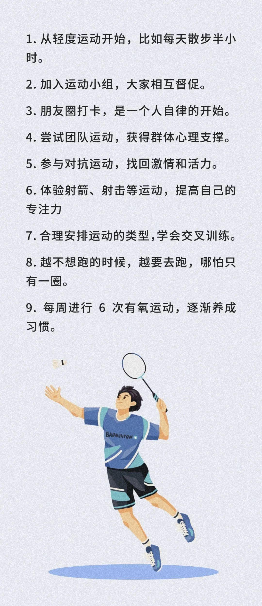
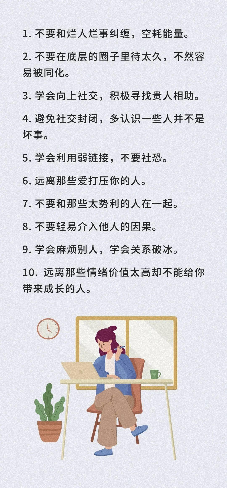

看过一项心理学研究。

心理学家格兰特招了一百名志愿者，其中认为自己运气特别好的和认为自己运气特别差的，各有五十人。

此后半年里，格兰特团队对这些人的生活进行跟踪调查。

最后调查结果表明：

自认为运气好的人，整体生活习惯更好，他们工作更自律，情绪更稳定，生活态度也更积极。

而自认为运气特别差的人，做事消极，拖沓懒惰，经常抱怨，整体生活习惯也很差。

最后，格兰特总结说：

**运气不是天定的，而是根据后天的行为习惯带来的，是我们每个人都可以把握的。**

你的习惯里，藏着一生的命运。

今天，给大家分享66条转运微习惯，帮你养成“锦鲤体质”，越活越幸运。

  
  <h3>1</h3>
  <h3>工作习惯</h3>

在今天的中文互联网，吐槽工作已经成为一种时尚。

网友纷纷以牛马、吗喽自嘲。以带薪蹲坑为荣，以摸鱼划水为乐。

但嘴上吐槽两句可以，千万别当真。

绝大部分人根本没资格躺平，工作是普通人翻身的唯一方式。

工作废了，人生基本就凉了。

养成良好的工作习惯，才能拥有更好的能力，才能有机会进入更好的平台。

这样，人生方能和好运撞个满怀。

  
  <h3>2</h3>
  <h3>运动习惯</h3>

我们常说运动可以锻炼体力，提高精力。

但是打工人经常遇到一个问题：工作一天到家，根本不想运动，累得倒头就睡。

然后第二天继续无精打采，无限循环，越来越累。

《凡人歌》里的卷王那隽就很聪明，越累越要去锻炼，越是加班多的时候，越要去运动。

运动可以提高精力，提高人的专注力，让你在工作中效率更高，待机时间更长。

运动是补充能量的，而不是消耗能量的。

工作越忙，越要抽出时间来锻炼，能量充足，才能从容面对人生挑战。

  
  <h3>3</h3>
  <h3>社交习惯</h3>

我们常说：鸟随鸾凤飞能远，人伴贤良品自高。

一个人能抵达的高度，基本上等于身边人的平均水平。

如果一个人总是在低水平圈子里打转，人生往往很难获得成长和跃迁。

人往高处走，水往低处流。

改变自己的社交习惯，脱离低水平的圈子，学会向上社交，人生才能有新的可能。

  
  <h3>4</h3>
  <h3>形象习惯</h3>

俗话说：人可以有霉运，但不能有霉相。

运气不好，是上天捉弄；灰头土脸，就是自我放弃。

形象是人的第一张名片。

没有人愿意通过邋遢的外表了解你丰富的内里。

保持形象清爽干净，是对别人的尊重，更是对自己负责。

保持良好的外表，意味着一个人依然认认真真对待生活。

行头换一换，好运来一半。

把自己收拾得体面干净的人，也定能遇见更多美好。

  
  <h3>5</h3>
  <h3>思维习惯</h3>

斯坦福大学心理学教授卡罗尔·德韦克在《终身成长》中提到：

决定人与人之间差异的，不是天赋，不是勤奋程度，而是思维模式。

思维决定行为，行为决定成败。

面对复杂的问题和挑战时，学会不同的方式思考，掌握不同的思维模型，才能够快速找到有效的应对方案，做出更好的决策。

拥有好的思维习惯，才能解锁人生智慧，实现跨越式成长。

  
  <h3>6</h3>
  <h3>学习习惯</h3>

我们常说：问渠那得清如许，为有源头活水来。

没有活水，水渠就会慢慢腐败，慢慢发臭，人生也是如此。

人到中年，很多中年人三点一线，日子慢慢稳定，也慢慢沉寂。

很多人开始放弃了学习。

没有了新东西的输入，脑子也就开始变得僵化、腐朽，一旦工作生活上有了变动，就是灾难的开始。

很多人总是怨天尤人，说自己运气不好，但实际上很多时候是自己落伍了，运气来了也抓不住。

人生的很多转机都是学习带来的。

任何人想要转运，都要从主动学习和思考开始。

一个能够消化吸收新事物的大脑，才是中年人好运的开始。

  
  <h3>7</h3>
  <h3>卫生习惯</h3>

你有没有感觉，家里整洁了，整个人都会很开朗，家里脏乱，整个人心情也会随之变得沉闷、压抑。

古人说：高堂素壁，无舒卷之劳；窗明净几，有坐卧之安。

家就是一个能量场，会潜移默化地影响我们的心态和命运。

住处脏乱，内心就会烦躁，负能量就会趁虚而入；

房屋整洁，内心开朗愉悦，种种好事便会纷至沓来。

一个家越整洁，住起来越舒适，风水也就越好。

把家里收拾得干净整洁，会集聚正向的能量磁场，给一个人带来好运。

  
  <h3>▽</h3>

钱钟书说：世界上没有无缘无故的能力，也没有无缘无故的运气。

运气，是有因果的。

那些看似运气爆棚的人，不过是在因上付出了努力，并在果上得到了回报罢了。

命自我立，福自我求。

保持良好的习惯，用心对待每一个人，每一件事，尽力完善自己，运气往往便会不请自来。

—END—

