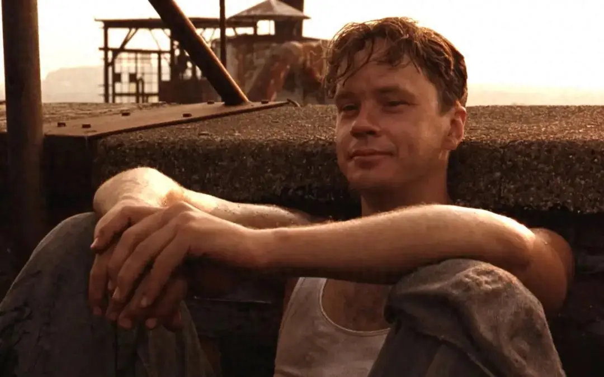
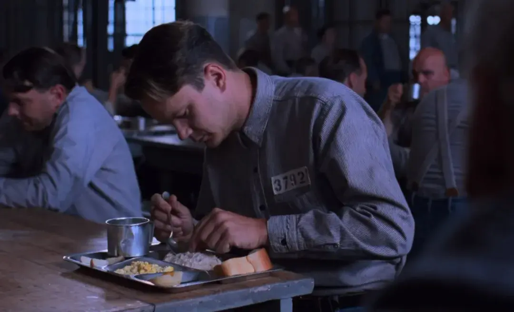

你有没有过这样的低谷期？

```

日夜勤勤恳恳地学习，却一再从考场上败下阵来；

每天加班加点地工作，可每次的提拔名单中都没有你；

长期省吃俭用地攒钱，但一场意外就能掏空你全部积蓄。

```


初入社会时失意，人到中年失业，随时又都有可能变得一无所有……

人在低谷时，四周仿佛处处是阻挡我们的高墙，我们深陷其中，怎么也逃不出去。

但《肖申克的救赎》里有句话说：**“这个世界上，穿透一切高墙的东西，它就在我们的内心深处。”**

恰如这本书的主人公安迪，年纪轻轻含冤入狱，从银行家沦为阶下囚。

面对命运的打击，他没有自暴自弃，而是尽一切努力自救，最终逃离监狱，重获自由。

我看了10遍安迪的故事，从中总结出了4条低谷期自救法则。

当你掌握了自救的能力，磨难重重的低谷期，就成了你增值自己的最佳时机。


<div style={{textAlign: 'center', color: '#FF8C00'}}>  
  <h3>1</h3>
  <h3>黑熊法则</h3>
</div>


听说过这样一个“黑熊法则”：

有一种黑熊，在冬季来临时，就会躲进洞穴睡觉，直到第二年春暖花开时才出洞。

因为它知道，寒冷的日子里食物稀缺，再加上四处白茫茫，一身黑色的它根本无处躲藏。

人生亦是如此，每一个低谷，都像是在过冬。

比起放声痛哭，四处诉苦，不如在沉默中养精蓄锐，独自熬过漫漫长夜。

在《肖申克的救赎》里，主人公安迪也深谙这个道理。

30岁的安迪，本是年轻有为的银行副总裁，却意外卷入一场谋杀案。

他的妻子及其情人被杀，他被警方锁定为最大的嫌犯。

尽管找不到充足的证据，法官依旧判处了他终身监禁。

入狱那天，监狱里的犯人们，见他文弱儒雅，打赌他一定会在当晚崩溃大哭。

谁知到了夜里，其他狱友整晚哭喊冤枉，安迪却默默坐在床上，一夜悄无声息。

有人拿脏话辱骂他，嘲讽他是“杀妻的银行家”，他也面色平静，从不出言反驳。

每天去操场放风时，他更是犹如在公园散步一般，步伐悠闲，神色轻松。

后来，监狱里的恶霸“三姐妹”盯上了他，一有机会就欺负他，将他打得遍体鳞伤。

脸上随时带着新伤的他，从没向周围人抱怨过，更没企图求助于外界。

他凭借一己之力，咬牙抵抗“三姐妹”的拳打脚踢，打赢对方、顺利逃脱的次数越来越多。

尽管一朝从天堂跌落到地狱，身心受尽折磨，但安迪没有喊过冤，叫过苦。

他明白事已至此，再怎么抱怨也是徒劳无功，干脆平静地接受了一切。

他默默忍受着监狱的黑暗，渐渐适应了糟糕的环境，甚至与犯人瑞德结为了挚友。

作家李应说：**“人这一生，都会经历两种冬天，一是季节的苦寒，一是人生的低谷。”**

每个人的一生中，都会经历被现实推入深渊，困进牢笼的无助时刻。

或许是一个意外的降临，害你一夜之间一无所有；

或许是一场无情的背叛，使你的内心备受打击；

又或许是一次不经意间的疏忽，让你的努力付诸东流。

你哭得再大声，讲得再难过，也换不回几分同情，反而会沦为旁人茶余饭后的谈资。

不妨学会保持静默，把无处宣泄的委屈和伤痛，化作支撑自己前行的力量。

咬紧牙关，自我疗愈，学会沉默和蛰伏，你才能迎来逆转与翻盘。





<div style={{textAlign: 'center', color: '#FF8C00'}}>  
  <h3>2</h3>
  <h3>门槛法则</h3>
</div>


作家老杨的猫头鹰说过一段话：

```

人生的路途中，门槛都是相对而言的。

本事够了，就是门；本事不够，就是槛。

人生的磕磕绊绊，多半是因为本事太小了。

```

落入低谷时，有人脚下处处是坑，寸步难行；有人面前却四通八达，往哪里走都是上坡。

区别就在于，我们是否有足够多的技能，足够大的本事，去应对生活的刁难。

《肖申克的救赎》中，安迪有一次被派去翻修屋顶，偶然间听到狱警海利和同事的对话。

海利继承到哥哥的一笔遗产，但需要上交的遗产税金额高昂，抵得上一辆崭新的汽车。

曾是银行副总裁的安迪，恰好精通税务知识，主动告诉海利如何合法避税。

安迪的专业建议，为修屋顶的每个同伴，都争取到了三罐啤酒的享受。

他的后续指导，也为自己换来了海利的庇护，监狱里的“三姐妹”再也不敢找他麻烦。

除此之外，安迪在音乐、文学、地质等方面也造诣非凡。

这些拿得出手的能力，都是他在苦难中的护身符。

他记忆力惊人，把圣经翻来覆去看过很多遍，背得出任意一段内容。

典狱长第一次查房时，便没有翻开那本藏着越狱工具的圣经，使他逃过一劫。

他精通财务知识，能帮监狱里所有的狱警报税，还能为贪心的典狱长做假账、洗黑钱。

典狱长便将他从洗衣房调到图书馆工作，让他摆脱了繁重且枯燥的体力活。

他还熟知户籍政策，给自己伪造了一个新身份，确保自己有一天能成功越狱、躲避抓捕。

安迪的过人能力，犹如一级级台阶，带他跨过一道道槛，推开了通往自由的那扇门。

**当危机的潮水袭来，一个人傍身的本事，就是他的救生圈。**

多学一项技能，就添了一丝应对危机的从容；多长一点本领，就涨了一分自由选择的底气。

所以，当你落入低谷时，与其怨天尤人，不如面对现实，修炼自我，做好重新出发的准备。

特别认同董宇辉的一句话：“真正的运气来临之前，做好两件事，积累知识、认真生活。”

越是艰难处，越该静下心来打磨自己，把苦难当成磨砺，将失意化为动力。

你用心钻研的本事，无论大小，只要精通，都能在关键时刻救你于水火。




<div style={{textAlign: 'center', color: '#FF8C00'}}>  
  <h3>3</h3>
  <h3>锤子法则</h3>
</div>


安迪在图书馆工作时，发现那里是由废弃库房改造的，书籍的数量不多，种类也不丰富。

于是，他决定写信给州议会，请他们给肖申克监狱拨款，用于扩建图书馆。

狱警和其他狱友都告诉他，这么做不过是白费功夫，州议会绝不可能回应一个囚犯的申请。

但安迪并未气馁，坚持每周写一封信，一写就是整整六年。

终于，州议会人员被他打动，为肖申克监狱拨了200美元。

安迪没有就此收手，开始每周写两封信，直到对方答应每年拨款500美元为止。

在他的努力下，昔日脏乱不堪的库房，成了当地最棒的监狱图书馆。

这正是安迪的与众不同之处：从不低估时间和坚持的力量。

他说：“如果一个人懂得利用时间的话，即使每次只有一点点时间，一点一滴积累起来，能做出多少事情。”

安迪刚入狱时，曾拜托瑞德搞来一把石锤。

看到那把小巧的锤子，瑞德心想：“要是拿它来挖地道，至少要挖600年。”

没想到，安迪最后只花了19年。

撕开囚室墙壁的海报，那个赫然出现的洞口，令所有人都瞠目结舌。

用锤子挖地道，是最容易被人想到，却又最难实现的一种越狱方式。

安迪也不知自己何时能把墙壁挖通，他只是日复一日地挖下去，直到顺利逃出生天。

这就是锤子法则：

**即便被困入铜墙铁壁，一锤锤地凿，一天天地熬，迟早能为绝望的生活开出一道缝隙。**

苏轼在《稼说送张琥》中说：“博观而约取，厚积而薄发。”

这世上，有太多聪明人，不愿为不确定的结果，投入看得见的成本。

但做任何事情，都有一个循序渐进的过程，需要时间的堆砌和力量的积蓄。

**尤其是人在低谷时，最好的活法，就是笨笨地坚持。**

越想投机取巧，越容易踩到陷阱；越是急于求成，越可能绕进弯路。

不如耐住性子，熬住寂寞，选定一个目标日日精进。

长年累月地潜心耕耘，时间终会还你一场奇迹。


<div style={{textAlign: 'center', color: '#FF8C00'}}>  
  <h3>4</h3>
  <h3>飞鸟法则</h3>
</div>


《肖申克的救赎》中有句经典台词：“有些鸟儿是关不住的。它的每一根羽毛，都闪耀着自由的光辉。”

安迪正是那只向往自由的鸟儿，并且自始至终都心存希望。

一次，安迪和瑞德聊天时，谈起自己的梦想。

他渴望有一天离开监狱，到太平洋小岛上开一座旅馆，迎着海风喝啤酒，过上自在的生活。

在瑞德看来，这些话无异于痴人说梦。

他告诉安迪：“希望是很危险的，它会让人发疯，在监狱里千万不要有这个念头。”

安迪却认为，人活在世上，只有心怀别人拿不走也碰不到的信念，才不会被任何苦难打败。

时间一晃过去数年，有个叫汤米的犯人进入了肖申克监狱。

汤米在其他监狱服刑时，听说过一个囚徒的故事。

那个囚犯曾经杀过一个女人和她的情人，警方却认定凶手是女人的丈夫，害得那位丈夫锒铛入狱。

听了案子的细节后，安迪发现汤米讲的正是自己那桩杀妻案。

得知真凶的安迪又惊又喜，打算找典狱长帮忙翻案，并请汤米为自己作证。

然而，典狱长为了继续控制安迪，让他为自己做假账，竟派人暗杀了汤米。

安迪洗清冤屈的希望，就此彻底破灭。

瑞德格外担心，安迪会感到万念俱灰，甚至萌生自杀的念头。

但心中不灭的微光，早已给了安迪足够的勇气，使他敢于面对任何打击。

他一边继续做账、打杂，遵循监狱里的规则，一边默默观察周遭情况，寻找出逃的合适时机。

终于，他等到了一个电闪雷鸣、警戒松懈的夜晚。

在雷雨的掩盖下，他奋力穿过地洞，爬过下水道，成功摆脱了牢笼的束缚。

最后，安迪以一个全新的身份，如愿抵达理想的栖息地，大口呼吸梦寐以求的自由空气。

想起作家塔拉的一句话：**“有些人生来就是振翅高飞的鸟，你关得住它的身体，关不住它自由的灵魂。”**

真正能困住一个人的，并非有形的监狱，而是无形的心灵枷锁。

生活中，很多人陷入悲惨境地时，也会不自觉地向现实服输，认为自己无路可逃。

然而，一旦你选择自我否定，放弃抵抗，便等同于在精神上给自己判了永久监禁。

诗人金子美铃说：**“向着明亮那方，哪怕只是分寸的宽敞，也要向着阳光照射的方向。”**

每个人的生命中，都会不可避免地遇到曲曲折折，坎坎坷坷。

停留在原地，只会沉沦于黑暗；大步往前走，才能看见光亮，找到出路。

无论你遭遇过多少次艰难困苦，多少回事与愿违，都让它随风而去。

知道自己为什么而活，相信自己能掌控命运，在心中点亮一盏明灯。

当你的信念足够强大，你就能生出一双翅膀，一往无前地飞出低谷，穿越苦厄。


<div style={{textAlign: 'center', color: '#FF8C00'}}>  
  <h3>▽</h3>
</div>


《肖申克的救赎》中，最动人的一幕，莫过于安迪与瑞德在监狱外的重逢。

他告诉瑞德：**“希望是美好的，也许是世间最美好的东西，而美好的事物永不消逝。”**


或许，在为生活奔忙的日子里，你有过很多又苦又累的时刻。

那些加不完的班、熬不完的夜、无处诉说的委屈、无人分担的压力，让你恨不得大哭一场，

但无论眼下多辛苦，日子多黯淡，都请你再撑一撑。

不必到处声张委屈，不要轻易放弃希望，只管埋头耕耘脚下那片贫瘠的土地。

迟早有一天，你能把当下的这些，全都变为成长的财富，把满地的荆棘，变成累累的硕果。


—END—


