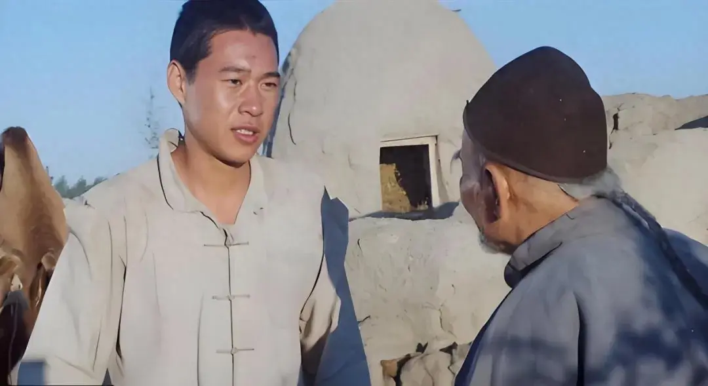

有人说，老舍先生100年前写下的《骆驼祥子》，其实是当代人的奋斗史。

年轻力壮的祥子，梦想是拥有一辆属于自己的黄包车，过上幸福的好日子。

为了这个目标，他起早贪黑赚钱，一天都不敢懈怠。

可奋斗半生，还是无法改变命运，最终自甘堕落，活成了一滩烂泥。

祥子的人生，何尝不是当下人们的写照。

许多人也是同样辛苦数十载，只换来了忙碌而贫穷的一生。

祥子到死都认为，他未能过上好日子，是因为拉车不够努力。

他永远都不知道，这3种穷人思维，早就把他困在了命运的铁笼里。


<div style={{textAlign: 'center', color: '#FF8C00'}}>  
  <h3>1</h3>
  <h3>只顾埋头苦干的老黄牛思维</h3>
</div>


那一年，祥子怀揣着满腔热血，成为北平的一名拉车夫。

他心心念念的，是拥有一辆属于自己的黄包车。

于是，他倾尽所有，先租来一辆黄包车，在北平城的街头巷尾开始了奔波。

然而，拉车仅两日，他的脚踝便肿胀得如同两条瓠瓜，再也无法抬起。

拉车时，祥子感觉自己犹如一只被抽打的陀螺，日复一日地被生活抽着旋转。

尽管他如此努力，但赚钱之路依旧艰难无比。

有时候，他从东直门拉到西直门，连一个乘客也未遇到；

有时候，他累得汗流浃背，却还会碰到赖账的乘客。

他拼尽了所有努力，但每日仅能积攒一角钱。

而一辆黄包车的售价，就高达百元。

这意味着，买车的愿望，成了遥不可及的梦想。

你看，祥子为什么赚不到钱，是因为他一直埋头苦干，却没有想过这种低质量的努力有没有价值。

就像一头老黄牛一样，只顾埋头拉车，却没有抬头思考前进的方向对不对。

以前我上班的单位，有个同事工作特别辛苦也特别勤快，什么脏活累活都抢着干。

但奇怪的是，几年过去了，很多人都升职加薪，只有他的薪水一成不变。

数年辛苦工作，只不过是换来了一个比以前更差的身体。

终于有一天，他忍不住向老板抱怨：“我一直以为，只要自己努力工作，就能得到相应的待遇。但是为什么我累死累活，拿的还是公司最低的薪资？”

老板听完，意味深长地回答他说：“你天天就干些填表、搬东西的活，谁都可以做，就算你每天加班到十二点，你也拿不了高薪。”

这番话，既刺耳又真实。

这个社会，真正的财富一定不是靠盲目拼命赚来的。

如果你一味地追求辛苦钱，你会发现自己饿不死，但也过不上更好的日子。

所以，要想实现财富的增长，就要从繁重的体力劳动中解脱出来，思考更多元化的赚钱模式。

就像在《骆驼祥子》里，祥子只一门心思想着拉车，但是车行的刘四却想办法卖车。

刘四通过钱生钱，最终当上了大老板，祥子却只能始终在底层徘徊。

经济学家丹尼尔·卡尼曼说：

**重复且长时间的无尽忙碌，大部分人都可以做到。难的是思考。没有深入的思考，勤奋就没有意义。**

唯有不断地提升个人的思维方式，才能彻底摆脱贫穷的束缚，迎来命运的重生。




<div style={{textAlign: 'center', color: '#FF8C00'}}>  
  <h3>2</h3>
  <h3>只图蝇头小利的贪心鬼思维</h3>
</div>


历经三年的咬牙苦干，祥子终于积攒下了一百大洋，如愿以偿地购置了一辆属于自己的车。

他满心以为，梦想已经近在咫尺，现实的残酷却给了他沉重的一击。

那段时期，老北京城被战争的谣言所笼罩，人心惶惶。

都说西直门外的军阀正在大肆搜捕车辆，车夫们因此都不敢轻易接单出车。

但祥子为了多赚两块钱，还是毅然决然地冒险外出拉车。

不幸的是，他还没能驶上小道，就连人带车被一伙士兵给劫持了。

车被官府无情地没收，祥子心痛如刀绞。

在被囚禁于军营的日子里，祥子悲愤呐喊：“凭什么？凭什么啊？”

他一味控诉社会的黑暗，却从未深入反思过自身的问题。

当两块钱的诱惑摆在面前，他就昏了头拎不清。

他急着挣钱，却没有想过：**哪些钱能挣，哪些钱不能挣。**

正是这一时的贪婪之心，让他多年来的辛苦付诸东流。

胡雪岩说：“世上诸事，都有两面，这一面占了便宜，那一面就要吃亏。”

很多人之所以穷，就是因为像祥子一样，困于眼前的蝇头小利，结果掉进了现实的陷阱里。

想起一段很有意思的话：

```

兼职的人为什么收入最少？因为他们的眼光只能看到一天，拿的只能是日薪；

打工族为什么收入同样少？因为他们的眼光只能看到一个月，拿的只能是月薪；

老板为什么收入很高？因为他们的眼光可以看到几年，拿的是项目款；

企业家为什么收入最高？因为他们的眼光可以看到未来几十年甚至上百年，拿的是将来的钱。

```

《跃迁》中有段话说：

**“高手并不是能力比我们强、智商比我们高、定力比我们好。**

**只是因为他们看到了更大的系统。”**

在赚钱这件事上，欲速，则不达；见小利，则大事不成。

你能获取多大的财富，取决于你眼光有多远。

做事要注重长远利益，从全局分析利弊，财富才会源源不断而来。


<div style={{textAlign: 'center', color: '#FF8C00'}}>  
  <h3>3</h3>
  <h3>只按惯性思考的一根筋思维</h3>
</div>


祥子离开兵营后，再次陷入一贫如洗的境地。

无奈之下，他只好回到洋车厂，租了一辆车，继续靠出卖劳力来积攒购车资金。

车厂的厂主刘四爷，见祥子为人诚恳老实，便主动提出愿意借钱给他买车。

但祥子舍不得支付利息，坚持要用现钱买现货。

主顾方太太出于好意，想帮他在银行办理一张存折，这样既安全又方便，还能赚取一些利息。

祥子依然听不进去，他认为只有把钱紧紧攥在自己手里才是最踏实的。

没想到，一位狡猾的侦探盯上了他，三言两语就骗走了他的家底，祥子追悔莫及。

老话说：听人劝，吃饱饭。

很多穷人之所以穷，就是源于一根筋思维。

就像祥子，觉得一切方法都不如用体力赚钱来得踏实，一切新方法都不如老方法更可靠。

他一味认死理，只按着自己的惯性去思考问题，最终放弃了任何改变的可能。

同样是社会最底层的可怜人，高妈却一步一步改变了命运。

高妈的丈夫是个酒鬼赌徒，家产早已被他败光。

吃不饱饭的高妈，只好从乡下来到城里，勉强讨生活。

在曹先生家做女仆的时候，高妈手脚勤快干活麻利，很快就在曹宅站稳了脚跟。

女仆的收入不高，但高妈并没有紧盯着死工资。

她想起自己的赌徒丈夫，曾经很喜欢四处借钱，每回都要还利息。

高妈琢磨了一番，也学着银行的模式，把钱放了出去，让钱生钱。

凭借这套赚钱模式，高妈很快就赚得盆满钵满，过上了滋润的小日子。

高妈曾经劝祥子：“祥子，钱搁在兜儿里，一个子永远是一个子！放出去，钱就会下钱！”可惜祥子只想靠拉车过一辈子，最终怎么也摆脱不了穷苦的命运。

很多时候，框住一个人的不是环境，也不是能力，而是僵化的思维模式。

听不进去别人的意见，总认为自己是对的，就很难摆脱贫穷的束缚。

赚钱的路子，永远不止一条。

学会聆听周围人的声音，以灵活多变的方式去挣钱，才能真正迈向富有的大门。


<div style={{textAlign: 'center', color: '#FF8C00'}}>  
  <h3>▽</h3>
</div>


经济学上，有个名词叫“低收入陷阱”。

说的是：**很多人的收入没办法得到积累，所以就会形成恶性循环，越来越穷。**

恰如祥子的一生，拼尽全力也改变不了现状，最终一败涂地。

背后原因就在于，他始终被穷人思维裹挟而不自知。

经济学家阿比吉特·班纳吉在《贫穷的本质》中说：**“贫穷不仅是一种物质状态，更是一种心态和思维方式。”**

思维不改变，无论多努力，也会被锁死在社会的底层。

认清自身的思维局限，并致力于打破这种定式，才能摆脱贫穷的枷锁，实现真正的财富自由。


—END—

