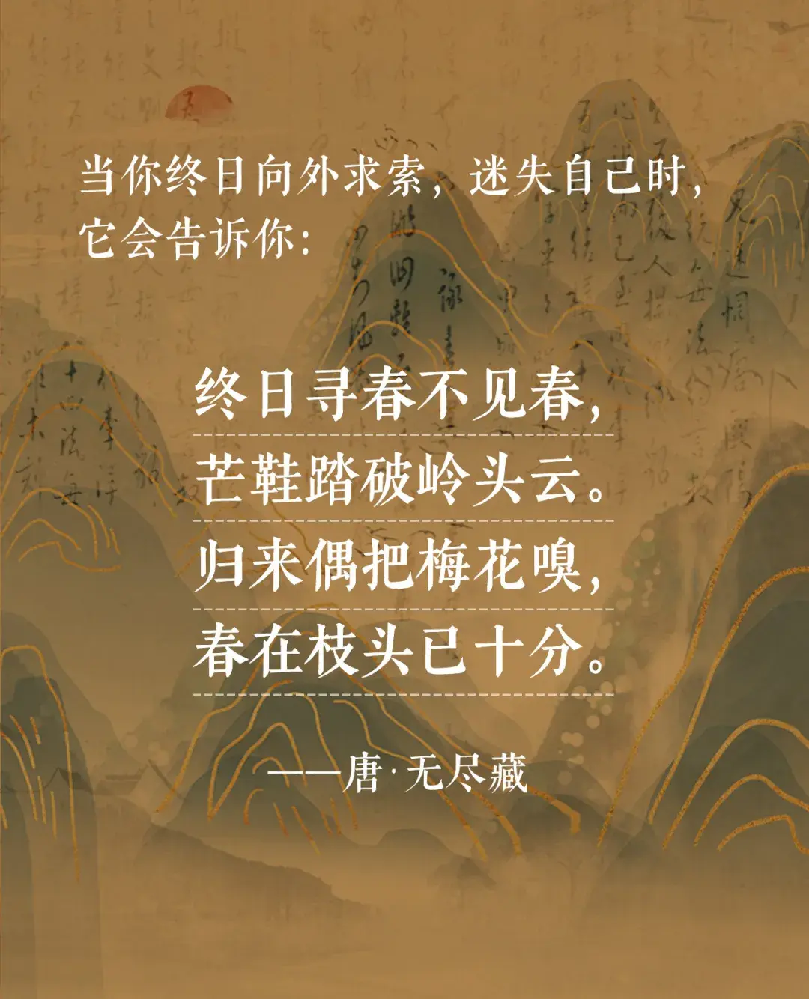
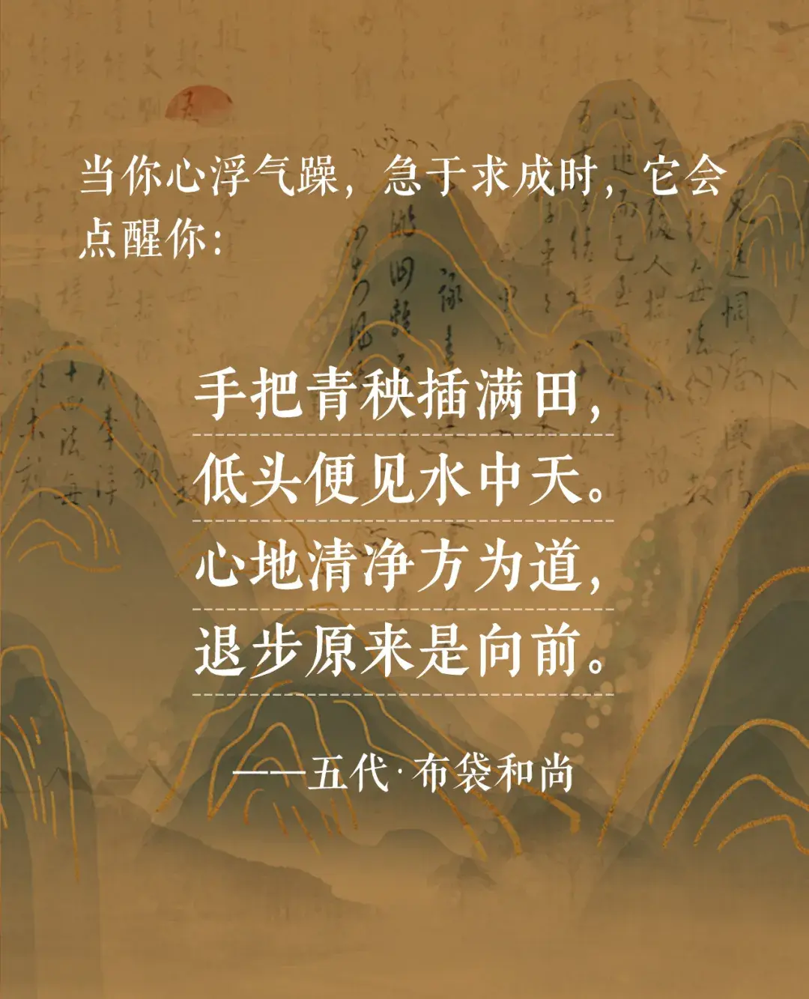
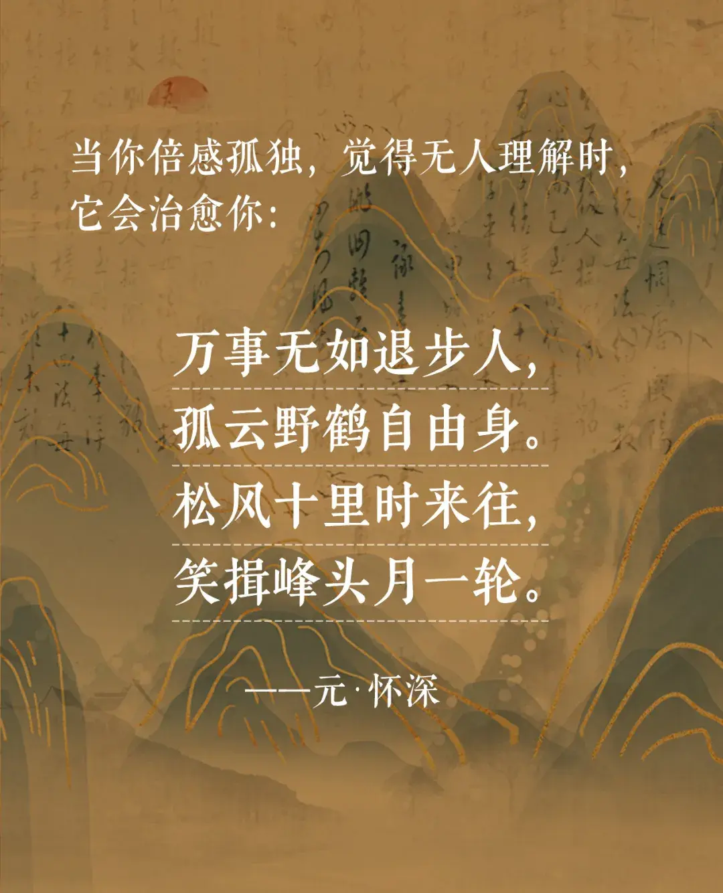

大千世界，芸芸众生，各有迷障。

有人为了事与愿违而苦扰，有人为了一时名利迷失自我，有人深陷忧虑之中惶惶不可终日。

作家林清玄年轻时，也曾陷入低谷，痛苦迷茫时，他就坐下来读禅诗。

最终，他的人生困惑，都在禅诗中找到了救赎之道。

这7首史上最经典的禅诗，朴素无华，却参透了人生的诸多智慧。

你若能读懂其中的深意，相信也能治愈自己所有的焦虑和内耗。


<div style={{textAlign: 'center', color: '#FF8C00'}}>  
  <h3>1</h3>
</div>


仓央嘉措曾在诗中写道：“世间事，除了生死，哪一桩不是闲事。”

人活于世，磕磕绊绊不会少，喜怒哀乐也总有时。

但无论遇到怎样的事情，你不将它们放在心上，它们就会随着时间的流逝，烟消云散。

佛语亦云：“烦恼本无根，不捡自然无。”

世间之事，往往只在一念而已。

秉持着一颗平常心行走于世间，把大大小小的烦恼尽抛诸脑后。

去欣赏春天的百花齐放，夏天的凉风拂林，秋天的皓月当空，冬天的白雪皑皑。

当你把注意力集中于一切美好的事情，专注于活在当下，饥来食，困则眠，热取凉，寒向火。

你就会懂得：**日日是好日，时时是好时，目之所及皆是美好。**


<div style={{textAlign: 'center', color: '#FF8C00'}}>  
  <h3>2</h3>
</div>





唐代一个叫无尽藏的禅师，在参禅开悟的关键时刻，总是难以突破。

于是师父让她去寻找春天。

可怜她历经千辛万苦，遍访名山大川，都没有找到一枝春意。

直到回到自家庵庙门口，发现了第一支春梅，她才顿悟：

原来她一直苦苦追求的事物，一直都在自己身边。

**生活中，我们也总是忽视那些唾手可得的幸福，而去追求那些遥不可及的东西。**

比如金钱，比如地位，比如名誉......

这些东西，很多人终其一生都得不到，就算得到了，也只会有一刹那的狂喜。

那些东西并不能带来真正的幸福，真正的幸福来自于那些能抚慰你心灵的事物。

比如爱，比如自由，比如健康。

而这些，其实一开始就在，只是你后知后觉而已。

因此，别在因为求索而迷失了自己，多去珍惜自己的拥有，你才能真正地感受到生活的美好。


<div style={{textAlign: 'center', color: '#FF8C00'}}>  
  <h3>3</h3>
</div>


沈复在《浮生六记》中说：

```

世事茫茫，光阴有限，算来何必奔忙？

人生碌碌，竞短论长，却不道容枯有数，得失难量。

```

就好比你去看庭中的一棵树，早春时它花满枝头，可到了暮春，也许就只剩残叶落花。

人间的事情也是同样的道理。

风头正盛时，你可能会拥有很多，一旦时运过去，你就会尽数失去。

花活一季，人活一世，有些荣枯绕不开，有些得失逃不过。

你若执着得失，一味自苦，人生就会多出许多痛苦。

常言道：**“心无增减，得失随缘。”**

学着活得从容一点，留不住的，随缘随喜；得不到的，一笑而过。

保持内心的淡然，我们自然就能少些烦恼，多些洒脱。


<div style={{textAlign: 'center', color: '#FF8C00'}}>  
  <h3>4</h3>
</div>




五代时期有一个游方僧人，经常背着一口布袋出游四方，世人便称呼他为“布袋和尚”。

一日，他路过田间，见农夫手握一把秧苗，一根接着一根插在田里。

农夫一直在往后退，可是种的苗却越来越多，布袋和尚由此明白：

插秧时的退步，恰恰是为了离丰收更进一步。

人生亦是一样的道理。

很多事情，你越急，越浮躁，越容易往失败的方向走；

事事争胜，时时要强，也只会透支自己的生命力。

**可你若懂得后退的智慧，便能圆融贯通地看待世间万事，从容通达地行走于世间。**


<div style={{textAlign: 'center', color: '#FF8C00'}}>  
  <h3>5</h3>
</div>


有个寺庙内有两株树。

一株生机勃勃，另一株却凋零破败。

禅师问他的两个弟子：枯的好，还是荣的好。一个弟子回答：“当然是荣的好。”

另一个弟子却说：“枯也由它，荣也由它。”

禅师赞道：“世间万物，生长凋零皆有定数，无需过分执着其中的差异。”

是啊，这短短的一生，我们只来一次，又何必过于在意过去如何，未来怎样。

佛曾说：**“过去心不可得，未来心不可得。”**

人能把握的，唯有当下。

往后余生，那些解不开的结，要学会看淡；那些还没发生的事，更不必忧惧。

做一个外在淡然、内心丰盈的人，让一切顺其自然，不论发生什么，你都能从容应对。


<div style={{textAlign: 'center', color: '#FF8C00'}}>  
  <h3>6</h3>
</div>




现代人特别害怕孤独，一身处孤独之中，就会感到莫名的惶恐。

于是他们竭尽全力去合群，最终却在人群中迷失了自己。

其实，孤独未尝不是一件好事。

元代怀深就说，一个人住在深山之中，听松风吹拂，看明月高悬，是一件多么闲适的事情。

而这种惬意，是永远无法在人群之中体会到的。

作家冯骥才说过：**“平庸的人用热闹填补空虚，优秀的人以独处成就自己。”**

对于后者来说，孤独不是寂寞，是沉淀，是丰盈，是自在。

所以你也不妨试着享受孤独，当你真正从独处中找回自我，灵魂就会回归丰盈，生活也会返璞归真。

到那时，你亦可以做到：闲云野鹤离红尘，自立山头一片云。


<div style={{textAlign: 'center', color: '#FF8C00'}}>  
  <h3>7</h3>
</div>


人的一生中总会面临这样那样的困境。

大诗人王维也不例外。

他出身于官宦世家，又是远近闻名的神童，少年可谓是志得意满。

可进入官场后，他很快因为一场“伶人舞黄狮子”犯了皇家大忌，被人一举告发，贬官千里。

不久后，她的妻子又因难产身亡，孩子也没生下来。

遭此困顿，王维也伤痛消沉了很长一段时间。

但他没有一直沉沦下去，而是决定放下过往，在终南山边过起了随遇而安的生活。

每个人的一生中，都会经历这样的至暗时刻。

这些黑暗的经历，修的就是我们的一颗心。

当你的心境被修炼得足够豁达，那么无论处境如何坎坷，你也一定能一一潇洒走过。

就像木心先生所说：**“所谓无底深渊，下去，也是前程万里。”**


<div style={{textAlign: 'center', color: '#FF8C00'}}>  
  <h3>▽</h3>
</div>


苏轼说：“人生如逆旅，我亦是行人。”

在这趟人生逆旅里，多的是事与愿违、想不通和意难平。

所以越对人生之路感到迷茫，我们就越应该读禅诗。

就像有人说的：**“读诗，能获得内心的安宁，而读那些富有禅理禅意的诗，则更能治愈人的精神内耗。”**

众多禅师多年的修行智慧，总有一句能教你释怀、助你醒悟。

在你彷徨失意时，这些所得会拓宽你的心胸，让你释怀一切的内耗与烦恼，活得越来越通透。


—END—


