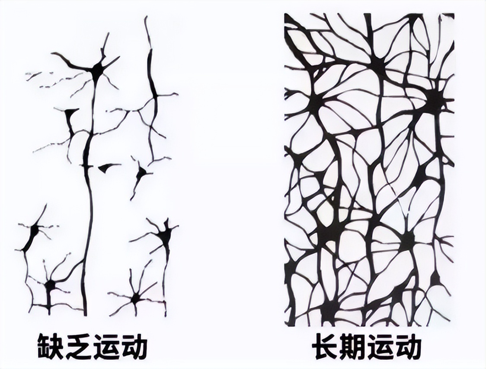

经常跑步的人，身上会发生什么样的变化？

看到一组对比图：

跑步前，人体被大大小小的情绪、健康问题所困扰，状态十分紊乱；

跑步后，人从内至外都变得清清爽爽，无论身体还是心态，都得到很大改善。

跑步就像一场由内至外的洗礼，让人的面貌焕然一新。

对此，美国记者斯科特·道格拉斯，深有体会。

斯科特曾在15岁时，被确诊为抑郁症，靠长期吃药，控制病情。

一次偶然，他发现自己很享受迎风奔跑的过程，从那以后，他便养成了每天跑1—2小时的习惯。

跑步，让他渐渐摆脱了抑郁症的困扰，即便不吃药，也能心态积极地投入工作和生活。

如今，斯科特已经有40年跑龄。

但他还是一如既往地热爱跑步，还把自己的对跑步的探索，写成了一本书——《跑步的力量》。

在书中，他感慨：

“我深深陶醉于跑步对我的影响中，那种走出家门，只需30分钟就能带着活力、充实和愉悦感回家的感觉，实在是太神奇了！”

**跑步，是心灵的重建，也是自我的重生。**

无论什么时候，都不要小瞧跑步的力量。

当你迈开腿，脚下的每一步，都能让你摆脱平庸，迎来新生。

  
  <h3>1</h3>
  <h3>跑，激活大脑</h3>

卢梭有句名言：“我的身体必须不断运动，脑筋才会开动起来。”

人的思维就像齿轮，只有动起来，才能越来越灵活。

《跑步的力量》中解释，这是因为，我们在运动时，大脑的供血量会增加。

**脑部血液循环越通畅，接受的营养物质就越多，效率自然就高了。**

跑步，是激活大脑性价比最高的方式。

有空多跑步，我们的大脑会在这些方面，发生惊人的改变：

**1. 增强记忆力**

《跑步的力量》里提到，跑步有助于促进海马体内神经元的增长。

而海马体又被称为人脑的“记忆中枢”，里面的神经元数量越多，越能更好地控制认知，储存记忆。

跑步，能从根本改善人的记忆力。

每跑一次步，你的脑力就会被激发一分，你的潜能，也会增加一大截。

很多人上了年纪后，会感到自己越来越健忘。

想提升记忆力，再多的食补药补，都比不上坚持跑步。

每跑一次步，就可以让神经元在运动的刺激下，加速连接、生长，形成顺畅的“记忆高速通路”网络。

记忆力好了，烦心事也少了，你也能以焕然一新的精神面貌，投入高效的工作和生活。

**2. 提高专注力**

书里，作者提到了一个“跑步流”的概念。

意思是，跑步后的人，注意力会更集中，更容易进入“心流”状态。

这是因为，跑步会促进大脑吸收更多的氧气，让人在工作时，保持更长时间的清醒和专注。

相信很多人都有这样的时刻：明明想专注完成任务，可心里却充斥着各种各样的杂念，始终找不到状态。

心浮气躁时，与其花时间埋头死磕，不如出门跑一次步。

让大脑在运动的过程中恢复清明，你也能收回涣散的注意力，更加聚精会神，攻克一个又一个难题和挑战。

**3. 激发思考力**

书里，作者分享了自己一位作家朋友的神奇体验：

这位作家每次跑完步，都会感到脑海中迸发出很多灵感，跑步前写的零碎句子，他也能以颇具创意的方式，重新组合成文。

这种状态，是他静坐提笔时，绞尽脑汁都无法达到的。

所以每次跑完步，他都会跑到书桌旁，把灵感记录下来。

长此以往，他攻克了很多输出难关，写作之路也越走越顺。

跑步，就像撬开思维之锁的钥匙，让人的思考能力，得以源源不断迸发。

有研究表示，即使5分钟的锻炼，也能激发创造力；锻炼20分钟，不仅能增强脑力，而且效果可持续数个小时。

**你对跑步有多注重，你的思考能力就有多出众。**

思路堵塞的时候，就去跑跑步，说不定哪天的灵光乍现，就能让你得到机遇垂青，改变自己的一生。

  
  <h3>2</h3>
  <h3>跑，治愈情绪</h3>

《世界日报》曾发表过一项研究：

相比那些懒于运动的人，经常运动者的快乐感，足足高出52%。

运动，是对情绪的深度滋养，能把心中所有的焦虑、愁闷、不安，荡涤干净。

当你觉得被生活压得喘不过气，不妨出门跑跑步。

随着汗水的挥洒，身体舒畅了，很多负面情绪，都能不药而愈。

**1. 走出抑郁**

书里，作者通过哈兹的故事，展现了跑步治愈抑郁的全过程。

哈兹曾经因为意外流产，跌入人生至暗时刻。

她经常动不动哭泣，每天除了待在家，哪都不想去。

直到咨询师建议她跑步，情况才开始好转。

刚跑步时，哈兹的脑海常常充斥着各种消极想法，不是反刍失去孩子的痛苦，就是反复暗示“我不行”。

但神奇的是，每当跑完1/4的路程，她的注意力就会聚焦到自己的速度、呼吸和心率上。

等跑完全程，她心中的消极念头，早已荡然无存。

坚持几个月后，哈兹越来越享受跑步的过程，她不再困于抑郁情绪中，性格也越来越开朗。

对此，作者解释道，**跑步可以促进多巴胺、血清素的分泌，这些“快乐激素”，能够治愈身心，让人感到从未有过的酣畅淋漓。**

想要触发人体的“快乐开关”，最有效的方法，就是在风里尽兴跑一回。

在汗水挥洒中，把所有糟心事都抛诸脑后，你终将把自己从负面情绪里拉出，收获满心的欢喜。

**2. 缓解焦虑**

《跑步的力量》里，作者提到了一个“杏仁核劫持”的概念。

简单来说，就是人在面对精神压力时，体内的杏仁核会过度反应，让我们产生紧张、焦虑的情绪。

而跑步，则能抑制杏仁核的过度反应，帮我们释放压力，舒缓情绪。

书里，塞西莉亚就是一个典型例子。

塞西莉亚是一位律师，工作上的各种疑难案件，让她精神长期高度紧张，有段时间，她甚至感到自己心脏狂跳、呼吸困难。

在医生建议下，塞西莉亚开始晚上跑步。

神奇的变化出现了——跑之前，塞西莉亚的情绪指数只有4分，但跑步之后，往往能达到8分。

坚持一段时间后，塞西莉亚感到自己渐渐摆脱了焦虑状态，即便工作繁忙，她也能应付自如。

跑步，就像舒缓心绪的速效药，让人卸下精神内耗的包袱，把所有焦虑、烦恼，抛到九霄云外。

快节奏的时代，人们被生活的洪流裹挟，难免有感到身心俱疲的时候。

跑步，正是纾解压力的良方。

**当你奋力往前跑，烦恼就会往后退，你也能以饱满的精神状态，迎接生活和工作的挑战。**

**3. 摆脱自卑**

作者斯科特认为：“跑步会带来一个巨大心理益处，就是自尊的激增。”

这是因为，每当我们实现跑步目标，内心就会涌起极大的满足感，驱动我们更积极地，投入下一次行动。

很多人被自卑的枷锁困住，不是困难当前时妄自菲薄，就是因为旁人的优秀，陷入落差感中。

想提升自信，没有比跑步，成本最低、效果最好的方式了。

**只要你迈开腿，就能百分百到达目的地；只要你愿意付出努力，就会有确定性的收获。**

把跑步坚持成习惯，你将逐渐走出自卑的阴影，信心百倍地，绽放出自己闪光的一面。

  
  <h3>3</h3>
  <h3>跑，重塑生活</h3>

很喜欢作者在书中说的一句话：

“每天跑1小时，就能带动剩下23小时的进步。”

如果说有一件事，能帮助人强身健体的同时，提升生活质量，那一定是跑步。

选择跑步，就是选择一种生活方式。

当你爱上跑步，你会发现，跑步也全方位地，为你塑造了更好的生活：

**1. 改善作息时间**

书中，作者提到，坚持跑步能使睡眠持续的时间更长、质量更高。

人一旦睡好了，作息也会更规律，无论什么时候，都元气满满。

我曾经有段时间，经常玩手机到凌晨两三点，导致第二天不是睡过头，就是工作时哈欠连天。

直到有一天，一位朋友邀请我一起夜跑。

每次跑完步后，我都累得气喘吁吁，回家洗完澡，就忍不住倒头大睡。

长此以往，我渐渐养成了早睡早起的习惯，第二天上班，也精力充沛。

可以说，是跑步，给我带来了健康的生物钟，精神面貌也得到改善。

现代人生活节奏快，难免会通过报复性熬夜等方式，放纵自身。如果你迫切地希望改变糟糕的作息状态，不妨通过跑步，重启生活。

将奔跑进行到底，在迎风奔跑中，你就会遇到更规律健康的自己。

**2. 戒掉不良嗜好**

书中，作者通过拉斯本的故事，论述了跑步对于戒瘾的重要性。

拉斯本是一位工程师，因为应酬繁多，渐渐沾上酗酒的恶习。

直到被女友要求戒酒，他才开始通过跑步，转移对喝酒的注意力。

拉斯本惊喜地发现，坚持跑一段时间后，自己对酒精的依赖，逐渐消失了。

以前他去应酬，他总会情不自禁喝到烂醉如泥；但现在，他喝一两杯，就会自觉地停止。

坚持跑步5年，拉斯本彻底摆脱了酗酒的恶习。

书里有一句话：

“锻炼会让成瘾者去适应新的刺激，从而让他们养成更加健康的习惯。”

跑步，是戒掉陋习的开始，也是良好习惯的起点。

每天坚持跑起来，用好习惯，去替换你的坏习惯，你将在汗水洗礼下，完成从平庸到优秀的蜕变。

**3. 养成自律体质**

村上春树曾说：

“通过跑步可以养成自律的习惯，锻炼自己的意志力。”

对此，作者也有类似的观点。

他采访过一位叫哈夫斯特的跑者，刚开始晨跑时，哈夫斯特非常不适应，总是想赖床。

为了监督哈夫斯特，教练让他养成记日记的习惯。

这样一来，哈夫斯特就渐渐有了跑步的动力，因为他实在不想在坚持跑一段时间后，在日记上记个0。

跑步过程中，哈夫斯特也逐渐有了深刻的感悟：

“如果我在最糟的日子里，仍旧坚持跑步，那还有什么事情我做不到呢？”

哈夫斯特把这份自律延续到了生活和工作中，无论遇到什么挑战，他都能死磕到底。

**跑步，就像一把雕刻刀，削去懒怠和拖延，让人成为更强大的自己。**

一个在跑步上严于律己的人，心性一定是足够坚韧的。

跑的时间越久，你越会发现，自律成了一件轻而易举的事，你也能克服懒散，找回对生活的掌控感。

  
  <h3>▽</h3>

书里，作者说：

**“跑步对人的最大意义，就是跑完后全身都会被按下‘重置’按钮，更好开启每一天。”**

跑步，能激活人的大脑，治愈糟糕的情绪，由内至外地重塑生活。

越是浑浑噩噩、萎靡不振的时候，越需要通过奔跑，改变当下的状态。

再烦闷的心情，风里跑一圈，也能获得治愈；再低迷的生活，坚持跑一年，也会迎来蜕变。

—END—

