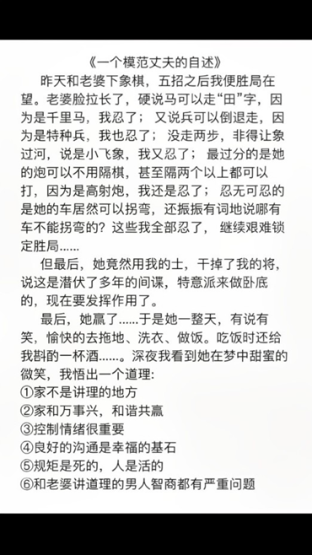

多年前，读到南怀瑾先生分享的一道古诗，曾深感困惑：

  
  <h4>手把青秧插满田，低头便见水中天。</h4>
  <h4>心地清净方为道，退步原来是向前。</h4>

直到后来因为太过争强好胜，与家人朋友的关系频频出现矛盾，才终于理解诗中深意。

任何感情想要长久，都离不开一个底层逻辑：学会适时让步，不争无谓输赢。

就像插秧，退步是为了向前。

人与人相处也一样，要懂得先让对方赢，最后你才能赢得他。

  
  <h3>1</h3>

- **让伴侣赢，才能赢得真情。**

作家莫鲁瓦说过：没有冲突的婚姻，几乎同没有危机的国家一样难以想象。

两个人同住一个屋檐下，有分歧和摩擦很正常。

但如果你凡事都要据理力争，非得在嘴上压对方一头，那就注定把日子过成鸡飞狗跳的模样。

宁波有位男士，和妻子曾因一碗面而吵架吵上热搜。

夫妻俩去面馆，妻子饿着肚子等了半个多小时，等来的却是一碗煮坨且鱼腥味浓到发臭的面。

妻子当即要求店家换一碗，可还没等店家说话，丈夫竟扭身就走。

妻子气从中来喊住丈夫，可对方却反过来指责她小题大做，为了十几块钱给自己丢脸。

他一通输出，对妻子大讲特讲道理：

就这么点小事，何必上纲上线，也不想想人家开店不容易……

越训越起劲，最终把妻子逼到崩溃大哭。

他压根不明白，**婚姻中需要的从来不是争对错，而是能容错。**

每个人都有自己的性格和脾气，总要争个高下，就算赢了口舌也会输了感情。

学会克制反驳欲，适当服软，适时示弱，才是聪明人的爱情保鲜之道。

想起有人在网上发的一篇朋友圈自述。

丈夫和妻子下象棋，原本已胜局在望，但妻子不服输，硬是找各种理由乱出棋。

最后，妻子用“士”干掉了他的“将”，他也乐得顺水推舟，让妻子赢得开开心心。

结果就是那一天下来，妻子在家做什么都是有说有笑，对他的态度也变得格外温柔。

这位丈夫不由感叹，和老婆讲道理的男人智商都有问题，是放着好日子不过。

**喜欢是势均力敌，爱是主动认输。**

婚姻幸福美满的前提是，有一方肯先退让。

既然如此，何不做那个更大度的人，修炼为爱服软的能力，赢得和爱人一生相偎相伴的福气。

  
  <h3>2</h3>

- **让父母赢，才能赢得安宁。**

知乎上有个提问：老一辈的中式父母，可以让子女有多无奈？

有个高赞的回答写道：你想让他们安享晚年，可他们却要没苦硬吃，有病硬扛。

这样的矛盾在家庭中确实比比皆是，你越是把它当回事，家里的关系可能会越处越僵。

去年，朋友怕70岁的老父亲在乡下呆得太孤单，特地把他接到城里住。

可老人平时种地种习惯了，根本就闲不住，没多久便偷偷瞒着她去小区里捡垃圾。

直到有次，老人在楼道里不小心滑倒，所幸送到医院检查后没有大碍。

之后朋友就极力反对父亲再去捡垃圾，可老人嘴上答应，行动上还是该干嘛干嘛。

朋友气不过朝他大发了一次脾气，说自己家不缺他捡垃圾卖的那三瓜两枣。

老人家也倔得很，甩下一句“以后再也不来受气了”，直接收拾行李回了老家。

面对越来越固执的父母，很多人容易心生不耐，急欲劝说他们做出改变。

但其实，这恰恰说明父母真的老了，更需要我们设身处地多关怀。

**家事无对错，和睦的家庭关系，无非是少一点争锋相对，多一点理解万岁。**

主持马东曾在节目中提及自己70多岁的母亲，最喜欢做的一件事就是关灯。

马东多次尝试提醒母亲，开灯费不了多少电，并且开关用多了也会影响使用寿命。

但他后来发现，节约用电已经是母亲的习惯，自己反复指出问题，只会让她变得焦虑紧张。

自那时起，他不仅很少再因为这些小事和母亲计较，还会在离开家门时主动先帮母亲关灯

《礼记》中月言：孝子之养也，乐其心，不违其志。

两代人之间，代沟无可避免。

父母有父母的世界，为人子女该做的，不是强求观念一致，而是学会不争不斥。

包容父母的落伍之处，尊重他们的生活方式，让他们能够开心自在地生活，才是最好的孝顺。

  
  <h3>3</h3>

- **让朋友赢，才能赢得人心。**

常听到一句感慨：成年人的友谊难得易失。

想想真是如此。

人生从来知己难求，但想要失去一个朋友，却只需要一颗争强好胜之心就够了。

作家刘墉在书中写过一篇故事。

三个曾经无话不谈的好友，一起签约在同一家唱片公司，还合租了房子共同生活。

后来其中一个人被公司作为重点新人包装，发了唱片，有了知名度。

自那时起，另外两人就开始有了落差感，常以各种方式和她暗中较量。

三番两次感受到敌意后，她选择搬离公寓，主动结束这段关系。

我们都希望能拥有一份永不变质的情谊，可很多时候，亲手毁掉它的人也是自己。

因为自己摆不正心态，总是错把朋友当成竞争对手，才让关系变得无以为继。

能走得长久的友情，并非没有差异，只是懂得克制胜负欲，转而给予彼此欣赏与鼓励。

梁启超在结识陈寅恪后，十分认可其才情，并向清华大学校长曹云祥力荐了他。

得知陈寅恪既没有学位，又没有著作，曹校长起先并不同意。

梁启超拍着胸脯立誓保证：“我全部著作，不如他数百字有价值。”

陈寅恪到清华任教后，因博学强识而很快扬名，成为深受学生推崇的“活字典”。

之后外界常有人拿他们做比较，梁启超非但不介意，还很乐于认输，承认朋友比自己优秀。

通过相处，陈寅恪也愈加钦佩于梁启超的豁达心胸，将其视之为值得一生相惜的挚友。

诚如古书《幽梦影》中所写：

云映日而成霞，泉挂岩而成瀑，所托者异，而名亦因之。此友道之所以可贵也。

朋友如金，贵在用心。

戒掉无谓的攀比，彼此有成就托举对方的智慧，自能让友情承于惺惺相惜，久于细水长流。

  
  <h3>4</h3>

- **让伙伴赢，才能赢得大局。**

加利福尼亚大学查尔斯·卡费尔德教授，曾对1500名取得杰出成就的人物进行调查和研究。

得出一个共通点：他们在职场中注重的是如何借力合作，而不是考虑怎样击败他人。

很多人看似精明，处处与人争利，到头来不过是占了小便宜，却输了全局。

真正的聪明人，则恰恰相反，他们知道一味追求自己赢，永远无法达成良性的合作。

学会先让对方获益，才是让自己获益的前提。

就好比，两个人分一个橙子，就算你费尽力气分到了大半个橙子，也只会适得其反。

因为你真正的需求，是得到整个果肉。

正确做法，是想办法让对方感觉他赢得了“果皮”，对方自会心甘情愿把“果肉”留给你。

一场优质的合作，本质是用相互认可的沟通，实现长远的互惠互利。

台湾企业家林家正年轻时做生意一直擅于精打细算，可在商场摸爬滚打多年后仍以破产告终。

经过反躬自省，他吸取了以前的错误。

第二次创业，他不管跟谁合作，都坚持以让对方先有钱可赚为原则，自己少拿两分利。

就这样，舍得眼前小利，积得良好口碑，让他的生意自此一路顺风顺水。

很认可刘润的一句话：**合作的前提，是走出“我一定要打败你”的思维，找到共同利益。**

虽说职场如战场，但锱铢必较的结果，不是此消彼长，就是两败俱伤。

我们需要做的，放下对一己之利的贪求，建立共赢思维。

当你照顾到别人的需求，别人必定也会乐意来成全你的要求。

  
  <h3>▽</h3>

《菜根谭》中有言：处世让一步为高，待人宽一分是福。

人与人相处，能笑到最后的赢家，都是懂得把无谓的胜利让给对方的人。

学会适当吃亏、适度让步、适时服软，才是维系关系最好的方式。

—END—

