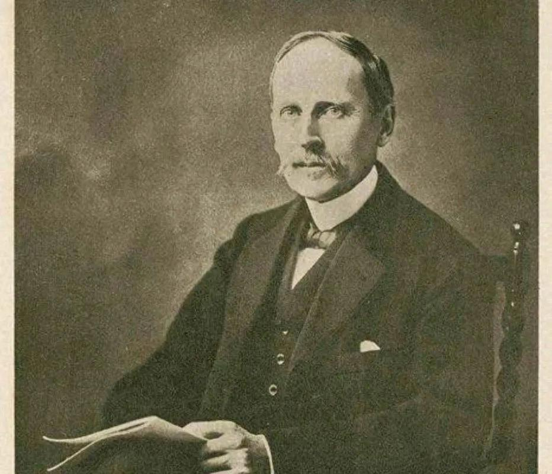

1944年12月30日，法国作家罗曼·罗兰与世长辞。

他是唯一一个被世人称为“世界良心”的文学巨匠。

身处战火纷飞的年代，所有人都在高谈阔论，谈政治、说局势。

唯独他，始终把目光瞄准在最底层的普通人身上。

他用一支笔，写尽了这些人生活中的苦与难，诉说着人该如何过好这一生。

傅雷说：**“在我最迷惘的时候，看到了罗曼·罗兰的书，让我如获神光烛照顿获新生。”**罗曼·罗兰的一言一语，都浓缩了他一辈子的人生智慧，让人醍醐灌顶。

在你迷茫泄气的时刻，不妨看看他这6句话，相信能帮助你解开所有的谜题。

  
  <h3>1</h3>
  <h3>关于生活</h3>

**世界上只有一种真正的英雄主义，就是在认清生活真相之后仍然热爱生活。**

罗曼·罗兰的第一任妻子，是一位富家千金。

结婚时，他还未成名，写的作品无人问津，收入很是低微。

妻子就劝他，不如写点被人喜欢的通俗小说，能够赚更多的钱。

可他依然坚持自己的文学创作方向。

以至于微薄的稿费，根本无法满足妻子的物质需求。

妻子为此大发雷霆，对他冷嘲热讽。

两人的隔阂越来越深，家中满是冰冷与戾气。

原本他憧憬许久的爱情、婚姻、家庭，仅仅维持一年便彻底破碎。

面对现实的重击，很多人都认为他会就此一蹶不振，不再相信婚姻。

可他并未颓丧，而是继续满腔热情地投入至生活。

后来，他遇到了第二任妻子玛利亚。

玛利亚性情温顺，为人朴素而坚强。

在最困顿的时候，她仍旧不怨不恼陪着罗曼·罗兰，鼓励他继续创作。

就这样，两人相知相伴，一直走到生命尽头。

人这一生，充满了太多的失意，理想破灭，爱而不能，求而不得……

很多人在饱受磋磨后，选择随波逐流，变得麻木，变得冷漠。

但罗曼·罗兰说，真正的英雄主义，是认清生活的真相以后，依旧热爱生活。

**不管当下有多难熬，熬过去，一切自然就会好起来。**

现实虽然残酷，但总有光照进来的地方。

只要你选择坚守本心，终能一步步抵达心之所向。

  
  <h3>2</h3>
  <h3>关于成功</h3>

**与其花许多时间和精力去凿许多浅井，不如花同样的时间和精力去凿一口深井。**

心理学家安吉拉·李·杜克沃斯，曾花多年时间研究，决定一个人能否成功最重要的因素。

她调查了社会各界许多成功人士，最后发现：

一个人能否成功最重要的因素，不是智商、情商、人脉，也不是兴趣，而是毅力。

罗曼·罗兰就曾在书中，讲过雕塑家米开朗琪罗的故事。

米开朗琪罗一生受制于教皇，被命令做过许多不喜欢的事。

今天奉命造陵墓，明天不得不学壁画。

但即便如此，他从不曾放下自己情有独钟的雕塑。

他会随身携带锤子和凿子，每有空暇，便找块石头敲敲打打。

他一生倾心于雕塑，数十年如一日打磨技艺。

得益于此，他雕刻出了《大卫》《创世纪》等世界名作。

曾国藩说：**用功譬若掘井，与其多掘数井而皆不及泉，何若老守一井，力求及泉而用之不竭乎？**

我们的人生，就像挖井取水。

四处挖井，浅尝辄止，就只能得到更多的废井。

当你死心塌地挖一口井，持续向下，自然能看到活水溢出。

所以从今天起，开始集中精力，深耕一事。

总有一天，你流过的泪，受过的苦，都会变成一股股甘泉。

  
  <h3>3</h3>
  <h3>关于读书</h3>

**和书籍生活在一起，永远不会叹气。**

作家赫尔岑说：

书籍是最有耐心和最令人愉快的伙伴，在任何艰难困苦的时刻，它都不会抛弃你。

哪怕你被生活拖入泥潭，但只要有书相伴，就总能获得内心的安宁。

1940年，德国法西斯侵占了巴黎。

罗曼·罗兰因为发表反战言论，遭到德军囚禁。

身陷囹圄的折磨，加上身体疾病的痛苦，让他一度有了轻生的念头。

就在绝望之时，他看到了自己随身携带的《战争与和平》。

于是，他决定埋头在书中，以此躲避内心的杂念。

没想到，他读着读着，整个人竟然平静下来。

看着书中人物的悲欢离合，命运的跌宕起伏，他慢慢觉得自己的牢狱之灾并不算什么。

他不再心生怨气，重新找到了勇气和希望。

张恨水曾说：**有书读，就有希望，有了书，路就会在脚下延伸。**

生活刁难每一个人，但只要你愿意，总有一本书，可以为你消解人生的苦。

焦躁难安时，读书能安抚心绪；彷徨无助时，书籍是最好的向导。

人一旦撞开了读书这扇求生门，纵使深陷低谷，也总能突出重围。

  
  <h3>4</h3>
  <h3>关于幸福</h3>

**没有一个人是完整的。所谓幸福，就是认清自己的限度并安于这个限度。**

罗曼·罗兰成名以后，曾有人劝他从商。

对方向他保证，凭借他的名气，商业前景大好。

但罗曼·罗兰一口回绝：我只会写作。

在他看来，自己完全没有投资、管理的能力，能够依靠写作赚得些许报酬，就已经足够了。

如果强行掺和商业运作，他就是在自寻烦恼。

正如他自己所说：

“没有一个人是完全幸福的，所谓幸福，是在于认清一个人的限度而安于这个限度。”

现实生活中，就有不少人认不清自己，喜欢做超出能力的事。

原先过着不错的生活，却偏要买更好的房子，让自己背上沉重的负担；

明明有份稳定可靠的工作，却非要下海经商，以至于赔光了积蓄。

当人无法审视自己的能力，去追逐不切实际的目标，就注定会陷入焦虑、失望的漩涡，无法自拔。

**一个人幸福的开始，就是能够认识自己的能力和价值所在。**

只有找对自身定位，认准方向，才能将日子过得风生水起。

  
  <h3>5</h3>
  <h3>关于苦难</h3>

**累累的创伤，就是生命给你的最好东西，因为在每个创伤上面都标志着前进的一步。**

杨绛说过一句话：

一个人经过不同程度的锻炼，就获得不同程度的修养，不同程度的效益。

好比香料，捣得愈碎，磨得越细，香得愈浓烈。

人想要往前迈步，就必须历经世事磨难的锻炼。

罗曼·罗兰曾在书中写下贝多芬的经历。

贝多芬家境贫寒，一出生就背负了全家的寄托。

从4岁开始，父亲倾尽所有，培养他学习音乐。

一直到25岁那年，他才声名渐起，获得贵族们的欣赏和追捧。

但命运向来无情，日子刚有起色，他就患上了严重耳聋症。

因为听不到任何声音，他跟不上歌唱演员的节奏，在演出时，直接被人当场轰下了台。

此后，他处处遭受排挤，被赶出了五光十色的名利场。

在最落魄无助的时候，他仍旧没有放弃音乐。

远离浮华后，他不断从大自然中找寻缓解伤痛的力量，也汲取了不少创作灵感。

最终，他创作出了感染人心的《欢乐颂》交响曲，重新回到了音乐界巅峰。

正如《汤姆·索亚历险记》中所说，**世间一切磨难，都是能得到补偿的。**

生而为人，没有谁甘愿吃苦，我们总是想方设法地躲避千难万险。

可苦难从不会无缘无故出现，它是避无可避的修行，更是快速成长的捷径。

当你不害怕，不逃避，熬过苦难洗礼，锤炼出真本事，改命的契机也会随之而来。

  
  <h3>6</h3>
  <h3>关于活着</h3>

**大多数人在二十岁或三十岁的时候就已经死了，一过这个年龄，他们只变了自己的影子，以后的生命不过是用来模仿自己。**

罗曼·罗兰在小说《约翰·克利斯朵夫》中，写过一位老人。

他是克利斯朵夫的房东于莱，为人善良正直。

但年少的克利斯朵夫，很是厌恶他。

原因很简单，老于莱不论做什么，都只用年轻时的老一套。

似乎从青年开始，他就已经停止了生长。

他和克利斯朵夫聊天，也只是一遍遍重复他过去的见解。

这跟追逐新潮，活力四射的克利斯朵夫迥然不同。

对此，罗曼·罗兰在书中感慨道：大多数人在二十岁或三十岁的时候就已经死了。

到了一定的年龄，他们的认知、观念、眼界就停止了生长。

剩下的日子，他们只会一天天地重复过去的生活轨迹。

作家石康说：**“一个人的死亡时间，其实是从停止学习开始的。”**

在这个日新月异的时代，每时每刻都在淘汰旧事物、旧思想。

千里马再好，也比不上汽车；珠算再快，也比不上计算机。

如果你不懂得与时俱进，就只能被时代无情抛弃。

唯有及时更新自己，你才能在这个瞬息万变的世界里，永远有立足之地。

  
  <h3>▽</h3>

茨威格说：**我们要像罗兰·罗兰一样，在疯狂的世界依然清醒地活着。**

走进罗曼·罗兰的文字，就像聆听一位智者讲述烟尘往事。

那昂扬的言语，释放着温暖且智慧的光芒，拯救着每一位处在水深火热的读者。

人这一生，谁也无法掌控莫测的命运。

上一秒还你侬我侬的爱情，下一刻就支离破碎。

原本蒸蒸日上的事业，风云变幻间就可能陷入危机。

当你陷入迷茫与苦痛，不妨看看罗曼·罗兰的这6句通透的话。

只要你不抱怨，不气馁，哪怕生活颠簸不定，你也能活出自在豁达。

—END—

