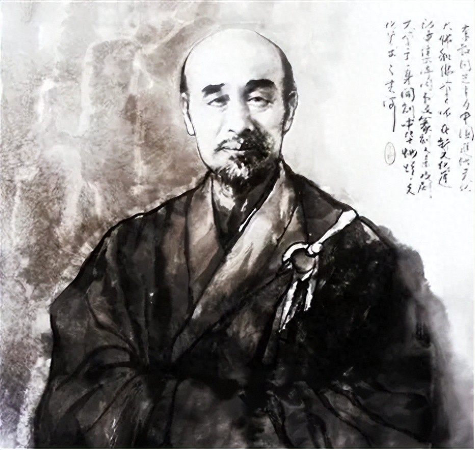

世人对于弘一法师李叔同的印象，可以用七个字概括：

**半世风流，半世僧。**

李叔同出家之前，是风流绝代的富贵公子，也是跋涉世间的惆怅旅人。

他虽然出身极好，然而成年后，却仍旧尝尽了爱而不得、亲朋渐散的苦楚。

这些痛苦，让他倍感沮丧、孤独。

但渐渐地，他开始在苦痛中，变得透彻、通达。

终于在三十八岁那年，他得以堪破红尘，皈依佛门，成为世人敬仰的弘一法师。

前半生的诸多遗憾，竟成全了他后半生的平静从容。

正如一句话所说：**所有遗憾，皆为修行。**

很多时候，遗憾的出现，并非要折磨你，而是为了教会你，如何去遇见更好的自己。




<div style={{textAlign: 'center', color: '#FF8C00'}}>  
  <h3>1</h3>
  <h3>无疾而终的感情</h3>
  <h3>让你的内心变得强大</h3>
</div>


有人说：**人生最大的遗憾，莫过于在无能为力的年纪，遇到想要照顾一生的人。**

而这样的遗憾，李叔同也经历过。

十六岁那年，他在戏园听曲，偶遇了名角杨翠喜。

只一眼，李叔同便深深地为她痴迷，直到戏散场了，也久久不愿离开。

而很少为谁动情的杨翠喜，在见到李叔同时，也心动不已。

此后，他们几乎每天都会在戏园相会。

杨翠喜的每场戏，李叔同都会雷打不动地坐在第一排，为她鼓掌喝彩。

散场之后，李叔同又会化身护花使者，打着灯笼，送杨翠喜回家。

在朝夕相处中，两人的感情越来越浓，李叔同也渐渐萌生了娶杨翠喜的念头。

可这世间的才子优伶，又有哪一对得到了善终？

先不说家大业大的李家，不会允许李叔同娶一个戏子进门。

就说杨翠喜，虽被人捧为名角，但也是身如浮萍，根本没有决定自己人生的权利。

后来，李叔同因事去了上海，杨翠喜就被人高价买去当了小妾。

而李叔同在得知这个消息后，整日伤心欲绝，郁郁寡欢。母亲王氏不愿见他沉沦至此，便给他迅速安排了一门亲事，逼着他娶了门当户对的俞氏。

在此后的日子里，李叔同与俞氏相敬如宾。

对于感情之事，他不再执着；对于过往的伤痛，他也渐渐学会了看开。

在很多人的一生中，也会遇到这样无疾而终的感情。

**这种感情会让你痛苦不已，但它的出现，也一定会教会你些什么。**

《项塔兰》中写道：

```

命运早晚会使我们和某些人相遇，一个接一个，从而让我们知道我们可以让自己，以及不该让自己成为什么样的人。

```

如果有些人的出现，给你带来了无尽的遗憾和创伤，那恰恰是因为，命运需要以这样的方式教你坚强，渡你成长。


<div style={{textAlign: 'center', color: '#FF8C00'}}>  
  <h3>2</h3>
  <h3>渐行渐远的朋友</h3>
  <h3>让你学会看淡聚散</h3>
</div>


作家黄于洋在《路过》中写道：

“聚散离合终有时，历来烟雨不留人。”

这句话流露出来的遗憾，大概就是李叔同写《送别》时的心境。

1898年，李叔同迁居上海。在那里，他与许幻园、袁希濂等人结下了金兰之谊，号称“天涯五友”。

他们五人经常聚在一起谈论诗词歌赋，度过了一段相对快意的时光。

然而在时局动荡下，再深厚的情谊，也只能跟着命运浮沉。

经济危机爆发后，许幻园一夕之间破产，他只得被迫离开上海，远走他乡。

大雪纷飞中，他来到李叔同家屋外告别：“叔同兄，我破产了，咱们后会有期……”

说罢，就转身消失在了漫天的风雪中。

李叔同望着好友远去的背影，百感交集，挥泪写下了这首《送别》：

<div style={{textAlign: 'center'}}>  
  <h4>《送别》</h4>
  <h4>长亭外，古道边，芳草碧连天。</h4>
  <h4>晚风拂柳笛声残，夕阳山外山。</h4>
  <h4>天之涯，地之角，知交半零落，</h4>
  <h4>一壶浊酒尽余欢，今宵别梦寒。</h4>
</div>

此后的岁月里，他们五人各走一方，再也没聚齐过。

而李叔同也在不断地聚散中，看淡悲欢离合，最后遁入空门，释怀了这份物是人非、知交零落的惆怅。

《次第花开》中说：**“从出生到终老，我们的一生就是一个不断失去和分离的过程。”**

在这过程中，那些曾与你把酒言欢的知己，都会因为世事的磋磨，与你渐行渐远；

那些曾答应和你做一辈子朋友的人，也会在某一个时刻，与你挥手告别。

但即便如此，你也不必过多伤感，太执着于聚散。

**因为那些曾来过你生命里的人，早已在你的心里，为你种下了一片风景。**

此后无论前路如何艰难，只要回忆起那段时光，你就会感到一股从心底里洋溢出的温暖。

而这，就是遇见一个人，最大的意义。


<div style={{textAlign: 'center', color: '#FF8C00'}}>  
  <h3>3</h3>
  <h3>事与愿违的经历</h3>
  <h3>让你学会原谅生活的不完美</h3>
</div>


人生伊始，命运就给了李叔同一个极好的开局。

可在接下来的时光里，又从未让他顺心如意过。

他爱上了一个女子，却不为世俗所容，只能眼睁睁地看着自己心爱的人另嫁他人；

他结交了几个知己好友，却又因为时局的原因，不得已与他们分离，此后天各一方；

他想通过科举取仕，却又屡屡受挫，最后只落了个“童生”出身，连秀才都未中；

后来，他又投身于滚滚的革命浪潮之中，然而仅仅过了百日，变法又以失败告终。

李家的人，因为怕被牵连，便将李叔同连他的家眷都赶了出去。

再后来，李母病逝，李叔同天津老家破产。

一系列的变故，让李叔同对世事逐渐有了新的了悟：

**“人生犹如西山日，富贵终如瓦上霜。”**

我们所看重的名利、财富、感情，即便有幸得到，最终也会在某一刻失去。

既然结局如此，又何必为了事与愿违而遗憾，为了不完美而郁郁寡欢。

想通这一点的李叔同，不再怨怼曾经历的苦楚，渐渐对人生有了大彻大悟。

终于在1918年，38岁的李叔同了结一切尘世的牵绊，在杭州虎跑寺出了家，法名“弘一”。

此后几十年，李叔同以苦修渡自己，以慈悲渡世人，将生命活出了最高的境界。

记得在网上看过一句话：

```

有些事上天让你做不成，那是在冥冥之中保护着你。

别生气，别抱怨，世间万物都有定数。

记住：得到未必是福，失去未必是祸。

```

当你经历得越多，你就越会明白：

**这世上没有完美无缺的人生，所有的事与愿违，其实是生命里的另一种成全。**

学会接受生活的不完美，你才能余下的时光中，与所有的失意握手言和。


<div style={{textAlign: 'center', color: '#FF8C00'}}>  
  <h3>▽</h3>
</div>


弘一法师在圆寂之时，曾留下四个字：**悲欣交集。**

这四个字，道尽了他一生的感悟，也是他留给世人最后的启示。

他用一生的心得告诉我们：

**任何人的一辈子，都要有悲，有喜；有得，有失；有遗憾，有圆满。**

这些错综复杂的事物交织在一起，才构成了我们独一无二的人生。

所以，不要去抱怨命运里的苦难，不要去埋怨生命里的缺憾。

一切痛苦和失去，所有遗憾和错过，都只是人生中的一道道关卡。

当你迈过了这些关卡，便能破茧成蝶，蜕变成一个更优秀的自己。


—END—

