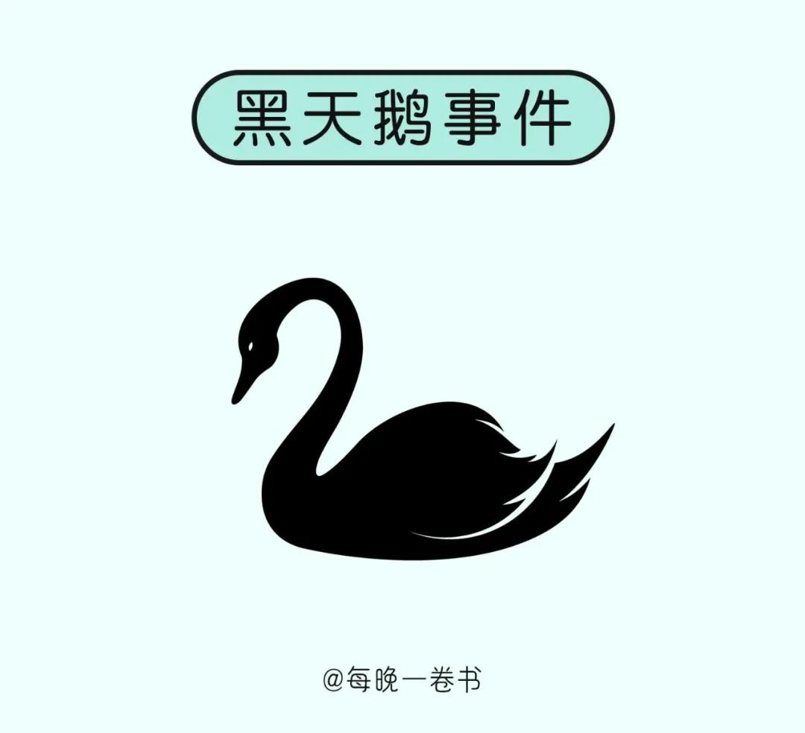

《韩非子》中有言：“天有大命，人有大命。”

意思是说，万物皆有序列，人类社会也有普遍法则。

若不顺应轨迹而行，做任何事，都会如逆水行舟，耗时费力。

反之，则能借助法则的力量，破除迷障，平步青云。

社会运行的这10大运行法则，你读懂了，便能受益终生。

  
  <h3>1</h3>

宇宙间有一个神奇的“吸引力法则”。

**即你相信什么，就会吸引什么，最后便会得到什么。**

也就是说，一个人的命运或好或坏，皆由他的念力决定。

正念越强，哪怕此刻你正逢低谷，最后的结局也一定会往好处发展；

反之，不好的念头越多，人就会被长时间困在霉运当中，难有出头之日。

有个叫威尔的人，曾立志要在杂志业做出一番成绩，却不幸赶上出版业没落，丢了饭碗。

面对如此糟糕的状况，他没有自暴自弃，而是很快打起精神，决定转行当律师。

司法考试难度极大，很少有人能考上。但威尔却有信心，自己一定能实现目标。

于是他卯足了劲备考，之后的考试中，他果然一路过关斩将，顺利考上了法学院。

毕业后，还成了当地知名的律师，收入也是之前的好几倍。

这恰如荣格所说：**“人们的潜意识指引着人生。”**

世间的万事万物，其实都遵循着吸引力法则。

你若是特别想做成某一件事，那就将念力集中在这一领域。

等你努力一段时间后，跟这个领域相关的人、事、物，就都会被你吸引而来。

  
  <h3>2</h3>

在自然界中，由于资源有限，只有强者才能享用最优的资源。

弱一点的，只能得到一些强者吃剩的残羹冷炙。

而那些最差的，就注定被自然界淘汰。

这就是“丛林法则”。

**丛林法则，在人类社会同样存在，而且更加残酷。**

周星驰当年在跑龙套的时候，没有人尊重他，连吃个盒饭也要被人骂。

甚至还有人讽刺他，怎么努力都做不了主角。

后来他一朝成名，谁见了他都客客气气地叫他“星爷”，关心他“想吃点什么”“渴不渴”，还不停地夸他敬业。

可能你会觉得周星驰遇到的人太现实，但在社会上，弱肉强食，优胜劣汰，是屡见不鲜的事儿。

如果身处底层，你就只能任人欺凌，根本不可能拥有什么资源、权力。

可你若能一朝翻身，那所有人都会对你尊敬不已，所有好的资源也会源源不断地向你涌来。

**所以，你只有让自己不断变得强大，这个世界才会对你和颜悦色。**

  
  <h3>3</h3>

阿基米德说过：“给我一个支点，我就能撬动整个地球。”

这就是杠杆原理最简单、最直观的诠释。

通过借力支点，我们可以用很少的力气，撬动很大的资源。

生活中亦是如此，凡事懂得借力，才会事半功倍。

艺术家陈巨源早年间没什么名气，画作也是无人问津。

为了得到大师木心的指点，他主动与对方结交，并把所有的作品都展示给木心看。

而木心也很耐心地给他提出了很多详细意见，还建议他多研究中西方的色调搭配，在笔墨、水分的调配上更大胆些。

听取了这些建议后，陈巨源一下子就找到了自己的艺术定位。

此后他便转变自己的绘画风格，将中西风格融为一体，很快就成为一代大家。

韩非子说过：**“顺风而呼，声非加疾，其势激也。”**

人在社会上混，不要一直单打独斗，要学会借力使力，四两拨千斤。

或向平台借势，或向高人借力，或向书中借智。

当你懂得以外界之力加持自己，你就能以最小的代价，收获丰厚的成果。

  
  <h3>4</h3>

意大利经济学家帕累托曾提出过一个“二八定律”。

他认为：**往往80%的劳动成果，都来自20%的付出。**

换句话说，专注于20%最重要的事情，就可带来80%的回报。

美国企业家威廉·穆尔，在为格利登公司销售油漆时，头一个月仅挣了160美元。

于是他仔细分析自己的销售图表，发现他的80％收益，来自20％的客户。

而他却对所有的客户，都花费了同样的时间。

得出这个结论后，他便要求把他最不活跃的36个客户，重新分派给其他销售员。

他自己则把精力集中到最有希望的客户上。

之后的一个月，他就赚到了1000美元。

凭借着出色的销售业绩，最终穆尔晋升为了凯利-穆尔油漆公司的主席。

由此可见，**有些事情你就算付出了80%的努力，最终的成果很可能收效甚微。**

可你若把精力用在最见成效的地方，那你就能摆脱无效努力，做到事半功倍。

最后你所得的报酬，也会远超从前。

  
  <h3>5</h3>

不知道大家有没有这样的感受：

当刚开始做一件事，或是进入一个新领域，你常常会觉得异常忙碌和无所适从。

可一旦你坚持了下来，并在这个领域深耕了一段时间，你就会发现：

做任何事情都是驾轻就熟，根本不需要耗费太多精力。

这其实就是很有意思的**“飞轮效应”。**

飞轮效应在现实中比比皆是。

比如你刚开始看一本厚书时，会觉得很艰难。

可随着对书中情节了解愈深，你很快就能读完一整本书；

刚开始锻炼时，每天做三十个仰卧起坐，也许会让你感觉很吃力。

但随着时间的推移，即使做四五十个，你也会觉得轻轻松松。

它揭示了一个最简单的道理：**做任何事情，都有一个从难到易的过程。**

你若一开始就被它的艰难吓倒，早早放弃，那永远不可能做成一件事情。

可你若克服了畏难情绪，不断深耕自己，自然就能厚积薄发，得心应手地解决所有难题。

  
  <h3>6</h3>

《新约·马太福音》里有这样一句话：

**“凡是少的，就连他所有的，也要夺过来；凡是多的，还要给他，叫他多多益善。”**

这就是著名的“马太效应”。

它指的是社会中一种强者愈强、弱者愈弱的现象。作家马银春讲过温州两兄弟的故事。

改革开放初期，哥哥看准了鞋子商机，决定办一家鞋厂。

很快，哥哥就凭借自己的努力，赚得盆满钵满。

还开了很多家分店，让自家鞋厂如雨后春笋般遍布全国。

弟弟也跟着办了一家，却三天打鱼两天晒网，累了就瘫在家里，基本不去跑客户。

就这样，他店面的收益越来越差，很久就亏光了所有家底。

这个故事也告诉我们：

那些穷又不努力的，只会让自己的人生陷入恶性循环，变得越来越穷；

只有凭借头脑和努力，去赚取第一桶金，而后搭建起赚钱体系的人，才会变得越来越富。

所以当处于弱势地位的时候，不要摆烂，不要哭穷。

唯一的出路就是让自己强大，只有你强大了，才能有更多的资源向你聚拢。

  
  <h3>7</h3>

经济学上有一个概念叫“复利”。

任何事物经过复利的积累，都会出现“利滚利”式的增长。

问大家一个问题：

如果有一个超级大的国际象棋棋盘，从棋盘的左上角开始，第一格放一粒米，第二格放两粒米，第三格放四粒米……

以此类推，下一格均是前一格的一倍。

那到第64格，是多少粒米呢？

你一定想不到，答案是1844.67亿亿粒米。

这就是复利所带来的惊人增长。

爱因斯坦曾说：**“复利的威力远远超过原子弹。”**

它可以使一个资质平庸的人，变成一个精通某个领域的人才；

也可以让一些看似微不足道的努力，变成推动人生的大手。

永远记住：越专注，所得越多；越持久，复利越多。

在一个领域持续深耕下去，你才能享受到复利带来的红利。

  
  <h3>8</h3>

20世纪70年代，美国一个名叫洛伦兹的气象学家，在解释空气系统理论时说：

“亚马逊雨林一只蝴蝶翅膀偶尔振动，也许两周后就会引起美国得克萨斯州的一场龙卷风。”

这个著名的“蝴蝶效应”理论，揭示了一个道理：

**任何微小的改变，都可能引发巨大的影响。**

在我们的日常生活中，这个效应也在不断地发挥作用。

你也许觉得，自己不吃早餐也没什么，可长久下来，你很有可能患上胃病；

或者你老是喜欢熬夜，熬上几个月，你的身体也会吃不消。

相反，如果你每天早起，你就能拥有规律的生活节奏，和更健康的生活习惯。

你每天健身，你的身材也会随之越变越好。

所以千万不要小瞧一件小事给你带来的改变。

你可以利用蝴蝶效应的影响，每天读几页书，做几个俯卧撑，存一些钱。

长期坚持下来，你也能蜕变成一个见识渊博、身体强健，不为生活发愁的人。

  
  <h3>9</h3>

“黑天鹅事件”出自《黑天鹅》一书，指的是那些出乎意料发生的小概率、高风险事件。

一旦发生影响足以颠覆以往任何经验，具有不可预测性。

然而在生活中，“黑天鹅”事件却无处不在。

比如裁员、公司倒闭、自然灾害、经济危机……这些时代的灰尘，落在任何人头上都是一座大山。

在“黑天鹅”事件面前，有的人乱了阵脚，有的人惶惶不可终日。

也有的人，深谋远虑，培养自己可迁移的能力，及时更换了赛道。

最终，也只有后者才能在难以预料的时代浪潮中，不被大浪拍走，而是稳立潮头。

人们常说，天有不测风云。

我们永远无法预料到黑天鹅从哪个方向飞来。

**作为普通人，我们唯一能做的，就是不断提升自己，与时代的不确定性共舞。**

在风和日丽时潜心修好自己的屋檐，即便到时候风再狂雨再大，你也能稳坐钓鱼船。

  
  <h3>10</h3>

作家良叔曾提出一个很深刻的观点：**比黑天鹅事件更值得警惕的，是灰犀牛效应。**

就像在辽阔的草原里，你看到一只远处跑来的犀牛，你会觉得它跑得笨重缓慢，从而不以为意。

可一旦它贴近你时，你就基本不可能有机会躲开。

说到这里，他还讲到了朋友老刘的故事。

老刘在深圳从事金融销售行业，由于入行久，积累了一批人脉，所以业务做得还算不错，小日子过得也挺安逸。

但他也知道，做销售不是长久之计，可每当想到转型时，他又还是觉得做销售还是自在点。

后来有个老同事创业搞了一家互联网金融公司，叫他一起去当合伙人。

他考虑了一下又放弃了，因为他现在业务收益还不错，去创业风险太大。

他想，还是现在这样稳稳当当挺好，反正他业务不错，公司也不可能开除他。

没想到才过了几年，他手头的客户就走得差不多了，他也因业绩不达标，被公司淘汰。

就像社会心理学家汉斯·艾森曾说：

**很多人如同待在一个破漏的船上，只要水没进来，他们就不急于逃生。**

可大势已然是这样，待在原地的人，最终一个个都会被时代抛弃。

因此，永远不要对未来抱有侥幸心理。

如果你不奔跑，藏在暗处的灰犀牛迟早会追到你。

  
  <h3>▽</h3>

如果你看懂了上面的10个法则，你就会发现，它其实说了一个共同的道理：

人若不提升自己，就会失去应对世事的能力，被命运捶打、被时代抛弃；

唯有持续精进自己，我们才能在不确定的人生里，跟上时代、打败平庸、逆流而上。

作家刘同说：**“你把时间花在哪里，人生的花就会开在哪儿。”**

当你对照这十大法则进化自己，你便能站得更高，看得更远，赶超社会中绝大多数人。

—END—

