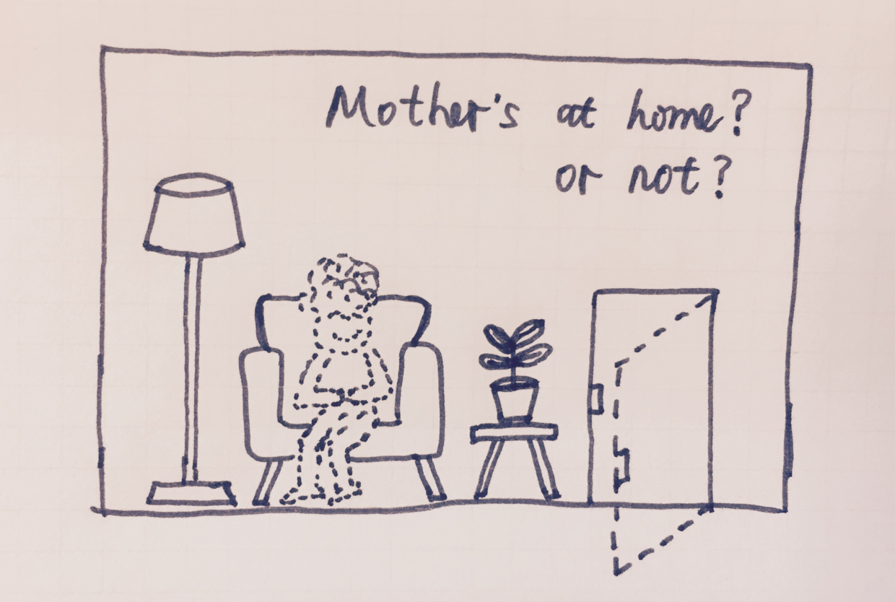
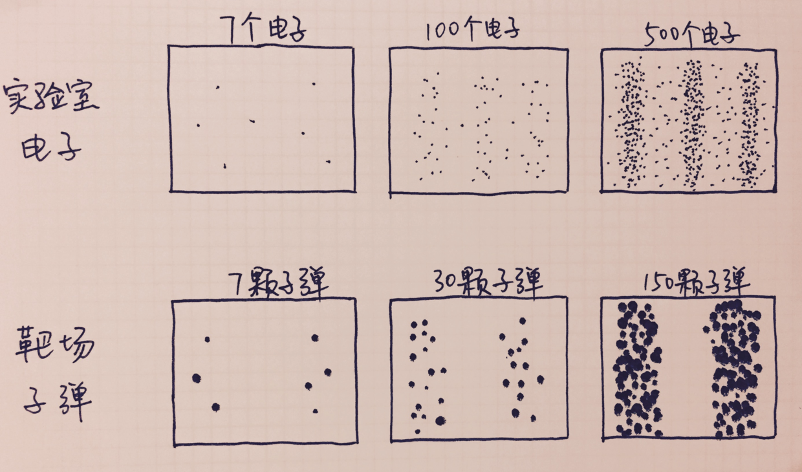
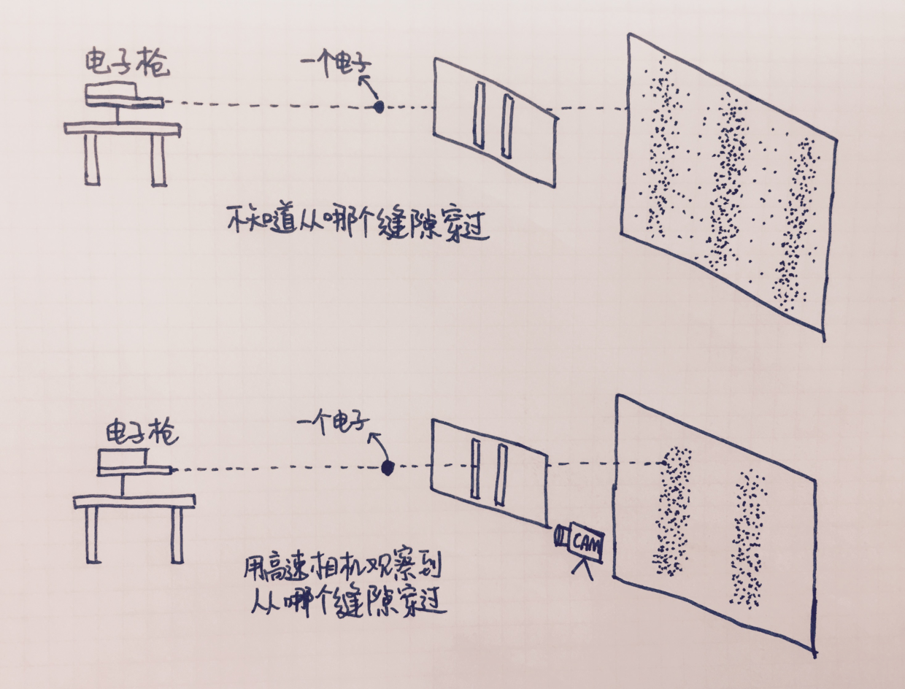
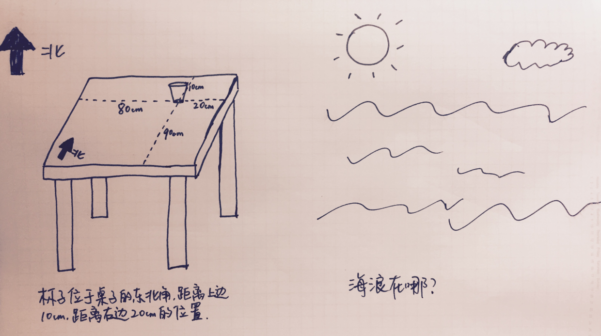

1.

相信很多人都听说过“薛定谔的猫”，但大多数人并不知道它是个故事，还是个理论，或者只是一只主人名字很怪的猫。我听过最有趣回答是说“你是指那个关于把猫从20楼扔下来但是不会摔死因为它与众不同的生理构造的理论吗？”好吧并不是... 也可能你知道这是个把猫关起来做实验的事，还和量子力学有点关系，但各种科普文章里解释这只猫“既活着也死了”的结论实在是让人一头雾水。这篇文章的目的，就是讲清楚这只特别的猫的由来和它的意义。可能稍微涉及一点量子力学的知识，但是相信我，并不复杂。而且比起来从此了解薛定谔的猫的本质，知道量子力学到底在讲什么，甚至能够让我们用全新的视角审视这个世界的收获来说，肯定值得。

我们先来看看这个实验具体说了些什么。

奥地利物理学家埃尔温·薛定谔在1935年提出了一个思想实验，将一只猫放到一个不透明的盒子里，同时还放入一个放射性的粒子和一瓶毒药。放射性粒子发生放射的概率是50%，不放射的概率也是50%。一旦放射，将触发机关打破药瓶毒死这只猫。

（灵魂画师手绘图1）

按照量子力学的观点，在未打开盒子之前，这只猫将处于既活着也死了的状态（注意，这里有一个关键点：不是生死不明，而是“既死又生”）。直到打开盒子观察的瞬间，猫的状态变成一个确定状态（量子力学中叫做：坍缩），猫的生死被瞬间决定了（这里的第二个关键点：打开盒子观察，不是看到了猫的生死，而是决定了猫的生死）。

这个实验的两个关键点，一个是概率，一个是观察。这两件事，也是理解量子力学的关键。

其实大多数人看到这个实验的第一反应都是有点懵，然后会尝试用物理常识和生活经验加以理解。最常见的理解方式，这就像我们下班回家，母亲可能在家，也可能去跳广场舞了不在家，所以在没有打开房门之前，她就处于可能在家也可能不在家的状态，而只有打开房门才能确定她是不是在家。可这不就是生活常识吗？跟量子力学有什么关系。但在这个宏观的例子中，母亲在家或不在家是个确定的状态，只是处在什么状态我们还不知道，直到打开门，我们才能确定母亲是否在家。而量子力学告诉我们说，在微观量子世界里，母亲处于在家和不在家同时发生的叠加状态，而你打开房门的动作不是确认母亲是否在家，而是决定了母亲是否在家。

（灵魂画师手绘图2）

但这怎么可能呢？人或事物的状态在某一时刻不应该只有一个吗？这种“不同状态的概率叠加+观察决定”的理论一经提出，就受到各种非议。这也正是薛定谔设计盒子里的猫这个思想实验的目的：这不可能 —— 他本人并不信这种理论。

薛大师是量子力学的重要奠基人之一，他提出的薛定谔方程是量子力学最重要的基础理论之一，这个方程排在世界十大公式之六（排第四第五的分别是“勾三股四弦必五”的勾股定理和爱因斯坦的E=mc²...）。但即使是量子学的奠基人，全世界的物理学家都用他的方程研究微观粒子的状态，薛定谔本人对量子力学的根本属性却仍然是困惑不已（量子物理学家可能都有点人格分裂..）。“不同状态的概率叠加+观察决定”的理论被称为“哥本哈根诠释”，诞生于1920年代，是用来解释当时量子力学各种匪夷所思的实验现象的几个理论的统称。数百年来人类智慧的顶尖人物一直在苦心寻找各种“规律”来解释这个世界，无论是牛顿，麦克斯韦（电磁理论奠基人）还是爱因斯坦。然而量子力学的“哥本哈根诠释”本质上是用“概率和不确定性”来描述我们的世界，而非规律，这彻底颠覆了科学界，乃至人类的思维方式和对世界的认知。薛定谔提出的这个思想实验，其实是为了讽刺这个理论，他希望物理学家们能再多动动脑筋，用新的理论代替这个“我们的世界就是个忽悠”的理论。而和他一条阵线，大声疾呼“我们的世界不忽悠”（原话是“上帝不掷骰子” ..）的，正是爱因斯坦。然而，不幸的是，20世纪近百年来的各种微观实验，一次次证实薛定谔和爱因斯坦都错了。上帝是个名副其实的大忽悠。

2.

接下来我们用一个真实的实验来说明薛定谔的猫在微观世界里的情况。电子双缝干涉实验。

在讲这个实验之前，为了不让思维过于发散，要记得我们的所有思考都要专注于解释两件事：概率，和观察的作用。

我们在高中物理都学过双缝干涉实验，就是在绝对黑暗的密室中，把一束光射向两道相近的窄缝，会在后面屏幕上出现明暗相间的条纹（干涉条纹），以此来证明光是一种波。因为所有的波（声波，水的涟漪，电磁波等）在穿过两道窄缝后，都会因为彼此不断地叠加（波峰+波峰 or 波谷+波谷）、抵消（波峰+波谷），最终形成明暗条纹。后来爱因斯坦因为光电效应证实光同时也是一种粒子，从而为微观粒子的“波粒二象性”这个量子力学重要概念打下基础。尽管“波粒二象性”现在已经广为人知，但事实上这是一件非常违背常识的事，只要我们把光换成电子，就可以理解这个事情有多奇怪了。

我们都知道电子是一种粒子，带负电，并且围绕着原子核运动。而1920年代的实验就已经证明，一束电子流也能像一束光一样在双缝实验中留下干涉条纹，从而证明电子也是一种波，也具有波粒二象性。这似乎是高中物理知识，乍一听好像也没有什么让人震惊的。

（灵魂画师手绘图3）

但现在让我们稍微改变一下实验形式，不是发射电子流，而是一次只发射一个电子，会有什么现象呢？这种一个一个地发射电子的方式，很像在射击场打靶。如果靶子正中间也有两道缝，然后用步枪一颗一颗地发射子弹，我们就能同时观察在微观和宏观世界的异同。电子穿过缝隙会在屏幕上留下一个亮点，然后再发射第二个电子。而子弹穿过靶子上的缝隙也会在后面的墙上留下一个洞，之后再发射第二颗子弹。

在靶场，随着我们打出的子弹数量的增加，穿过左右缝隙的的子弹会在墙壁上形成越来越多的弹孔（当然有很多子弹并没穿过缝隙被靶挡住），而这些弹孔一开始可能不规律，但逐渐有的偏左（从左边缝隙穿过），有的偏右（从右边缝隙穿过）。如果你的枪法足够好，也可能左面多右面少（只瞄着左面的缝隙打），或者右面多左面少（只瞄着右面的缝隙打）。总之，最终墙壁上会留下左右两堆弹孔。

（灵魂画师手绘图4）

但是在实验室，电子却呈现了完全不同的一面。一开始，和子弹打靶一样，穿过缝隙的电子在屏幕上留下的亮点也没什么规律，但逐渐的，规律开始显现，但却不是左右两堆亮点，而是，明，暗，明，暗....的干涉条纹！

（灵魂画师手绘图5）

没错，一个一个地发射，最终也表现出波一样的特性！但这怎么可能？每次只发射一个电子，每个电子怎么知道自己最终要飞向“亮”的区域还是“暗”的区域？而且干涉条纹是两道波之间干涉产生的，每次只发射一个电子，它和谁干涉？难道...和自己？是的，自己和自己干涉。

这就是我们要说的第一个关键，概率（量子力学中用波函数描述）。量子力学的解释是，电子在到达左右缝隙的瞬间处在这样一个状态：既从左边缝隙穿过，也从右边缝隙穿过，既同时穿过两道缝隙，也都没穿过。它处在这四种可能同时发生的“叠加状态”，每种可能的状态对应一个概率。

还是让人难以理解，子弹是一颗一颗穿过缝隙的，电子也是一个一个穿过缝隙的，怎么会如此不同？如果我们在靶场上放一台高速摄像机，就能看到子弹是从哪个缝隙穿过的。同样，在电子穿过两道缝隙的位置也放一台，是不是也能看到电子是从哪道缝穿过的？是的，没有什么能逃过高速摄像机的眼睛，随着电子一个一个的发射，我们果然能够在摄像机中看到电子是从哪道缝隙穿过的。但是，当回过头看屏幕，我们熟悉的干涉条纹，消失了！！只剩下和子弹的弹孔一样的两堆亮点。而当我们撤下高速摄像机，继续发射电子，干涉条纹重新出现！甚至如果我们换了一台速度没那么快，看得没那么清楚的中高速摄像机，干涉条纹竟然也变得隐隐约约！似有似无！电子，就好像灵魂附体一样，完全知道我们的一举一动。

（灵魂画师手绘图6）

这正是我们要说的第二个关键，观察（量子力学中叫做测量）。摄像机的作用，正是观察，这一人的主观动作。这也是让量子力学变得神秘的主要因素之一。当你不去观察的时候，量子给你一个不确定的，概率的结果。而当你观察的时候，量子给你一个确定的，唯一的结果。人的主观意志在微观量子世界的决定性作用这一真实实验结果，让我们从根本上重新审视对这个世界的看法。我们所看到的世界是否只是真实世界无数可能中的一种？而正是我们的主观意志让我们看到了眼前这个世界的样子？“你看到是因为你想要看到”。难道，意识真的能决定物质？

在我们陷入哲学问题的讨论之前，还是先搞清楚，为什么观察在这里起到决定性作用？在我们观察的瞬间，到底发生了什么？

3.

我们日常所说的“观察”或者“看见”，其实是光照射物体被反射或者漫反射到我们眼睛的视网膜上，如果光的波长在380nm到760nm之间的可见光范围，我们就能够“看见”这个物体。而反射进我们眼睛的光，正是由一个个“光子”组成的。对于摄像机也是一样，光照射在物体上反射进镜头并到达底片形成图像。没有光，无论是眼睛还是摄像机都不能“看见”（夜视仪也是通过捕捉人眼看不到的红外光，而非完全没有光）。做个形象的比喻，当我们看见一个苹果的时候，是无数光子撞到苹果表面并被弹飞，其中弹进我们眼睛的部分并且属于可见光范围的光子，刺激我们的视网膜，最终让我们“看见”。

当我们把同样的情况放回到电子实验室的时候，情况会有什么不同呢？高速摄像机能够捕捉到电子从哪个缝隙穿过，同样是因为有光子或其他物质（比如其他可以被镜头感知的电磁波）“撞击”到电子被反射进镜头从而被“看见”。然而与宏观世界不同的是，电子是如此如此的小，只有10^-18次方米，光子对它的撞击不会像撞击苹果一样微不足道，而是深刻改变了电子的状态。如果人眼本身就像高速摄像机一般具备高速录影的能力，结果也是一样，观察者的观察行为仍然会深刻地影响被观察对象。因此，尽管我们希望“客观”地对电子进行观察和测量，却只能得到一个不确定的被严重改变的测量结果。这个原理，就是著名的“不确定性原理”，也叫测不准原理。这就是为什么观察这一貌似主观的意识在量子实验中具有决定性作用。

事实上，我们也可以在宏观世界理解不确定性原理。当我们说一件连衣裙是蓝色的，它真的是蓝色吗？在日光下的人类视觉中是蓝色，但是在一间挂满大红灯笼的屋子里，这条裙子就是紫色的。而对于一只狗或一只猫来说这条裙子是灰色的，而一只蜻蜓会告诉你这是一条五彩斑斓的裙子。那么当我们尝试问这条裙子真正的颜色，客观的颜色，本质的颜色，都显得没有意义，因为这和观察行为和观察者戚戚相关。可以说，观察者决定了裙子的颜色。

好吧，我们好像理解了“观察”对电子的深刻影响。但是为什么这个影响会让电子的“波”的属性消失并导致干涉条纹的消失，而不是让粒子属性消失而不影响干涉条纹的呈现呢？

当我们观察电子从哪个缝隙穿过的时候，实际上是在测量“位置”信息，而位置信息是粒子的属性。打个比方，你可以指出一个杯子在桌子上的确切位置，但却没法说海浪在哪个位置——它在everywhere。因此当我们尝试测量电子从哪个缝隙穿过的时候，就表明了测量电子的粒子性的目的，此时，波动性便消失了。

（灵魂画师手绘图7）

因此，在用来观察波动性的双缝干涉实验里，电子展现出波动性并呈现干涉条纹。而在有摄像机观察电子的位置信息即粒子特征的时候，电子在双缝实验中展现出粒子性并留下两堆亮点。电子这种具备波粒二象性但在测量中彼此排斥只会展现一种特征的特性，在量子力学中称为互补原理。

不确定性原理，互补原理，加上前面提到的概率，就是构成量子力学“哥本哈根诠释”的核心理论。

4.

我们前面的讨论理应是个科学话题，却多次触碰到了世界本源甚至哲学层面的议题。那接下来我们就严肃地谈点哲学，虽然哲学其实是个特别不严肃的事儿。这句话好哲学...

通过薛定谔的猫的思想实验和电子双缝干涉实验，我们似乎对“现实”产生了根本性的疑问。一方面，真正的“现实”竟然是个“概率”，而看到的“现实”却是因为我们想要看它，甚至可以叫“观察创造现实”。这样的“现实”还算什么现实？真让人想哭... 而这一切竟然印证了那句经典的哲学名言：“存在即是被感知”。不去感知，就没有存在。

我们同时也推翻了“客观”。一切所谓客观的观察都会影响被观察者，这导致被观察者究竟是怎样的永远是不确定的。如此看来，纯粹的客观世界压根就不存在，一切都是你中有我我中有你的不可分割的整体。下次再有人说自己“客观，独立，第三方”，我们就跟他好好聊聊量子力学。

我们还重新审视了“意识”。千百年来我们对意识的理解似乎都是抽象的，和客观实在对立。当然很多人会说，意识事实上就是活跃在大脑皮层中复杂的电信号，只是它太过复杂，我们的科技水平还难以模拟或解读。例如现在已经可以通过在人脑中插入电极来刺激脑中的某些区域，使人哭或者笑。而在最新的脑医学实验中，人可以通过“意识”移动机械手臂，抓起杯子来喝水，甚至“脑控”玩飞行模拟游戏。这么看我们似乎已经掌握了意识的门道，我们基本了解了意识是如何传递的，可以在一定程度上模拟意识给身体发行动指令，甚至将意识的电信号输出。所以只要等技术如摩尔定律般爆炸，我们就拿到了通往意识世界的钥匙。但这个乐观态度似乎忘记了一个非常重要的事，意识在我们的大脑里究竟是怎么产生的？例如，我可以在咖啡馆和你一边聊天，讲着笑话，一边摆弄着桌子上的手机，腿随着背景音乐打着拍子，脑子里不断回闪着上午篮球比赛最后时刻的超级逆转。意识为什么会用这种方式指导我们？在这个复杂场景里意识都参与了哪些呢？意识让我们行动、思考、回忆、畅想、探究这个世界究竟是有意识的还是无意识的？回答这些问题，可比用电极刺激大脑让我们抓起个杯子难多了。

坐在我对面的你能听到我的笑话、看到我摆弄手机的手和抖来抖去腿，却不知道我脑子里不断回放的进球画面，意识似乎并没有办法影响到你。而薛定谔盒子里的猫，却在我随便看了一眼的情况下就被决定了生死。但如果是在我专注地想着别的事对眼前“视而不见”的情况下打开盒子（我们都有可能遇到这种情况，地球救亡政府通过监控找到作为唯一目击证人却完全失忆的你：三天前的那个早上的街上，沉浸在刚刚拒绝你表白的女神的无限悲伤中正在回忆每一个偶遇细节的你，完全没有看到穿着黑色皮夹克拿着AK47用iPhone给同伴打电话说“我是Caesar，明天就开始我们消灭人类计划”大摇大摆从你眼前经过的黑猩猩），那猫的生死，是在我的眼睛睁开的那一刻就决定了，还是等我的意识突然反应过来注意到它时才被决定呢——意识“觉醒”与否能延迟波函数（概率）的坍缩（被决定）吗？

（灵魂画师手绘图8）

这就像是在电子双缝实验中，放在双缝处的高速摄像机，打开镜头盖但是开机和不开机两种情况下的实验。我们先给出真实的实验结论：不管观察者是人还是仪器，只要电子的位置/路径信息没有被捕捉到，干涉条纹就不会消失。只要位置/路径信息泄露，干涉条纹就会消失。因此不开机的情况下，干涉条纹不会消失，我们骗不了电子。

那人眼呢？在上面“视而不见”的例子里，电子是否也陷入了两难的判断：“这个人因为在想别的事儿没有看见我的行踪所以我还是个波吧”，“不对，他其实看见了只是已经埋藏在意识深处总有一天会想起来呢得赶紧变成粒子”，“到底是波还是粒子？？我恨人类”...

对于电子两难的处境事实上有另外的理论加以解释。在哥本哈根诠释中，概率/波函数在观察的瞬间坍缩成一个的结论让很多人不舒服，于是慢慢发展出了一个新的理论：多宇宙理论。即所有概率叠加的结果在被观察的瞬间不是坍缩成了一个，而是产生了多个宇宙，也就是说：你进了家门看到你妈在家做了一桌子饭然后和她老人家开心吃饭聊天是一个宇宙，你进了家门发现你妈不在家只能去冰箱里找了半根香肠拿微波炉热热填饱肚子是另一个宇宙。而事实上你打开冰箱看到香肠和香蕉犹豫片刻选择拿了香肠或是香蕉又分别产生了两个宇宙。如果你家冰箱里放了好多吃的你犹豫的越多产生的宇宙也就越多。每种可能+每个意识选择让这个世界充斥着无穷无尽的平行宇宙...

薛定谔的这只猫的实验背后，是量子物理对我们这个世界的巨大冲击。在量子物理诞生近百年后，依旧让我们感到既着迷又困惑。数百年来现代科学对事物规律的寻找，在量子物理面前变成要被推翻的守旧思维。而几千年来围绕意识与物质的哲学思辨，竟然在科学领域看到了讨论的可能。虽然量子力学的种种实验现象和理论仍仅限于微观世界，但我们的宏观世界正是由微观粒子构成的，因此当你抬头看月亮，它确实有一个非常非常小的概率突然不见了。或许每天早上醒来你应该庆幸，摸摸鼻子——在呢，够一下手机——也在，踢一脚床上的猫猫——还在，拉开窗帘看看太阳——也升起来了。好幸福。

不过在另一个平行宇宙有个没鼻子的家伙则...

—END—