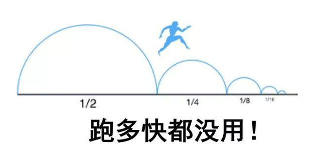

鸽子，动物界脊索动物门鸟纲鸽形目鸠鸽科鸽属，喜欢发出“咕咕咕”的叫声，是一种广泛活跃在广场、表情包、汤里的动物。

放鸽子，一种象征和平的仪式，后被引申为爽约、不守承诺。 是一种让人对此结果和造成此结果的借口都让人感到“意外”的现象，尤其令人意想不到的是，这种看似八竿子打不着的引申，还真有科学依据：

我国最早对放鸽子的记载来自清朝的《右台仙馆笔记》，里边记录了一个打算放别人鸽子结果被别人放了鸽子的故事，我的古文素养大概只能总结到这：

现如今鸽已经成为都市青年的常态，且表现形式丰富：迟到属于小鸽，缺席属于大鸽，一个人鸽叫独具一鸽，一群人鸽叫鸽显神通...

这些鸽人总是用实际行动告诉身边的朋友：生活就是一切都想不到，明天和意外，永远不知道哪个先来。但每次鸽完，难免都会被人诟病，长此以往很费朋友。

鸽鸽这么可爱，怎么能人人喊打呢！我结合学术大佬的实验理论思想，利用多年来鸽与被鸽的经验，教大家一些你可能想象不到的科学放鸽法！

一、初级方案

初级方案属于技术难度低的方法，也比较容易想到。适用于乳鸽们。只要你脸皮够厚，就没什么人你鸽不了，但杀伤力较大，属于伤敌一千自损15的类型。

1、薛定谔鸽法

薛定谔认为，将一只猫关在密闭容器里。密闭容器中存在衰变元素，如果元素衰变，猫就会死；如果不发生衰变，猫就活着。

根据量子力学理论，我们在没有打开盒子前并不知道猫的状态，因此猫是既死又活的叠加态。除非打开盒子，才有确定的答案...

所以薛定谔的鸽法最核心的地方，就是在赴约之前，对方也不知道你到底鸽不鸽。

一旦有人问你来不来，你就回复这个表情包

此图巧妙地将自己置于鸽和不鸽的叠加态。说你来，但图上有鸽，说你不来，文案又说来。事后无论对方怎么责问，你都有正当理由解释。

最后，对方只有到达约定现场，你的叠加态才会坍缩，对方才明白你到底来了没。

此法既能让你成功鸽掉，又能让人体会到量子力学的魅力！推荐！

2、牛顿第一定律鸽法

教材上牛顿第一定律的表述是：任何物体都要保持匀速直线运动或静止状态，直到外力迫使它改变运动状态为止。

引申到鸽子领域后，表述即为：任何人都要保持按照计划运行的状态，只是外力迫使我改变计划变成鸽态。

基于此，牛顿第一个鸽法的常见开头都是：

本来我要来的/我本来都出门了/我本来计划好的

一定要表达出自己的原本计划非常完美和无懈可击，显示自己的诚意。然后话锋一转，强调外力的突然性和想不到：

结果老板突然找我/小区地震了/我家猫秃了

借外力改变原本的计划，让自己也变成了受害者，不得不变成鸽子保卫和平。

此方案使用一两次无伤大雅，多次使用可能你家猫会不开心。

3、阿尔茨海默鸽法

这个理解起来比较简单，总结起来就是无中生病，引病上身，学会失忆。

要点就在于一定要掌握失忆的时间，要是聚会还没开始就跑到群里装失忆，反而会被迫重新回忆

一定要等到聚会结束，再到群里一顿自我责备，将自己置于智商的洼地里，如果还能加上几分社畜的无奈感，会显得更加动人。

此方案的要诀是勇气，你要敢于自己骂自己鸽，才能让朋友无鸽可骂。

二、进阶方案

进阶方案，重点是似鸽非鸽，让朋友好像能够想到，又好像想错了，所谓“怕你鸽，又怕你不鸽”。所以以下方案对朋友的伤害比初级方案低得多，起码能维护你生而为人的体面。

1、罗森塔尔鸽法

从罗森塔尔的方案我们可以获得灵感：要懂心理暗示和心理预期。

在最开始约的时候，你就要表达出自己很想来，但存在来不了的可能。在前期铺垫足够多的心理暗示，充分表达出对未来的不确定性，才能鸽的水到渠成。

这时就会降低对方的心理预期，有了被鸽掉的心理准备。等到了那天，真的被鸽掉之后，对方就会有一种“我早就知道”的感觉，被鸽的心安理得。

2、巴甫洛夫鸽法

这是历史上著名的实验：巴甫洛夫每次给狗子送食物前先打开红灯、响起铃声。这样经过一段时间以后，即便不再给狗子食物，铃声一响或红灯一亮，狗子就开始分泌唾液。

这培养了狗子的条件反射。所以你也可以试着培养朋友们的条件反射——你一鸽，就给大家打钱。

久而久之，大家一听到你鸽，就知道有钱，就会开心，得到了鸽=快乐的条件反射。此后哪怕你不发红包了，大家听说你鸽，也会快乐。

此时你已经达到了人鸽合一的状态，从此诺贝尔和平奖就是诺贝尔和你奖。

如果有朋友想要实验此法，可以加我微信。

3、芝诺的鸽法

芝诺悖论的观点是，“一个人从A点走到B点，要先走完路程的1/2，再走完剩下总路程的1/2，再走完剩下的1/2……”如此循环下去，永远不能到终点。

在赴约前对方问你到哪儿了，可以通过汇报的方式，无限逼近赴约地点，但就是永远到不了，成为芝诺的悖论里的鸽子。

常用话术为——

我出发啦一会见！谁迟到谁请客啊！

出门发现忘记带充电宝了我回家拿一下！

我路上有点堵车可能会晚点到！

还有一站路就到了！马上马上！

放心我再拐个弯儿就到啦！

啊你们已经聚完了那就算了吧！

总之要表达出自己无限努力的样子，但由于有芝诺悖论的存在，自己也永远无法到达终点，直到大家聚餐结束，才发现又被你鸽了。

三、高级方案

高级方案是我20年来摸索出的最巧妙方法，你们肯定没想到过！一旦使用，自己也不用费什么力气，但能让对方鸽的心服口服，无法反驳，甚至意识不到是谁鸽了谁。

1、递归鸽法

递归的核心在于层层递进，不断寻找双方时间的极限值。等到达一定时间，对方表示拒绝时，表达出不是我不想来而是你没时间的观念。

常见的递归鸽法聊天手法有：

如此一来，就能顺利成章将锅甩在他头上。留对方在眼花缭乱的操作中背起鸽子这口大锅。

但此方案不适用于那些几点约都能约出来的游手好闲之人。

2、袁隆平杂交鸽子法

大家都听说过袁隆平爷爷的杂交实验，我们放鸽子也可以运用这种交叉精神。

比如我同时约迪丽热巴和古力娜扎5点公园见，但我不去，同时鸽掉她们俩！但她们俩见面后也可以一起玩。

也就是说我虽然放了两个人的鸽子，但她们两个都没有被放鸽子！这么一琢磨简直太美妙了：自己爽了两次，别人也没有不快。非常AMAZING！

而且如果你爽约的两个人都是单身，那你甚至都不能叫鸽了，得叫月老啊！

—END—