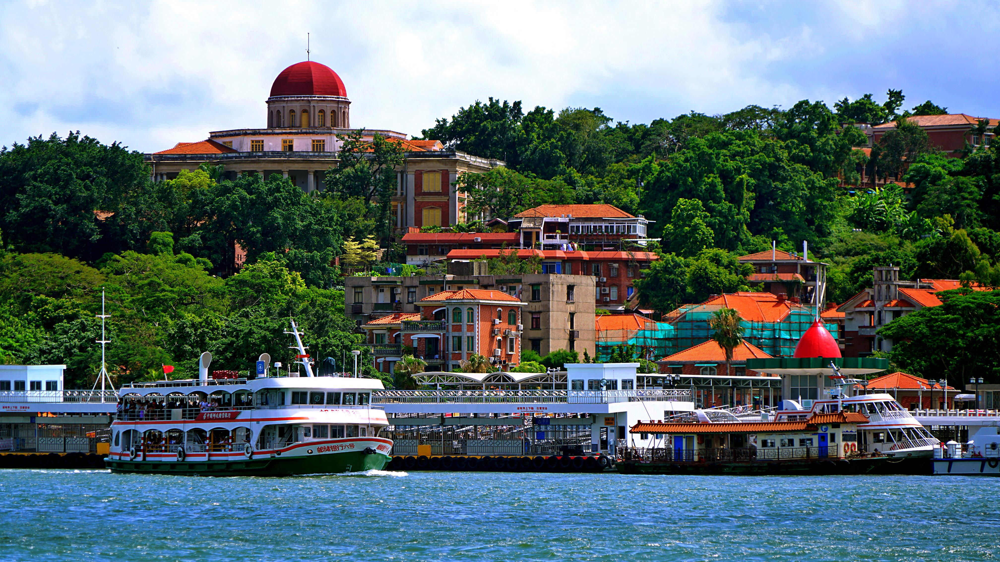
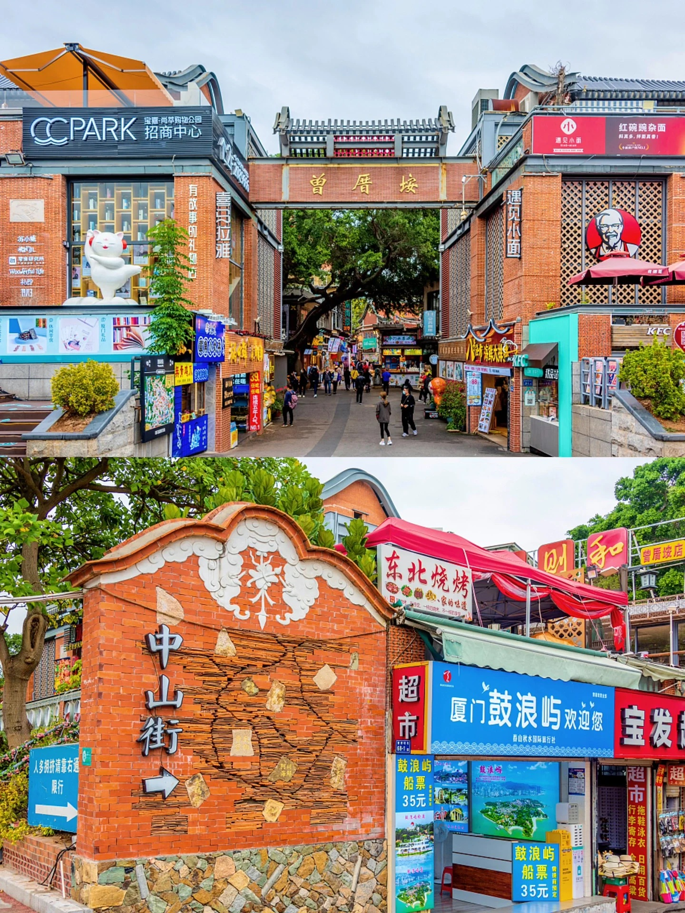
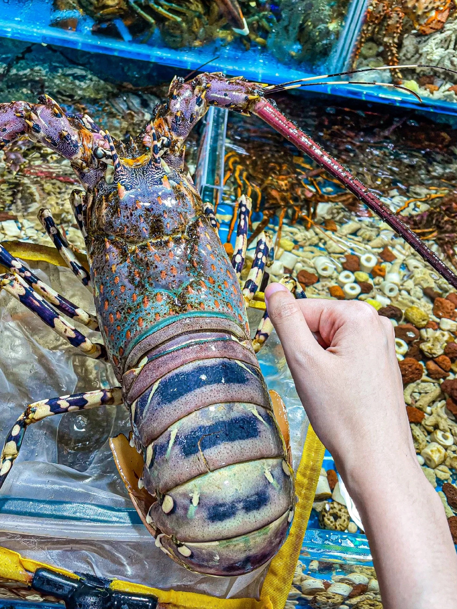
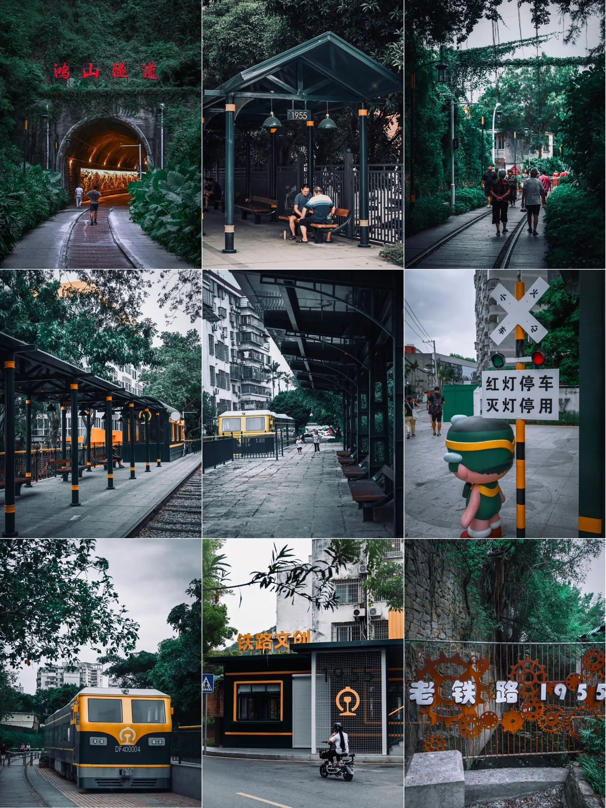

️厦门是一座文艺小清新的旅游城市，环境很好，路都很干净，树木葱郁，又是沿海的小岛，在环岛路走着就可以看见大海，碧海蓝天绿树，简直就是城市里的大自然，是一个非常小资的城市，每年都吸引了大量的游客来玩。接下来，介绍几个厦门好玩的地方。

✨①鼓浪屿

鼓浪屿作为厦门最出名的景点之一，岛上有很多奇花异草，和保存完好的西式建筑，被列入世界自然遗产名录，是厦门旅游的名片。

岛内遗留着诸多历史建筑和老别墅，随处可见的绿色植物把这里装扮成了一座海上的绿色玛瑙。上岛的方式只有一个，乘船。‍♂️需要提前订票，渡票价为35元一人。船票不需要取票，直接刷本人身份证即可。岛上的美食强烈推荐烧仙草，解渴，而且口感真的超级好。鼓浪屿很适合拍照，文艺的小店，湛蓝的海边，随便一站，都是美美的大片。而岛上的景点，例如日光岩、菽庄花园等地，要是你感兴趣，也可以去转转，门票一个人大概是60元左右。

✨②曾厝垵

被喻为“中国最美渔村”，是厦门现存最完善的也是唯一的原生态渔村，这里有很多家庭旅馆、青年客栈、富有情调的咖啡厅、餐吧、个性小店在此云集，是一个很好额游玩地方。

曾厝垵可以说是厦门的“第二个鼓浪屿”，这里聚集着大片网红民宿和网红打卡店，🤩大街小巷到处都是美食店和手工艺品店，出门喜欢吃吃吃的朋友有口福了。

✨③南普陀寺

在厦门大学旁边，香火很盛，如果你有心，可以去上一炷香，给家里人祈福，感受一下寺庙宁静的氛围。🤗

✨④八市

了解一座城市，一定要去当地的菜市场里看看。这里有不少民国时期的老房子。如果你想要接触厦门最接地气的生活气息和吃到当地最地道的特色小吃，八市绝对是最好的选择。另外再推荐一家值得去的小店，叫：朱记手撕鸡，据说是厦门第一家手撕鸡，店门很小，但排队买手撕鸡的人很多。

✨⑤中山路步行街

中山路是厦门现在保留最完好的旧城区，也是厦门最老牌最繁华的商业街，在这里你不仅可以感受到近代厦门的繁华，更有很多厦门特色美食，可以切身体会到厦门的古早味。

相对于鼓浪屿和曾厝垵这样文艺小清新的地点而言，中山路显然成熟和商业了很多，商场、小吃店鳞次栉比，众多网红店也吸引着大批游客，到了晚上，步行街全是熙熙攘攘的行人。沙茶面、蛤蜊煎、车轮饼、烤鸭肠，蜜汁，美食者一边享受着嘴边的美味，一边惬意的随处逛逛，也旅游和放松的一种方式。

✨⑥厦门大学

被喻为“中国最美大学校园”的厦门大学是整个厦门的名片，也是厦门知名度最高的景点之一，在这里你可以感受到厦大学长的风采，芙蓉隧道的文艺涂鸦。

作为国内出了名的最美大学之一，既然来了厦门，那么当然要去厦门大学看看。看着美丽的校园风景和大学生青春靓丽的身影，说不定会触动你的内心，想起自己的学生时代。门票：免费，但因为限制流量，需要提前预约。‍注意事项：游客凭二代身份证进校，只能从南门和西(群贤)门进入。注：厦门大学旁边有一条网红猫街，如果逛完厦大没处去可以去猫街转转。

✨⑦环岛路骑行

想象一下，一边城市高楼，一边是蓝天大海，是不是美如画。最适合相约伙伴，一起骑行，感受厦门这美景。

✨⑧铁路公园

厦门的铁路公园作为鹰厦铁路延伸线，早已荒废多年了，但却保留着厦门发展铁路交通的历史记忆，可以感受到近代厦门的发展过程，感受工业化进程和城市的过去，很有历史感。

—END—

